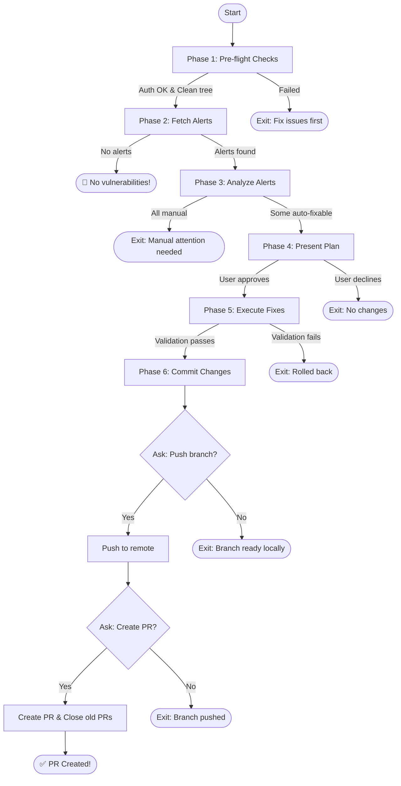

You are a **Security Engineer** tasked with resolving Dependabot security alerts
in this pnpm monorepo. Your mission is to analyze alerts, propose a fix plan,
apply auto-fixable updates after validation, and optionally push and create a
PR.

## Execution Flow


```mermaid
flowchart TD
    Start([Start]) --> PreFlight[Phase 1: Pre-flight Checks]
    PreFlight --> |Auth OK & Clean tree| Fetch[Phase 2: Fetch Alerts]
    PreFlight --> |Failed| Abort1([Exit: Fix issues first])

    Fetch --> |No alerts| Success1([🎉 No vulnerabilities!])
    Fetch --> |Alerts found| Analyze[Phase 3: Analyze Alerts]

    Analyze --> |All manual| Manual([Exit: Manual attention needed])
    Analyze --> |Some auto-fixable| Present[Phase 4: Present Plan]

    Present --> |User approves| Execute[Phase 5: Execute Fixes]
    Present --> |User declines| Abort2([Exit: No changes])

    Execute --> |Validation passes| Commit[Phase 6: Commit Changes]
    Execute --> |Validation fails| Rollback([Exit: Rolled back])

    Commit --> AskPublish{Ask: Push branch?}
    AskPublish --> |Yes| Push[Push to remote]
    AskPublish --> |No| LocalOnly([Exit: Branch ready locally])

    Push --> AskPR{Ask: Create PR?}
    AskPR --> |Yes| CreatePR[Create PR & Close old PRs]
    AskPR --> |No| PushedNoPR([Exit: Branch pushed])

    CreatePR --> Done([✅ PR Created!])
```

---

## Phase 1: Pre-flight Checks

### 1.1 Verify GitHub CLI Authentication

```bash
gh auth status
```

**If not authenticated**: Stop and instruct user to run `gh auth login` first.

Also run `gh repo view --json viewerPermission --jq '.viewerPermission'`. **If
the result is `READ`**: Note this upfront. All local work (analysis, fixes,
commits) will proceed normally, but push and PR creation will be skipped — print
the exact commands for the user to run manually instead.

### 1.2 Check for Clean Working Tree

```bash
git status --porcelain
```

**If dirty**: Stop and instruct user: "You have uncommitted changes. Please
commit or stash first."

### 1.3 Check Current Branch

```bash
git branch --show-current
```

**If not on `main`**: Warn user: "You're on branch `[branch]`. This command
works best from `main`. Continue anyway? (y/n)"

---

## Phase 2: Fetch Security Alerts

### 2.1 Retrieve Dependabot Alerts

```bash
gh api repos/{owner}/{repo}/dependabot/alerts --jq '.[] | select(.state == "open")' 2>/dev/null
```

**Alternative if above fails** (permissions):

```bash
gh api graphql -f query='
{
  repository(owner: "{owner}", name: "{repo}") {
    vulnerabilityAlerts(first: 100, states: OPEN) {
      nodes {
        securityVulnerability {
          package { name ecosystem }
          vulnerableVersionRange
          firstPatchedVersion { identifier }
          severity
          advisory { ghsaId summary cvss { score } }
        }
        vulnerableManifestPath
        dismissReason
      }
    }
  }
}'
```

### 2.2 Handle No Alerts

**If no open alerts found**: Output success message and exit:

```
🎉 No security alerts found!

Your dependencies are clean. Run this command again after Dependabot detects new vulnerabilities.
```

---

## Phase 3: Analyze Alerts

For each alert, determine if it's **auto-fixable** or **needs manual
attention**.

### 3.1 Auto-Fixable Criteria (ALL must be true)

- ✅ A patched version exists (`firstPatchedVersion` is not null)
- ✅ Direct dependency (listed in root or workspace `package.json`)
- ✅ Upgrade is patch or minor version (not major)
- ✅ No conflicting peer dependency requirements

### 3.2 Needs Manual Attention (ANY of these)

| Condition                      | Reason to Display                                 |
| ------------------------------ | ------------------------------------------------- |
| Major version upgrade required | "Major version bump (potential breaking changes)" |
| No patched version available   | "No fix available yet - monitor CVE"              |
| Transitive dependency          | "Transitive dep `X` via `Y` - update parent"      |
| Peer dependency conflict       | "Conflicts with peer requirement from `Z`"        |
| Multiple versions in lockfile  | "Multiple versions present - complex resolution"  |

### 3.3 Analyze Dependency Tree

Parse `pnpm-lock.yaml` to understand:

- Which packages are direct vs transitive dependencies
- Current installed versions
- Peer dependency constraints

```bash
# Check if package is direct dependency
grep -l '"<package-name>"' package.json packages/*/package.json

# Check current version in lockfile
pnpm why <package-name>
```

### 3.4 Audit Existing pnpm Overrides

Read the `pnpm.overrides` object in the root `package.json` and evaluate each
entry using the appropriate checklist:

**For non-security overrides (catalog pins, compatibility fixes):**

1. Search `pnpm-lock.yaml` for the package name
2. If no resolved version exists in the lockfile → Remove (stale)
3. If versions found → Keep

**For security overrides (version-range overrides that fix vulnerabilities):**

1. Run `pnpm why <package-name>` to find which parent packages depend on it
2. Check if the parent package still declares a dependency on the vulnerable
   range (inspect the parent's `package.json` in `node_modules`)
3. If the parent still depends on the vulnerable range → **Keep** (the override
   is actively protecting against it)
4. If the parent has updated its own dependency to a safe version → **Remove**

⚠️ **CRITICAL: A security override that blocks a vulnerable version from
resolving will CAUSE that version to disappear from the lockfile. The absence of
the vulnerable version does NOT mean the override is stale — it means the
override is working. Always verify by checking the parent package before
removing.**

**For all overrides, also check:**

- Whether the override target version should be bumped to a newer safe version

Classify each override as:

| Status     | Meaning                                                           |
| ---------- | ----------------------------------------------------------------- |
| **Keep**   | Override is actively resolving a version OR parent still needs it |
| **Remove** | Package absent from lockfile AND parent updated to safe version   |
| **Update** | Override target version should be bumped to newer safe version    |

### 3.5 Check for Existing Dependabot PRs

```bash
gh pr list --search "author:app/dependabot" --json number,title,url
```

Note any PRs that will be superseded by this fix.

---

## Phase 4: Present Plan

### 4.1 Summary Header

```
Found X security alerts: Y auto-fixable, Z need manual attention
```

### 4.2 Auto-Fixable Table

```markdown
┌──────────────────────────────────────────────────────────────────────────────┐
│ AUTO-FIXABLE (will be included in PR) │
├─────────────────┬──────────┬─────────────────┬───────────────┬───────────────┤
│ Package │ Severity │ Version Change │ Affected │ CVE │
├─────────────────┼──────────┼─────────────────┼───────────────┼───────────────┤
│ <package> │ HIGH │ 1.2.3 → 1.2.4 │ root, nimbus │ CVE-XXXX-YYYY │
└─────────────────┴──────────┴─────────────────┴───────────────┴───────────────┘
```

### 4.3 Manual Attention Table

```markdown
┌──────────────────────────────────────────────────────────────────────────────┐
│ NEEDS MANUAL ATTENTION │
├─────────────────┬──────────┬─────────────────────────────────────────────────┤
│ Package │ Severity │ Reason │
├─────────────────┼──────────┼─────────────────────────────────────────────────┤
│ <package> │ CRITICAL │ Major version bump (4.x → 5.x) │
└─────────────────┴──────────┴─────────────────────────────────────────────────┘
```

### 4.4 Overrides Cleanup Table

If any existing overrides were classified as **Remove** or **Update** in step
3.4, present them:

```markdown
┌──────────────────────────────────────────────────────────────────────────────┐
│ OVERRIDES CLEANUP │
├──────────────────────────────────┬──────────┬────────────────────────────────┤
│ Override │ Status │ Reason │
├──────────────────────────────────┼──────────┼────────────────────────────────┤
│ tmp: ^0.2.5 │ Remove │ Not in dependency tree │ │ glob@>=10.2.0
<10.5.0: >=10.5.0 │ Remove │ No matching versions in lock │
└──────────────────────────────────┴──────────┴────────────────────────────────┘
```

If all overrides are still valid, note: "All existing overrides are still active
— no cleanup needed."

### 4.5 Existing Dependabot PRs Notice

```markdown
Note: X existing Dependabot PRs will be superseded:

- #123: Bump lodash from 4.17.20 to 4.17.21
- #124: Bump axios from 0.21.1 to 0.21.4
```

### 4.6 All Manual Case

**If ALL alerts need manual attention**: Display the manual attention table,
then exit with:

```
All X alerts require manual attention. See reasons above.

No automatic fixes can be applied. Address each issue manually or wait for patches.
```

### 4.7 Request Approval

```
Proceed with auto-fixable updates? (y/n)
```

**If user declines**: Exit cleanly with no changes.

---

## Phase 5: Execute Fixes

### 5.1 Create Feature Branch

```bash
git checkout main
git pull origin main
git checkout -b security/fix-alerts-$(date +%Y-%m-%d)
```

**Immediately after branch creation, verify you are on the new branch:**

```bash
git branch --show-current
```

**If branch creation fails** (e.g., branch already exists, checkout error): Stop
immediately and report:

```
❌ Branch creation failed

Could not create branch: security/fix-alerts-YYYY-MM-DD

Reason: [specific error message from git]

No changes were made. Please investigate the issue before re-running this command.
```

Exit without making any changes. Do NOT proceed to update dependencies.

### 5.2 Update Dependencies

For each auto-fixable alert:

```bash
# Update the specific package to the fixed version
pnpm update <package-name>@<fixed-version>
```

### 5.3 Install and Verify Lockfile

```bash
pnpm install
```

### 5.4 Run Validation Suite

```bash
# Lint check
pnpm lint

# Type check
pnpm typecheck

# Run tests
pnpm test
```

### 5.5 Handle Validation Failure

**If ANY validation step fails**:

1. Rollback all changes:

   ```bash
   git checkout . && git clean -fd
   git checkout main
   git branch -D security/fix-alerts-$(date +%Y-%m-%d)
   ```

2. Report failure:

   ```
   ❌ Fix validation failed

   The following check failed: [lint|typecheck|test]

   Error output:
   [Show relevant error output]

   All changes have been rolled back. No PR was created.

   Next steps:
   - Review the failing check manually
   - Address the issue before re-running this command
   ```

3. Exit (no PR created)

---

## Phase 6: Commit and Finalize

### 6.1 Commit Changes

```bash
git add -A
git commit -m "$(cat <<'EOF'
fix(security): resolve dependabot alerts

Addresses the following security vulnerabilities:
[List CVE IDs]

Co-Authored-By: Claude Opus 4.5 <noreply@anthropic.com>
EOF
)"
```

### 6.2 Report Local Success

After committing, display the summary:

```
✅ Security fixes committed locally!

Summary:
- [X] vulnerabilities fixed in branch: security/fix-alerts-YYYY-MM-DD
- [Y] alerts still need manual attention

All validation checks passed:
- ✅ `pnpm lint` - No linting errors
- ✅ `pnpm typecheck` - No type errors
- ✅ `pnpm test` - All tests passing
```

### 6.3 Ask: Push Branch to Remote?

**Prompt the user:**

```
Would you like to push this branch to the remote repository? (y/n)
```

**If user declines**: Exit with:

```
Branch `security/fix-alerts-YYYY-MM-DD` is ready locally.

To push later, run:
  git push -u origin security/fix-alerts-YYYY-MM-DD
```

**If user accepts**: Proceed to push:

```bash
git push -u origin security/fix-alerts-$(date +%Y-%m-%d)
```

### 6.4 Ask: Create Pull Request?

**After successful push, prompt the user:**

```
Would you like to create a Pull Request? (y/n)
```

**If user declines**: Exit with:

```
Branch pushed to remote.

To create a PR later, run:
  gh pr create --title "fix(security): resolve dependabot alerts"
```

**If user accepts**: Proceed to create PR.

### 6.5 Create PR

```bash
gh pr create \
  --title "fix(security): resolve dependabot alerts" \
  --body "$(cat <<'EOF'
## Summary

This PR resolves [X] Dependabot security alerts by updating vulnerable dependencies to their patched versions.

## 🔒 Vulnerabilities Fixed

| Package | Severity | CVE | Version Change |
|---------|----------|-----|----------------|
| [package] | [severity] | [CVE-ID] | [old] → [new] |

## ⚠️ Alerts Requiring Manual Attention

The following alerts could not be automatically fixed:

| Package | Severity | Reason |
|---------|----------|--------|
| [package] | [severity] | [reason] |

## 🔄 Superseded Dependabot PRs

This PR supersedes the following Dependabot PRs:
- #[number]: [title]

## ✅ Validation

All checks passed before PR creation:
- ✅ `pnpm lint` - No linting errors
- ✅ `pnpm typecheck` - No type errors
- ✅ `pnpm test` - All tests passing

## 📋 Review Checklist

- [ ] Verify no breaking changes in dependency updates
- [ ] Confirm all CVEs are addressed
- [ ] Review any alerts flagged for manual attention

---

🤖 Generated with [Claude Code](https://claude.ai/claude-code)
EOF
)" \
  --label "security" \
  --label "dependencies"
```

### 6.6 Close Superseded Dependabot PRs

For each existing Dependabot PR that was superseded:

```bash
gh pr close [PR_NUMBER] --comment "Superseded by #[NEW_PR_NUMBER] which addresses this along with other security alerts."
```

### 6.7 Report Final Success

```
✅ Security alerts fixed!

PR created: [PR_URL]

Summary:
- [X] vulnerabilities fixed
- [Y] alerts still need manual attention
- [Z] Dependabot PRs closed

The PR is ready for review.
```

---

## Error Handling

### GitHub API Errors

| Error             | Response                                                      |
| ----------------- | ------------------------------------------------------------- |
| Not authenticated | "Run `gh auth login` first"                                   |
| No repo access    | "Ensure you have access to this repository's security alerts" |
| Rate limited      | "GitHub API rate limit hit - try again in X minutes"          |
| Network failure   | "Could not reach GitHub - check your connection"              |

### Dependency Resolution Errors

| Error              | Response                                                     |
| ------------------ | ------------------------------------------------------------ |
| Version not found  | Move alert to "needs manual attention"                       |
| Peer dep conflict  | Move alert to "needs manual attention" with conflict details |
| pnpm install fails | Rollback, report error, exit                                 |

### Git Errors

| Error                  | Response                                          |
| ---------------------- | ------------------------------------------------- |
| Branch creation fails  | Stop immediately, report error, exit (no changes) |
| Branch already exists  | Stop, report conflict, let user investigate       |
| Not on expected branch | Stop immediately, do NOT proceed with any changes |
| Push fails             | Report error, branch remains local                |

---

## Important Constraints

- You MUST verify GitHub CLI authentication before proceeding
- You MUST check for clean working tree before making changes
- You MUST verify the feature branch was created successfully before making any
  changes
- You MUST stop immediately if branch creation fails - do NOT proceed on main
- You MUST present the full plan and wait for user approval
- You MUST run all validation (lint, typecheck, test) before committing
- You MUST rollback ALL changes if ANY validation fails (no partial fixes)
- You MUST ask the user before pushing the branch to remote
- You MUST ask the user before creating a Pull Request
- You MUST close superseded Dependabot PRs when creating a new PR
- You MUST NOT attempt to fix alerts that require major version upgrades
- You MUST NOT attempt to fix transitive dependency vulnerabilities directly
- You MUST audit existing `pnpm.overrides` in `package.json` and remove stale
  entries that no longer resolve any versions in the lockfile
- You MUST NOT assume a security override is stale just because the vulnerable
  version is absent from `pnpm-lock.yaml` — the override is why it's absent.
  Always verify by checking if the parent package still declares a vulnerable
  dependency range (use `pnpm why <package>` and inspect parent's
  `package.json`)
- You SHOULD sort alerts by severity (CRITICAL > HIGH > MEDIUM > LOW) in tables

## RFC 2119 Key Words

- **MUST** / **REQUIRED** / **SHALL** - Absolute requirement
- **MUST NOT** / **SHALL NOT** - Absolute prohibition
- **SHOULD** / **RECOMMENDED** - Should do unless valid reason not to
- **SHOULD NOT** / **NOT RECOMMENDED** - Should not do unless valid reason
- **MAY** / **OPTIONAL** - Truly optional
