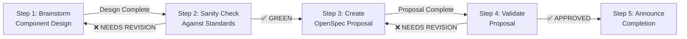

You orchestrate the creation of a new nimbus UI component following the
project's OpenSpec workflow. This command coordinates multiple specialized
skills to ensure the component meets all standards before implementation begins.

## Workflow Overview



## Step 1: Brainstorm Component Design

**Action**: Invoke `/brainstorm` with the component request: "$ARGUMENTS"

**Outcome**: Obtain a detailed design document covering:

- Component purpose, use cases, and scope
- Proposed API (props, slots, event handlers)
- Accessibility requirements (WCAG 2.1 AA compliance)
- Chakra UI v3 recipe approach
- React Aria Components patterns if applicable
- Edge cases and behavior specifications

**Success Criteria**:

- Design is documented with clear decision rationale
- Multiple implementation approaches presented with recommendations
- Design follows established Nimbus patterns

---

## Step 2: Sanity Check Design Against Nimbus Standards

**Action**: Validate the brainstorm output against these specific criteria:

**MUST-Level Requirements (violations prevent shipping):**

- [ ] You MUST use React Aria Components for accessible interaction patterns
      (reason: WCAG 2.1 AA compliance)
- [ ] You MUST implement Chakra UI v3 recipes for styling, not inline styles
      (reason: design system scalability and theming)
- [ ] You MUST include TypeScript types for all props (reason: dev experience
      and IDE support)
- [ ] You MUST follow the existing component file structure (reason:
      maintainability and consistency):
      `/packages/nimbus/src/components/{component-name}/`

**SHOULD-Level Best Practices (strongly recommended):**

- [ ] You SHOULD define clear component slots for customization (reason:
      flexibility for consumers, though not all components need slots)
- [ ] You SHOULD use JSDoc for prop documentation (reason: IDE tooltips and
      consistency)
- [ ] You SHOULD define internationalization strategy if applicable (reason:
      prevents retrofitting later)

**Design Consistency Guardrails (use as blockers):**

- [ ] You MUST NOT duplicate existing Nimbus components (If yes → STOP, use
      existing or extend)
- [ ] You MUST follow established patterns like Button, Select, and Dialog
      (reason: consistency)
- [ ] You MUST match WCAG 2.1 AA accessibility standards (reason:
      legal/compliance)

**Decision**:

- ✅ **GREEN**: All MUST-level requirements met → Proceed to Step 3
- ⚠️ **YELLOW**: Missing some SHOULD items → Okay to proceed, address in Step 3
- ❌ **NEEDS REVISION**: Any MUST-level failure → You MUST return to Step 1 with
  specific feedback on what architecture needs to change

---

## Step 3: Create OpenSpec Proposal

**Action**: Invoke `/openspec:proposal` with the validated design

**Required Proposal Structure**:

The task list MUST include these file creation steps in this order:

1. **Scaffold component structure** - You MUST create shell files:
   - `component.tsx` (empty, with exports)
   - `component.types.ts` (prop/slot type definitions)
   - `component.recipe.ts` (Chakra UI v3 recipe)
   - `component.slots.ts` (slot definitions, if applicable)
   - `component.stories.tsx` (story file with play functions)
   - `index.ts` (barrel export)

2. **Create failing Storybook tests** - You MUST write play functions that test:
   - Core functionality
   - User interactions
   - Accessibility requirements
   - Edge cases
   - **Verify tests fail initially** (TDD pattern)

3. **Implementation steps** - You MUST execute in dependency order:
   - Implement component types in `component.types.ts`
   - Implement recipe in `component.recipe.ts`
   - Implement slots in `component.slots.ts` (if applicable)
   - Implement component logic in `component.tsx`
   - Create/update documentation using the `/writing-developer-documentation`
     skill
   - Create/update design guidelines using the `/writing-designer-documentation`
     skill
   - Ensure Storybook tests pass
   - Run linting and TypeScript checks (violations block shipping)
   - Run the full test suite

4. **Validation steps** - You MUST verify standards compliance before shipping:
   - Component TypeScript compiles without errors
   - Storybook tests pass (play functions execute without error)
   - Unit tests pass (if applicable for hooks/utils)
   - Linting passes (`pnpm lint`)
   - Documentation is complete and accurate
   - Component is exported from main `packages/nimbus` barrel export

**Proposal Completion**: You MUST ensure the proposal includes clear acceptance
criteria for each task. Acceptance criteria help implementers know when they're
done and prevent ambiguous task definitions.

---

## Step 4: Validate OpenSpec Proposal

**Action**: Review the generated proposal against these criteria:

**Proposal Content Checks**:

- [ ] MUST list all required files in task list (types, recipe, slots, stories,
      component, index)
- [ ] MUST follow the order specified in Step 3
- [ ] MUST include play functions for all component behaviors in story file
- [ ] SHOULD use appropriate skills (developer-documentation,
      designer-documentation) for documentation tasks
- [ ] MUST explicitly check standards compliance in validation steps

**Design-to-Proposal Alignment**:

- [ ] MUST reflect all decisions from brainstorm design
- [ ] MUST have props that match the designed API
- [ ] MUST have slots that match the designed structure
- [ ] MUST have accessibility requirements testable in play functions
- [ ] MUST address edge cases in tests

**Decision**:

- ✅ **APPROVED**: Proceed to Step 5
- ❌ **NEEDS REVISION**: Return to Step 3 with specific feedback on proposal
  structure

---

## Step 5: Announce Proposal Completion

**Action**: Provide user with:

1. Summary of component being created
2. Link to the OpenSpec proposal
3. Next steps (user can now approve and implement)
4. List of validation checks passed

Example:

```
✅ Component proposal created: Button variant component

Proposal path: ./openspec/proposals/YYYY-MM-DD-button-variant.md

Validation Results:
- ✅ Architecture aligns with Nimbus standards
- ✅ Files properly structured and ordered
- ✅ Tests defined and acceptance criteria clear
- ✅ Documentation strategy included

Next steps: Review proposal and begin implementation using `/writing-developer-documentation`, `/writing-designer-documentation`, `/writing-stories`, and `/review` skills.
```
