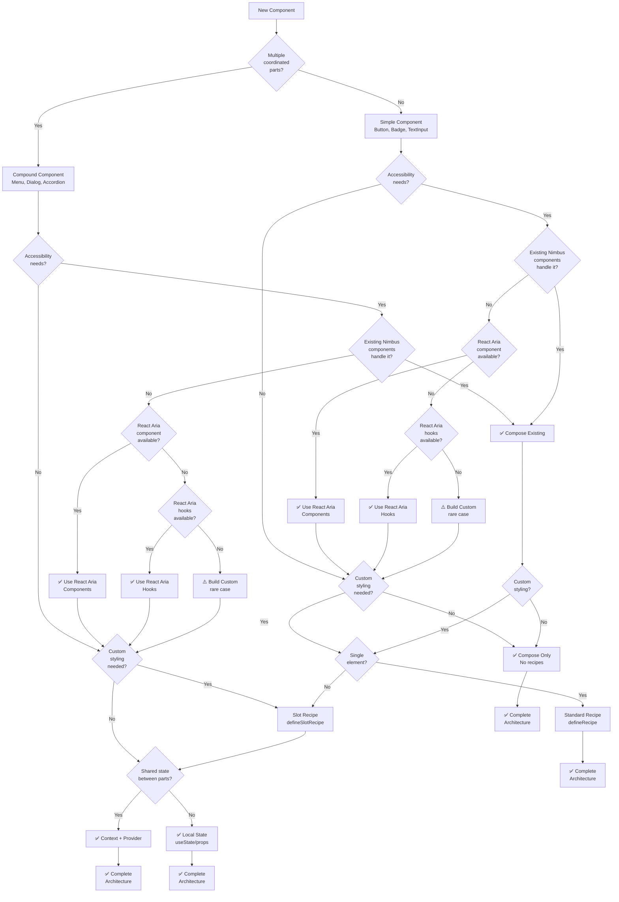

# Writing Components Skill

You are a Nimbus component specialist. This skill helps you create, update, or validate React components with proper architecture, React Aria integration, Chakra UI styling, and accessibility compliance.

## Critical Requirements

**Components are the core of the Nimbus design system.** Every component must follow architectural patterns, integrate React Aria for accessibility, use Chakra UI recipes for styling, and provide comprehensive TypeScript types.

## Mode Detection

Parse the request to determine the operation:

- **create** - Generate new component with complete file structure
- **update** - Enhance existing component, add features, refactor
- **validate** - Check component compliance with architecture guidelines

If no mode is specified, default to **create**.

## Required Research (All Modes)

Before implementation, you MUST research in parallel:

1. **Read** architecture decision guidelines:
   ```bash
   cat docs/file-type-guidelines/architecture-decisions.md
   cat docs/file-type-guidelines/main-component.md
   cat docs/component-guidelines.md
   ```

2. **Analyze** similar components for patterns:
   ```bash
   # Find similar components
   ls packages/nimbus/src/components/

   # Read reference implementations
   cat packages/nimbus/src/components/button/button.tsx  # Simple
   cat packages/nimbus/src/components/menu/menu.tsx      # Compound
   ```

3. **Query** React Aria documentation via context7:
   ```
   Library: react-aria-components
   Query: "component-type hooks patterns"
   ```

4. **Determine** component requirements:
   - Accessibility needs
   - Styling requirements
   - State management
   - Composition patterns

## Architecture Decision Tree

Use this comprehensive diagram to make all architectural decisions:



## Component Type Patterns

### Pattern 1: Simple Component

**Characteristics:**
- Single responsibility
- No internal parts
- Optional recipe for styling
- May use React Aria hooks

**File Structure:**
```
button/
├── button.tsx              # Implementation
├── button.types.ts         # Props interface
├── button.slots.tsx        # Slot component (if recipe)
├── button.recipe.ts        # Recipe (if styling)
├── button.stories.tsx      # Stories with tests
├── button.mdx             # Documentation
├── button.dev.mdx         # Developer docs
└── index.ts               # Public exports
```

**Implementation Template:**
```typescript
// button.tsx
import { useRef } from "react";
import { useButton, useObjectRef } from "react-aria";
import { ButtonContext, useContextProps } from "react-aria-components";
import { mergeRefs } from "@chakra-ui/react";
import { ButtonRoot } from "./button.slots";
import type { ButtonProps } from "./button.types";

/**
 * # Button
 *
 * Brief description of the component.
 *
 * @see {@link https://nimbus-documentation.vercel.app/components/category/button}
 */
const ButtonComponent = (props: ButtonProps) => {
  const { ref: forwardedRef, as, asChild, children, ...rest } = props;

  // Create local ref for internal use
  const localRef = useRef<HTMLButtonElement>(null);
  const baseRef = useObjectRef(mergeRefs(localRef, forwardedRef));

  // Consume context props for slot-aware behavior
  const [contextProps, contextRef] = useContextProps(
    rest,
    baseRef,
    ButtonContext
  );

  // Use React Aria hook
  const { buttonProps } = useButton(
    {
      ...contextProps,
      elementType: as || (asChild ? "a" : "button"),
    },
    contextRef
  );

  return (
    <ButtonRoot
      ref={contextRef}
      {...contextProps}
      {...buttonProps}
      as={as}
      asChild={asChild}
      aria-disabled={contextProps.isDisabled || undefined}
      data-disabled={contextProps.isDisabled || undefined}
    >
      {children}
    </ButtonRoot>
  );
};

ButtonComponent.displayName = "Button";

/**
 * ### Button
 *
 * Displays a Button.
 *
 * @see {@link https://nimbus-documentation.vercel.app/components/category/button}
 */
export const Button: typeof ButtonComponent & {
  Context: typeof ButtonContext;
} = Object.assign(ButtonComponent, {
  Context: ButtonContext,
});
```

### Pattern 2: Compound Component

**Characteristics:**
- Multiple coordinated parts
- Shared context/state
- Slot recipe for multi-element styling
- Namespace object with .Root first

**File Structure:**
```
menu/
├── menu.tsx                # Exports ONLY (no implementation)
├── menu.types.ts           # Props interfaces for all parts
├── menu.slots.tsx          # Slot components for all parts
├── menu.recipe.ts          # Slot recipe (defineSlotRecipe)
├── menu-context.tsx        # Context and provider (if needed)
├── components/             # Implementation files
│   ├── index.ts           # Barrel export
│   ├── menu.root.tsx      # Root implementation
│   ├── menu.trigger.tsx   # Trigger implementation
│   ├── menu.content.tsx   # Content implementation
│   └── menu.item.tsx      # Item implementation
├── menu.stories.tsx        # Stories with tests
├── menu.mdx               # Documentation
├── menu.dev.mdx           # Developer docs
└── index.ts               # Public exports
```

**Main Export File Template (CRITICAL):**
```typescript
// menu.tsx - EXPORTS ONLY, NO IMPLEMENTATION
import {
  MenuRoot,
  MenuTrigger,
  MenuContent,
  MenuItem,
} from "./components";

/**
 * Menu
 * ============================================================
 * Brief description of the component system.
 *
 * @see {@link https://nimbus-documentation.vercel.app/components/category/menu}
 *
 * @example
 * ```tsx
 * <Menu.Root>
 *   <Menu.Trigger>Open Menu</Menu.Trigger>
 *   <Menu.Content>
 *     <Menu.Item id="edit">Edit</Menu.Item>
 *   </Menu.Content>
 * </Menu.Root>
 * ```
 */
export const Menu = {
  /**
   * # Menu.Root
   *
   * The root component that provides context and state management for the menu.
   * Must wrap all menu parts to coordinate their behavior.
   *
   * @example
   * ```tsx
   * <Menu.Root>
   *   <Menu.Trigger>Options</Menu.Trigger>
   *   <Menu.Content>...</Menu.Content>
   * </Menu.Root>
   * ```
   */
  Root: MenuRoot, // ⚠️ MUST BE FIRST

  /**
   * # Menu.Trigger
   *
   * The trigger element that opens the menu when activated.
   * Handles keyboard and mouse interactions.
   *
   * @example
   * ```tsx
   * <Menu.Trigger>Open Menu</Menu.Trigger>
   * ```
   */
  Trigger: MenuTrigger,

  /**
   * # Menu.Content
   *
   * The container for menu items. Handles positioning and portal rendering.
   *
   * @example
   * ```tsx
   * <Menu.Content>
   *   <Menu.Item id="save">Save</Menu.Item>
   * </Menu.Content>
   * ```
   */
  Content: MenuContent,

  /**
   * # Menu.Item
   *
   * An individual menu item that can be selected.
   *
   * @example
   * ```tsx
   * <Menu.Item id="delete">Delete</Menu.Item>
   * ```
   */
  Item: MenuItem,
};

// Exports for internal use by react-docgen
export {
  MenuRoot as _MenuRoot,
  MenuTrigger as _MenuTrigger,
  MenuContent as _MenuContent,
  MenuItem as _MenuItem,
};
```

**Implementation File Template:**
```typescript
// components/menu.root.tsx
import { Menu as RaMenu } from "react-aria-components";
import { MenuRootSlot } from "../menu.slots";
import type { MenuRootProps } from "../menu.types";

/**
 * @supportsStyleProps
 */
export const MenuRoot = (props: MenuRootProps) => {
  const { children, ...rest } = props;

  return (
    <MenuRootSlot asChild>
      <RaMenu {...rest}>
        {children}
      </RaMenu>
    </MenuRootSlot>
  );
};

MenuRoot.displayName = "Menu.Root";
```

### Pattern 3: Form Component

**Characteristics:**
- Controlled and uncontrolled modes
- Validation support
- Form integration
- React Aria form hooks

**Additional Requirements:**
```typescript
type FormComponentProps = {
  // Controlled
  value?: string;
  onChange?: (value: string) => void;

  // Uncontrolled
  defaultValue?: string;

  // Validation
  isInvalid?: boolean;
  isRequired?: boolean;
  errorMessage?: string;

  // Accessibility
  'aria-label'?: string;
  'aria-describedby'?: string;
}
```

### Pattern 4: Overlay/Portal Component

**Characteristics:**
- Renders in portal
- Focus management
- Dismissal patterns
- Positioning logic

**Additional Requirements:**
- Focus trap on open
- Focus restoration on close
- Escape key handling
- Backdrop click (optional)

## React Aria Integration

### Import Convention (CRITICAL)

**ALWAYS** use `Ra` prefix for React Aria imports:

```typescript
// ✅ CORRECT
import { Button as RaButton } from "react-aria-components";
import { Menu as RaMenu } from "react-aria-components";
import { useButton } from "react-aria";

// ❌ WRONG
import { Button } from "react-aria-components";
import { Menu } from "react-aria-components";
```

### React Aria Components vs Hooks

**Prefer React Aria Components when available:**
```typescript
// ✅ PREFERRED - Use React Aria Component
import { Button as RaButton } from "react-aria-components";

export const Button = (props: ButtonProps) => (
  <ButtonSlot asChild>
    <RaButton {...props} />
  </ButtonSlot>
);
```

**Use React Aria hooks when component customization needed:**
```typescript
// ✅ ACCEPTABLE - Use React Aria hook
import { useButton } from "react-aria";

export const Button = (props: ButtonProps) => {
  const { buttonProps } = useButton(props, ref);

  return (
    <ButtonSlot {...buttonProps} ref={ref}>
      {props.children}
    </ButtonSlot>
  );
};
```

## Ref Forwarding Pattern (CRITICAL)

**ALWAYS** use this pattern for ref forwarding:

```typescript
import { useRef } from "react";
import { useObjectRef } from "react-aria";
import { mergeRefs } from "@chakra-ui/react";

const Component = (props: ComponentProps) => {
  const { ref: forwardedRef, ...rest } = props;

  // Create local ref
  const localRef = useRef<HTMLElement>(null);

  // Merge refs
  const ref = useObjectRef(mergeRefs(localRef, forwardedRef));

  return <Element ref={ref} {...rest} />;
};
```

## Context Props Pattern

For slot-aware behavior (when component can be used in slots):

```typescript
import { ButtonContext, useContextProps } from "react-aria-components";

const Button = (props: ButtonProps) => {
  const { ref: forwardedRef, ...rest } = props;
  const localRef = useRef<HTMLButtonElement>(null);
  const baseRef = useObjectRef(mergeRefs(localRef, forwardedRef));

  // Consume context props
  const [contextProps, contextRef] = useContextProps(
    rest,
    baseRef,
    ButtonContext
  );

  return (
    <ButtonRoot ref={contextRef} {...contextProps}>
      {props.children}
    </ButtonRoot>
  );
};
```

## Cross-Chunk Import Pattern (CRITICAL)

When importing components or types from OTHER component directories:

```typescript
// ❌ WRONG - Imports from barrel export (causes circular chunks)
import { IconToggleButton } from "@/components/icon-toggle-button";
import type { ToggleButtonProps } from "../toggle-button";

// ✅ CORRECT - Imports directly from implementation file
import { IconToggleButton } from "@/components/icon-toggle-button/icon-toggle-button";
import type { ToggleButtonProps } from "../toggle-button/toggle-button.types";
```

**Why:** Barrel exports (`index.ts`) create separate chunks. Cross-chunk imports cause circular dependencies.

**When to use:**
- Importing from DIFFERENT component directory
- Type-only imports across components
- Compound component parts accessing other components

**When NOT to use:**
- Importing within SAME component directory (use relative paths)
- Importing from utilities, hooks, constants
- Public API exports in your own index.ts

## JSDoc Documentation Requirements

### Simple Components

```typescript
/**
 * # ComponentName
 *
 * Brief description (1-2 sentences).
 *
 * @see {@link https://nimbus-documentation.vercel.app/components/category/name}
 */
export const ComponentName = (props: ComponentNameProps) => {
  // Implementation
};
```

### Compound Component Parts

Each part in the namespace object MUST have JSDoc:

```typescript
/**
 * # ComponentName.PartName
 *
 * Description of what this part does (1-3 sentences).
 * Additional behavior or interaction details.
 *
 * @example
 * ```tsx
 * <ComponentName.Root>
 *   <ComponentName.PartName>Example</ComponentName.PartName>
 * </ComponentName.Root>
 * ```
 */
PartName: ComponentPartName,
```

### Implementation Files (Compound Components)

```typescript
/**
 * @supportsStyleProps
 */
export const ComponentRoot = (props: ComponentRootProps) => {
  // Implementation
};

ComponentRoot.displayName = "Component.Root";
```

## File Requirements Checklist

### All Components (REQUIRED)

- [ ] Main component file (`{component}.tsx`)
- [ ] Types file (`{component}.types.ts`)
- [ ] Stories file (`{component}.stories.tsx`)
- [ ] Documentation file (`{component}.mdx`)
- [ ] Barrel export (`index.ts`)

### Styling (When Needed)

- [ ] Recipe file (`{component}.recipe.ts`)
- [ ] Slots file (`{component}.slots.tsx`)
- [ ] Recipe registered in `packages/nimbus/src/theme/recipes.ts`

### Compound Components (Additional)

- [ ] Components folder (`components/`)
- [ ] Implementation files for each part
- [ ] Components barrel export (`components/index.ts`)
- [ ] Context file (if shared state needed)

### Internationalization (When Needed)

- [ ] i18n file (`{component}.i18n.ts`)
- [ ] Messages registered in i18n package

### Additional Files (When Needed)

- [ ] Hooks folder (`hooks/`)
- [ ] Utils folder (`utils/`)
- [ ] Constants folder (`constants/`)
- [ ] Context file (`{component}-context.tsx`)
- [ ] Developer docs (`{component}.dev.mdx`)

## Create Mode

### Step 1: Architectural Analysis

You MUST determine:

1. **Component Type**
   - Simple or compound?
   - Decision: Multiple parts needed?

2. **Accessibility Approach**
   - Can existing Nimbus components be composed?
   - Which React Aria component/hook?
   - Decision matrix from architecture guidelines

3. **Styling Requirements**
   - Custom styling needed?
   - Single element (standard recipe) or multiple (slot recipe)?
   - Which visual variants?

4. **State Management**
   - Local state or context?
   - Controlled/uncontrolled support needed?

5. **File Organization**
   - Which subfolders needed?
   - Complex logic requiring hooks?

### Step 2: Create File Structure

Based on architectural decisions, create:

1. **Core files** (always):
   - Main component file
   - Types file
   - Stories file
   - Documentation file
   - Barrel export

2. **Styling files** (if needed):
   - Recipe file
   - Slots file
   - Register in theme

3. **Structure files** (if compound):
   - Components folder
   - Implementation files
   - Components barrel export

4. **Additional files** (if needed):
   - Context file
   - Hooks folder
   - Utils folder
   - i18n file

### Step 3: Implement Core Component

Follow the appropriate pattern:
- Simple component pattern
- Compound component pattern
- Form component pattern
- Overlay component pattern

### Step 4: Implement Types

Create comprehensive TypeScript interfaces:
- Component props
- Recipe variant props
- Ref types
- Event handler types

### Step 5: Implement Styling

If custom styling needed:
- Create recipe (standard or slot)
- Create slot components
- Register recipe in theme
- Generate theme typings

### Step 6: Write Stories

Create comprehensive Storybook stories:
- Base story with play function
- Variants stories
- States stories
- Controlled story
- SmokeTest

### Step 7: Write Documentation

Create both documentation files:
- Designer documentation (`.mdx`)
- Developer documentation (`.dev.mdx`)

### Step 8: Verify Build

Run verification commands:
```bash
pnpm --filter @commercetools/nimbus build
pnpm --filter @commercetools/nimbus typecheck
pnpm test packages/nimbus/src/components/{component}/{component}.stories.tsx
```

## Update Mode

### Process

1. You MUST read existing component files
2. You MUST identify update type:
   - Add new variant/prop
   - Refactor to compound component
   - Add React Aria integration
   - Enhance accessibility
   - Add controlled mode

3. You MUST maintain backward compatibility
4. You MUST update all related files:
   - Types (add new props)
   - Recipe (add new variants)
   - Stories (test new features)
   - Documentation (document changes)

### Common Updates

- **Add variant** - Update recipe, types, stories, docs
- **Add accessibility** - Integrate React Aria, update types
- **Convert to compound** - Refactor structure, maintain compat
- **Add controlled mode** - Update types, add state management
- **Enhance keyboard nav** - Add React Aria hooks, test in stories

## Validate Mode

### Validation Checklist

You MUST validate against these requirements:

#### Architecture
- [ ] Component type appropriate (simple vs compound)
- [ ] React Aria integration correct
- [ ] Styling approach appropriate (recipe type)
- [ ] State management pattern correct
- [ ] File organization follows guidelines

#### Implementation
- [ ] React Aria imports use `Ra` prefix
- [ ] Ref forwarding uses correct pattern
- [ ] Context props pattern (if applicable)
- [ ] Cross-chunk imports use direct file paths
- [ ] DisplayName assigned

#### Compound Components
- [ ] Main file is exports only
- [ ] .Root is first in namespace object
- [ ] JSDoc for each part
- [ ] Implementation in components folder
- [ ] _ComponentPart exports for react-docgen

#### Types
- [ ] Props interface exported
- [ ] Recipe variant props defined
- [ ] Controlled/uncontrolled types (if applicable)
- [ ] Ref type correct

#### Styling
- [ ] Recipe registered in theme
- [ ] Slot components created (if needed)
- [ ] Theme typings generated
- [ ] Recipe type matches structure (standard vs slot)

#### Documentation
- [ ] JSDoc comments present
- [ ] Component description clear
- [ ] Examples in JSDoc
- [ ] MDX documentation exists
- [ ] Developer docs exist (if needed)

#### Testing
- [ ] Stories file with play functions
- [ ] All interactions tested
- [ ] Accessibility tested
- [ ] State changes verified

### Validation Report Format

```markdown
## Component Validation: {ComponentName}

### Status: [✅ PASS | ❌ FAIL | ⚠️ WARNING]

### Architecture Assessment
- Component Type: [Simple | Compound | Composition]
- React Aria Integration: [Components | Hooks | None | ✅/❌]
- Styling Approach: [Standard Recipe | Slot Recipe | Composition | ✅/❌]
- State Management: [Local | Context | Hooks | ✅/❌]

### Files Reviewed
- Main component: `{component}.tsx`
- Types: `{component}.types.ts`
- Recipe: `{component}.recipe.ts` (if applicable)
- Slots: `{component}.slots.tsx` (if applicable)
- Stories: `{component}.stories.tsx`
- Documentation: `{component}.mdx`

### ✅ Compliant
[List passing checks]

### ❌ Violations (MUST FIX)
- [Violation with guideline reference and file:line]

### ⚠️ Warnings (SHOULD FIX)
- [Non-critical improvements]

### Recommendations
- [Specific improvements needed]
```

## Common Patterns Reference

### Wrapper Pattern
```typescript
export const Component = (props: ComponentProps) => (
  <ComponentSlot asChild>
    <RaComponent {...props} />
  </ComponentSlot>
);
```

### Composition Pattern
```typescript
export const Component = (props: ComponentProps) => (
  <Stack direction="row">
    <ExistingComponent1 {...props.part1Props} />
    <ExistingComponent2 {...props.part2Props} />
  </Stack>
);
```

### Provider Pattern
```typescript
export const ComponentRoot = (props: ComponentRootProps) => (
  <ComponentProvider {...props}>
    <ComponentRootSlot>
      {props.children}
    </ComponentRootSlot>
  </ComponentProvider>
);
```

### Controlled/Uncontrolled Pattern
```typescript
const Component = (props: ComponentProps) => {
  const [internalValue, setInternalValue] = useState(props.defaultValue);
  const value = props.value ?? internalValue;
  const onChange = props.onChange ?? setInternalValue;

  return <Input value={value} onChange={onChange} />;
};
```

## Error Recovery

If validation fails:

1. You MUST check import conventions (Ra prefix)
2. You MUST verify ref forwarding pattern
3. You MUST ensure cross-chunk imports use direct paths
4. You MUST confirm compound .Root is first
5. You MUST validate recipe registration
6. You SHOULD rebuild theme typings

## Reference Examples

You SHOULD reference these components:

- **Simple**: `packages/nimbus/src/components/button/button.tsx`
- **Form**: `packages/nimbus/src/components/text-input/text-input.tsx`
- **Compound**: `packages/nimbus/src/components/menu/menu.tsx`
- **Overlay**: `packages/nimbus/src/components/dialog/dialog.tsx`
- **Complex**: `packages/nimbus/src/components/date-picker/date-picker.tsx`

## RFC 2119 Key Words

- **MUST** / **REQUIRED** / **SHALL** - Absolute requirement
- **MUST NOT** / **SHALL NOT** - Absolute prohibition
- **SHOULD** / **RECOMMENDED** - Should do unless valid reason not to
- **SHOULD NOT** / **NOT RECOMMENDED** - Should not do unless valid reason
- **MAY** / **OPTIONAL** - Truly optional

---

**Execute component operation for: $ARGUMENTS**
