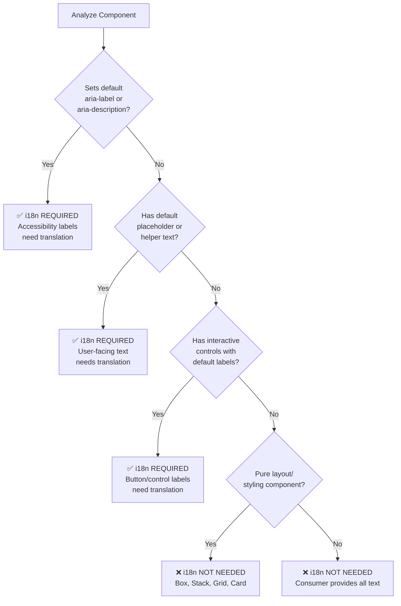

---
description:
  Create, update, or validate internationalization message definitions for
  components
argument-hint: create|update|validate ComponentName [details]
---

# Writing i18n Skill

You are a Nimbus internationalization specialist. This skill helps you create,
update, or validate i18n files (`{component}.i18n.ts`) that define translatable
message definitions for accessible, user-facing text.

**Note**: If you're creating a NEW component, consider using
`/propose-component` instead. This skill is for:

- Updating existing i18n files
- Adding translations when you know exactly what's needed
- Being invoked by higher-level commands or agents

## Critical Requirements

**i18n files ensure accessible, translatable UI text.** Every component with
user-facing text or accessibility labels MUST have properly structured message
definitions for Transifex integration.

## Mode Detection

Parse the request to determine the operation:

- **create** - Generate new i18n message definitions
- **update** - Add new messages, enhance existing definitions
- **validate** - Check i18n file compliance with guidelines

If no mode is specified, default to **create**.

## Required Research (All Modes)

Before implementation, you MUST research in parallel:

1. **Read** i18n guidelines:

   ```bash
   cat docs/file-type-guidelines/i18n.md
   ```

2. **Read** naming conventions for message IDs:

   ```bash
   cat docs/naming-conventions.md
   ```

   Message ID pattern: Nimbus.{ComponentName}.{messageKey}

3. **Review** component implementation to identify translatable text:

   ```bash
   cat packages/nimbus/src/components/{component}/{component}.tsx
   ```

4. **Check** similar i18n files:
   ```bash
   ls packages/nimbus/src/components/*/*.i18n.ts
   ```

## When i18n Is Needed (Decision Flow)

Use this diagram to determine if your component needs i18n:



### Components That NEED i18n:

**Has default accessibility labels:**

- Components setting default aria-label
- Components with aria-description
- Interactive elements with screen reader text

**Has default user-facing text:**

- Default placeholder text
- Button labels (increment, decrement, close, etc.)
- Helper text or instructions
- Tooltips or user-facing messages

**Examples:**

- NumberInput (increment/decrement labels)
- Alert (dismiss button label)
- DatePicker (input placeholders, button labels)
- PasswordInput (show/hide password label)

### Components That DON'T Need i18n:

**Pure layout/styling:**

- Box, Stack, Grid, Flex
- Card (unless sets default aria-label)
- Divider, Separator

**Consumer provides all text:**

- Badge (no default aria-label)
- Button (consumer provides label)
- Text, Heading (consumer provides content)

### Decision Flow

```
Does component set default aria-label or aria-description?
├─ YES → i18n REQUIRED
└─ NO  → Does component have default placeholder or helper text?
    ├─ YES → i18n REQUIRED
    └─ NO  → Does component have interactive controls with labels?
        ├─ YES → i18n REQUIRED
        └─ NO  → i18n NOT NEEDED
```

## File Structure

### Location

```
src/components/{component-name}/{component-name}.i18n.ts
```

### Basic Template

```typescript
export const messages = {
  messageKey: {
    id: "Nimbus.ComponentName.messageKey",
    description:
      "Context for translators explaining where and how this is used",
    defaultMessage: "English fallback text",
  },
  // Additional messages...
};
```

## Message ID Convention (CRITICAL)

All message IDs MUST follow this hierarchical pattern:

```
Nimbus.{ComponentName}.{messageKey}
```

### Standard Examples

- `Nimbus.Alert.dismiss`
- `Nimbus.DatePicker.clearInput`
- `Nimbus.NumberInput.increment`
- `Nimbus.PasswordInput.show`

### Nested Components

For complex components with sub-parts:

```
Nimbus.{ComponentName}.{SubComponent}.{messageKey}
```

Example: `Nimbus.DatePicker.Time.enterTimeHour`

### Naming Rules

- **ComponentName**: PascalCase (Alert, NumberInput, DatePicker)
- **SubComponent**: PascalCase if nested (Time, Calendar)
- **messageKey**: camelCase describing the message (dismiss, increment,
  clearInput)

## Message Properties (REQUIRED)

Each message MUST include all three properties:

### 1. id (Required)

Unique identifier following naming convention:

```typescript
id: "Nimbus.ComponentName.messageKey";
```

### 2. description (Required)

Developer-facing context for translators:

```typescript
description: "aria-label for dismiss button in alert";
description: "Placeholder text for date input field";
description: "Button label to increment numeric value";
```

**Good descriptions:**

- Explain WHERE the text appears
- Explain HOW it's used (aria-label, button text, placeholder)
- Provide context about the interaction

**Bad descriptions:**

- Too vague: "A label"
- Missing context: "Dismiss"
- No usage info: "Text"

### 3. defaultMessage (Required)

English fallback text:

```typescript
defaultMessage: "Dismiss";
defaultMessage: "Select date";
defaultMessage: "Increment value";
```

**Requirements:**

- Proper grammar and punctuation
- Concise and clear
- User-friendly language
- No technical jargon

## Message Patterns by Use Case

### Accessibility Labels

```typescript
export const messages = {
  increment: {
    id: "Nimbus.NumberInput.increment",
    description: "aria-label for increment button in number input",
    defaultMessage: "Increment",
  },
  decrement: {
    id: "Nimbus.NumberInput.decrement",
    description: "aria-label for decrement button in number input",
    defaultMessage: "Decrement",
  },
});
```

### Button Labels

```typescript
export const messages = {
  dismiss: {
    id: "Nimbus.Alert.dismiss",
    description: "Label for dismiss button in alert component",
    defaultMessage: "Dismiss",
  },
  close: {
    id: "Nimbus.Dialog.close",
    description: "Label for close button in dialog header",
    defaultMessage: "Close",
  },
});
```

### Placeholder Text

```typescript
export const messages = {
  selectDate: {
    id: "Nimbus.DatePicker.selectDate",
    description: "Placeholder text for date input field",
    defaultMessage: "Select date",
  },
  enterText: {
    id: "Nimbus.TextInput.enterText",
    description: "Default placeholder for text input field",
    defaultMessage: "Enter text",
  },
});
```

### State Indicators

```typescript
export const messages = {
  showPassword: {
    id: "Nimbus.PasswordInput.show",
    description: "Button label to reveal password text",
    defaultMessage: "Show password",
  },
  hidePassword: {
    id: "Nimbus.PasswordInput.hide",
    description: "Button label to conceal password text",
    defaultMessage: "Hide password",
  },
});
```

### Dynamic Messages (with values)

```typescript
export const messages = {
  itemsSelected: {
    id: "Nimbus.Select.itemsSelected",
    description: "Announces number of selected items to screen readers",
    defaultMessage:
      "{count, plural, one {# item selected} other {# items selected}}",
  },
  pageIndicator: {
    id: "Nimbus.Pagination.pageIndicator",
    description: "Current page indicator for pagination",
    defaultMessage: "Page {current} of {total}",
  },
});
```

## Component Integration

> **IMPORTANT:** Components do NOT import `.i18n.ts` files. They import compiled
> `*.messages.ts` dictionaries generated by the build pipeline.

### Import Pattern

```typescript
import { useLocalizedStringFormatter } from "@/hooks";
import { componentMessagesStrings } from "./{component}.messages";
```

### Usage in Components

**Simple usage:**

```typescript
export const Component = (props: ComponentProps) => {
  const msg = useLocalizedStringFormatter(componentMessagesStrings);

  return (
    <button aria-label={msg.format("dismiss")}>
      <Icons.Close />
    </button>
  );
};
```

**With dynamic values:**

```typescript
export const Component = (props: ComponentProps) => {
  const msg = useLocalizedStringFormatter(componentMessagesStrings);

  const label = msg.format("itemsSelected", {
    count: selectedItems.length,
  });

  return <div aria-label={label}>{/* ... */}</div>;
};
```

**With conditional messages:**

```typescript
export const PasswordInput = (props: PasswordInputProps) => {
  const msg = useLocalizedStringFormatter(passwordInputMessagesStrings);
  const [isVisible, setIsVisible] = useState(false);

  const toggleLabel = msg.format(
    isVisible ? "hidePassword" : "showPassword"
  );

  return (
    <button onClick={() => setIsVisible(!isVisible)} aria-label={toggleLabel}>
      {isVisible ? <Icons.VisibilityOff /> : <Icons.Visibility />}
    </button>
  );
};
```

## React Aria Integration

When using React Aria hooks, pass localized labels:

```typescript
export const NumberInput = (props: NumberInputProps) => {
  const msg = useLocalizedStringFormatter(numberInputMessagesStrings);

  const ariaProps = {
    ...props,
    incrementAriaLabel: msg.format("increment"),
    decrementAriaLabel: msg.format("decrement"),
  };

  const { inputProps, incrementButtonProps, decrementButtonProps } =
    useNumberField(ariaProps, state, ref);

  return (
    <div>
      <button {...incrementButtonProps} />
      <input {...inputProps} />
      <button {...decrementButtonProps} />
    </div>
  );
};
```

## Compound Components (Single i18n File)

**Components with multiple parts share a single i18n file:**

```typescript
// alert.i18n.ts - Single file for entire Alert compound component
export const messages = {
  dismiss: {
    id: "Nimbus.Alert.dismiss",
    description: "aria-label for dismiss button in Alert.DismissButton",
    defaultMessage: "Dismiss",
  },
  infoIcon: {
    id: "Nimbus.Alert.infoIcon",
    description: "aria-label for info icon in Alert.Icon",
    defaultMessage: "Information",
  },
  warningIcon: {
    id: "Nimbus.Alert.warningIcon",
    description: "aria-label for warning icon in Alert.Icon",
    defaultMessage: "Warning",
  },
});
```

**Usage in different parts:**

```typescript
// alert.dismiss-button.tsx
import { componentMessagesStrings } from "./component.messages";

export const AlertDismissButton = () => {
  const msg = useLocalizedStringFormatter(componentMessagesStrings);
  return (
    <button aria-label={msg.format("dismiss")}>
      <Icons.Close />
    </button>
  );
};

// alert.icon.tsx
import { componentMessagesStrings } from "./component.messages";

export const AlertIcon = ({ severity }: AlertIconProps) => {
  const msg = useLocalizedStringFormatter(alertMessagesStrings);
  const label = msg.format(
    severity === "info" ? "infoIcon" : "warningIcon"
  );
  return <Icons.Info aria-label={label} />;
};
```

## Supported Locales

Current Nimbus support:

- `en` - English (default)
- `de` - German
- `es` - Spanish
- `fr-FR` - French (France)
- `pt-BR` - Portuguese (Brazil)

## Create Mode

### Step 1: Analyze Component for i18n Needs

Determine if component needs i18n:

1. **Check for default aria-labels**

   ```typescript
   // ✅ Needs i18n
   <button aria-label="Dismiss">...</button>

   // ❌ Doesn't need i18n (consumer provides)
   <button aria-label={props.label}>...</button>
   ```

2. **Check for default placeholders**

   ```typescript
   // ✅ Needs i18n
   <input placeholder="Select date" />

   // ❌ Doesn't need i18n
   <input placeholder={props.placeholder} />
   ```

3. **Check for interactive controls**

   ```typescript
   // ✅ Needs i18n (increment/decrement buttons)
   <NumberInput />

   // ❌ Doesn't need i18n (pure layout)
   <Box />
   ```

### Step 2: Identify All Translatable Text

List all user-facing text:

- Accessibility labels
- Button text
- Placeholder text
- Helper text
- Tooltips
- Error messages

### Step 3: Create Message Definitions

For each translatable text, create a message:

```typescript

export const messages = {
  // messageKey should be descriptive
  actionName: {
    id: "Nimbus.ComponentName.actionName",
    description: "Clear context for translators",
    defaultMessage: "User-friendly text",
  },
});
```

### Step 4: Update Component to Use Messages

Replace hardcoded strings with `msg.format()`:

```typescript
// Before
<button aria-label="Dismiss">Close</button>

// After
const msg = useLocalizedStringFormatter(componentMessagesStrings);
<button aria-label={msg.format("dismiss")}>Close</button>
```

## Update Mode

### Process

1. You MUST read existing i18n file
2. You MUST scan component for new user-facing text
3. You SHOULD preserve existing message structure
4. You MUST follow naming conventions
5. You MUST provide clear descriptions

### Common Updates

- **Add new message** - New feature with text
- **Update description** - Improve translator context
- **Add dynamic values** - Support pluralization or variables
- **Deprecate message** - Mark old message with comment

## Validate Mode

### Validation Checklist

You MUST validate against these requirements:

#### File Structure

- [ ] i18n file exists with `.ts` extension
- [ ] Named export: `export const messages = {...})`
- [ ] Correct location: `{component}/{component}.i18n.ts`

#### Message IDs

- [ ] All IDs follow pattern: `Nimbus.{Component}.{key}`
- [ ] ComponentName is PascalCase
- [ ] messageKey is camelCase
- [ ] IDs are unique within file
- [ ] IDs match component name exactly

#### Message Properties

- [ ] All messages have `id`, `description`, `defaultMessage`
- [ ] Descriptions explain context for translators
- [ ] Default messages use proper grammar
- [ ] Default messages are user-friendly
- [ ] No technical jargon in default messages

#### Component Assessment

- [ ] Component assessed for i18n need
- [ ] Has default labels/aria-labels (if yes, needs i18n)
- [ ] Component imports messages correctly
- [ ] All user-facing text is internationalized
- [ ] No hardcoded strings in component

#### Integration

- [ ] Component imports `useLocalizedStringFormatter` from "@/hooks"
- [ ] Component imports compiled message strings from `*.messages.ts`
- [ ] Messages used with `msg.format(key)` or `msg.format(key, variables)`
- [ ] Dynamic values passed correctly as second parameter

### Validation Report Format

```markdown
## i18n Validation: {ComponentName}

### Status: [✅ PASS | ❌ FAIL | ⚠️ WARNING]

### i18n Assessment: [Required | Not Required]

### Files Reviewed

- i18n file: `{component}.i18n.ts`
- Component: `{component}.tsx`

### ✅ Compliant

[List passing checks]

### ❌ Violations (MUST FIX)

- [Violation with guideline reference and line number]

### ⚠️ Warnings (SHOULD FIX)

- [Non-critical improvements]

### Messages Found

- [List message IDs with their purpose]

### Missing i18n

- [List hardcoded strings that should be internationalized]

### Description Quality

- [Assess description clarity and completeness]

### Recommendations

- [Specific improvements needed]
```

## Best Practices

### ✅ DO

- Use i18n for ALL user-facing text
- Keep messages concise and clear
- Provide meaningful descriptions
- Use proper grammar and punctuation
- Test with different locales
- Use plural forms for counts
- Design layouts for text length variation

### ❌ DON'T

- Concatenate translated strings
- Use i18n for debug/internal messages
- Hardcode strings that should be translatable
- Omit descriptions
- Use technical jargon in default messages
- Assume text length stays constant

### Common Patterns

**Conditional messages:**

```typescript
const message = isVisible
  ? messages.hide
  : messages.show;

return <button aria-label={msg.format(message)} />;
```

**Pluralization:**

```typescript
defaultMessage: "{count, plural, one {# item} other {# items}}";
```

**With variables:**

```typescript
defaultMessage: "Page {current} of {total}";

// Usage
msg.format("pageInfo, { current: 1, total: 10 }");
```

## Error Recovery

If validation fails:

1. You MUST check message ID format
2. You MUST verify all three properties present
3. You MUST ensure component imports correctly
4. You MUST confirm no hardcoded strings remain
5. You SHOULD test with different locales

## Reference Examples

You SHOULD reference these i18n files:

- **Simple**: `packages/nimbus/src/components/alert/alert.i18n.ts`
- **Complex**:
  `packages/nimbus/src/components/number-input/number-input.i18n.ts`
- **Compound**: `packages/nimbus/src/components/date-picker/date-picker.i18n.ts`

## RFC 2119 Key Words

- **MUST** / **REQUIRED** / **SHALL** - Absolute requirement
- **MUST NOT** / **SHALL NOT** - Absolute prohibition
- **SHOULD** / **RECOMMENDED** - Should do unless valid reason not to
- **SHOULD NOT** / **NOT RECOMMENDED** - Should not do unless valid reason
- **MAY** / **OPTIONAL** - Truly optional

---

**Execute i18n operation for: $ARGUMENTS**
