# Writing Main Component Skill

You are a Nimbus component implementation specialist. This skill helps you
create, update, or validate main component files (`{component}.tsx`) that serve
as either the implementation home for single components or the export facade for
compound components.

## Critical Requirements

**Main component files define the public API contract.** Every component MUST
follow strict patterns for ref forwarding, props management, React Aria
integration, and accessibility compliance (WCAG 2.1 AA).

Key patterns enforced:

- Ref forwarding using `mergeRefs` + `useObjectRef`
- Props management: splitting, extracting, and forwarding in correct order
- React Aria integration with `Ra` prefix imports
- JSDoc documentation with `@see` links and examples
- Architecture-aware validation (single vs compound patterns)

---

## Mode Detection

Parse the request to determine the operation:

- **create** - Generate new main component file (typically invoked by
  `/propose-component`)
- **update** - Enhance existing component (new props, i18n, accessibility
  improvements)
- **validate** - Check component compliance with guidelines (**PRIMARY USE
  CASE**)

If no mode is specified, default to **validate**.

**Note**: Creation is typically handled by the `/propose-component` workflow.
Direct creation should only be used for standalone needs or prototyping.

---

## Required Research (All Modes)

Before any operation, you MUST research in parallel:

1. **Read** main component guidelines:
   - File: `docs/file-type-guidelines/main-component.md`
   - Purpose: Core validation rules for main components

2. **Read** architecture decision guide:
   - File: `docs/file-type-guidelines/architecture-decisions.md`
   - Purpose: Understanding when to use single vs compound patterns

3. **Read** compound component patterns:
   - File: `docs/file-type-guidelines/compound-components.md`
   - Purpose: Compound component structure and requirements

4. **Read** JSDoc standards:
   - File: `docs/jsdoc-standards.md`
   - Purpose: Documentation requirements and format

5. **Read** naming conventions:
   - File: `docs/naming-conventions.md`
   - Purpose: File naming, component naming, and import patterns

6. **Analyze** component type (single vs compound):
   - Single: Implementation in main file
   - Compound: Exports only, implementation in `components/` subfolder

7. **Review** related component files:
   - Types file:
     `packages/nimbus/src/components/{component}/{component}.types.ts`
   - Slots file:
     `packages/nimbus/src/components/{component}/{component}.slots.tsx` (if
     exists)
   - Recipe file:
     `packages/nimbus/src/components/{component}/{component}.recipe.ts` (if
     exists)
   - i18n file: `packages/nimbus/src/components/{component}/{component}.i18n.ts`
     (if exists)

8. **Study** similar component patterns:
   - Simple single: `packages/nimbus/src/components/button/button.tsx`
   - Complex single:
     `packages/nimbus/src/components/split-button/split-button.tsx`
   - Simple compound: `packages/nimbus/src/components/tooltip/tooltip.tsx`
   - Complex compound: `packages/nimbus/src/components/drawer/drawer.tsx`

---

## File Structure

### Location

```
packages/nimbus/src/components/{component-name}/{component-name}.tsx
```

### Component Architecture Patterns

**Single Component Pattern:**

- Implementation code lives directly in main file
- Uses React Aria hooks OR components
- Forwards refs using `mergeRefs` + `useObjectRef`
- Wraps with slot components for styling
- Example: Button, Checkbox, Badge

**Compound Component Pattern:**

- Main file contains EXPORTS ONLY (NO implementation code)
- Imports sub-components from `./components/index.ts` barrel export
- Each part documented with JSDoc in main file
- `.Root` component MUST be first property (non-negotiable)
- Example: Drawer, Menu, Tabs

### Architecture Decision Matrix

Use this matrix to determine component type:

| Characteristic                                    | Pattern          | Example                 |
| ------------------------------------------------- | ---------------- | ----------------------- |
| Single interactive element                        | Simple Single    | Button, Checkbox, Badge |
| Single element with complex composition           | Complex Single   | SplitButton             |
| Multiple coordinated parts (no state sharing)     | Simple Compound  | Tooltip, Card           |
| Multiple coordinated parts (shared state/context) | Complex Compound | Drawer, Menu, Tabs      |

**Key Questions:**

1. Does component have multiple related parts? → Compound
2. Do parts need to coordinate/share state? → Complex Compound
3. Is it a single interactive element? → Single
4. Does it compose other components? → Complex Single

---

## Validate Mode

### Validation Checklist

You MUST validate main component files against these requirements organized by
category. Each violation MUST be reported with specific line numbers and
guideline references.

#### Category 1: File Structure & Architecture (6 items)

- [ ] **File location**: Component file exists at correct location:
      `packages/nimbus/src/components/{component}/{component}.tsx`
- [ ] **Imports**: File imports only required dependencies (no unused imports)
- [ ] **Compound exports**: For compound components, main file contains EXPORTS
      ONLY (NO implementation logic)
- [ ] **Compound imports**: For compound components, imports from barrel export
      `./components/index.ts`, NOT individual files
- [ ] **Single implementation**: For single components, implementation is
      present in main file
- [ ] **DisplayName**: Component has `displayName` set correctly:
  - Single: `Component.displayName = "ComponentName"`
  - Compound part: `ComponentPart.displayName = "Component.Part"`

#### Category 2: Component Type & Pattern (7 items)

- [ ] **Architecture decision**: Component type (single vs compound) matches
      requirements
- [ ] **Pattern selection**: Pattern choice (simple/complex, single/compound) is
      appropriate
- [ ] **Compound Root first**: For compound components, `.Root` is FIRST
      property in export object (API contract requirement)
- [ ] **Compound JSDoc**: For compound components, each part has JSDoc in main
      export file
- [ ] **Part JSDoc format**: Each compound part's JSDoc includes:
  - Heading: `# Component.Part`
  - Description: 1-3 sentences explaining purpose
  - Example: `@example` block with typical usage
- [ ] **Single pattern**: For single components, uses appropriate React Aria
      pattern (hook, component, or composition)
- [ ] **Type exports**: Component types properly exported (re-export from types
      file or inline)

#### Category 3: Ref Forwarding (6 items)

- [ ] **Ref prop acceptance**: Component accepts `ref` prop in props interface
- [ ] **Local ref creation**: Local ref created with `useRef<HTMLElement>(null)`
      when needed for hooks
- [ ] **Ref merging**: Refs merged correctly:
      `const ref = useObjectRef(mergeRefs(localRef, forwardedRef))`
- [ ] **Ref forwarding**: Merged ref forwarded to underlying element (React Aria
      component or slot)
- [ ] **Ref types**: Ref type matches underlying element type
      (`HTMLButtonElement`, `HTMLDivElement`, etc.)
- [ ] **Compound ref**: For compound Root components, ref forwarding implemented
      if needed

#### Category 4: Props Management (8 items)

- [ ] **Props destructuring**: Props destructured appropriately at component
      entry
- [ ] **Props extraction**: Props extracted in standard pattern:
      `const { ref: forwardedRef, children, ...rest } = props`
- [ ] **Recipe splitting**: If using slot recipes, variants split correctly:
      `const [recipeProps, restRecipeProps] = recipe.splitVariantProps(props)`
- [ ] **Style props extraction**: If supporting style props, extracted
      correctly:
      `const [styleProps, functionalProps] = extractStyleProps(restProps)`
- [ ] **Props forwarding order**: Props forwarded in correct order:
  1. Recipe props (variants, sizes)
  2. Style props (margin, padding, etc.)
  3. Functional props (event handlers, aria attributes)
- [ ] **Props merging**: No prop spreading conflicts; use `mergeProps` when
      combining multiple prop sources
- [ ] **Context props**: If using React Aria contexts, props consumed via
      `useContextProps(props, ref, Context)`
- [ ] **DOM prop filtering**: Component-specific handlers (e.g.,
      `onValueChange`, `onTextChange`) are component abstractions, not DOM
      events. Destructure them before spreading props to DOM elements

#### Category 5: React Aria Integration (8 items)

- [ ] **Ra prefix imports**: React Aria imports use `Ra` prefix consistently:
  - `import { Button as RaButton } from 'react-aria-components'`
  - `import type { ButtonProps as RaButtonProps } from 'react-aria-components'`
- [ ] **Hook integration**: For hook-based components, props passed to React
      Aria hooks and return values forwarded
- [ ] **Component wrapping**: For component-based, React Aria components wrapped
      with slots using `asChild` pattern
- [ ] **Context integration**: Uses `useContextProps` for context-aware behavior
      when applicable
- [ ] **Event handlers**: Uses `onPress` (not `onClick`) for React Aria
      button-like components
- [ ] **Keyboard navigation**: Delegates keyboard navigation to React Aria (no
      custom keyboard handlers unless necessary)
- [ ] **Focus management**: Uses React Aria's built-in focus handling
- [ ] **State management**: Uses React Aria hooks for complex state
      (useToggleState, useSelectState, etc.) when applicable

#### Category 6: Accessibility (WCAG 2.1 AA) (9 items)

- [ ] **Semantic HTML**: Uses semantic HTML elements (button, nav, main) OR
      proper ARIA roles
- [ ] **Keyboard accessibility**: All interactive elements keyboard accessible
      (handled by React Aria)
- [ ] **Focus indicators**: Focus indicators visible (applied via recipe/slots)
- [ ] **ARIA attributes**: ARIA attributes set correctly: `aria-label`,
      `aria-describedby`, `aria-disabled`, etc.
- [ ] **Data attributes**: State-based data attributes: `data-disabled`,
      `data-invalid`, `data-selected` (as needed)
- [ ] **Icon labels**: Icon-only elements have `aria-label` using
      `msg.format("*")` for i18n
- [ ] **Color not sole indicator**: Color not sole indicator of state (icons +
      text + aria attributes used)
- [ ] **Overlay focus management**: For overlays, focus management (trap,
      restoration) handled by React Aria
- [ ] **Form associations**: For form elements, labels associated with inputs,
      error messages announced

#### Category 7: JSDoc Documentation (8 items)

- [ ] **Main component JSDoc**: Main export has JSDoc block with heading
      separator:
  ```typescript
  /**
   * ComponentName
   * ============================================================
   * Brief description
   */
  ```
- [ ] **Description**: JSDoc includes 1-2 sentence description explaining
      component purpose
- [ ] **@see link**: JSDoc includes `@see` link to live documentation:
  - Format:
    `@see {@link https://nimbus-documentation.vercel.app/components/category/component}`
  - Link placed BEFORE `@example` block
- [ ] **@example block**: JSDoc includes `@example` block showing typical usage
- [ ] **@supportsStyleProps tag**: `@supportsStyleProps` tag present if
      component accepts Chakra UI style props
- [ ] **Compound parts JSDoc**: For compound components, EACH part has JSDoc in
      main file (NOT implementation files)
- [ ] **Part heading**: Each compound part's JSDoc includes heading:
      `# ComponentName.Part`
- [ ] **Complete example**: For compound components, main JSDoc shows complete
      usage example with all parts

#### Category 8: Import Conventions (7 items)

- [ ] **Ra prefix requirement**: React Aria imports NEVER unaliased (always use
      `Ra` prefix)
- [ ] **Same-directory imports**: Slot/type/i18n imports use relative paths:
  - `./component.slots`
  - `./component.types`
  - `./component.i18n`
- [ ] **Cross-component imports**: Cross-component imports use DIRECT file
      paths:
  - ✅ Correct: `@/components/icon/icon` or `../button/button`
  - ❌ Wrong: `@/components/icon` or `../button`
- [ ] **Type-only imports**: Type-only imports use direct file paths:
  - ✅ Correct: `import type { ButtonProps } from '../button/button.types'`
  - ❌ Wrong: `import type { ButtonProps } from '../button'`
- [ ] **No barrel exports**: NO barrel exports for cross-component imports
      (causes circular dependencies)
- [ ] **Utils barrel OK**: Utils/hooks CAN use barrel exports: `@/utils`,
      `@/hooks` (these are safe)
- [ ] **Import organization**: Imports organized logically (React, third-party,
      internal, relative)

#### Category 9: Type Safety (6 items)

- [ ] **Explicit typing**: Component explicitly typed with props interface:
      `(props: ComponentProps) => JSX.Element`
- [ ] **Ref types**: Ref types match underlying element types
- [ ] **Children typing**: Children typed as `React.ReactNode` (or specific type
      if restricted)
- [ ] **Event handler types**: Event handlers properly typed (React Aria types
      OR standard React types)
- [ ] **Generic types**: Generic types used correctly if component handles
      collections
- [ ] **No any types**: No `any` types without explicit comment justification

#### Category 10: Integration & Testing (6 items)

- [ ] **Barrel export**: Component exported from directory's `index.ts` barrel
      export
- [ ] **Stories exist**: Storybook stories file exists:
      `{component}.stories.tsx`
- [ ] **Play functions**: Stories include play functions for interactive
      components
- [ ] **Recipe registered**: If component has styling, recipe registered in
      theme: `packages/nimbus/src/theme/recipes.ts`
- [ ] **i18n defined**: If component has user-facing text, i18n messages defined
- [ ] **Build succeeds**: Component builds without errors:
      `pnpm --filter @commercetools/nimbus build`

### Total Validation Items: 63 across 10 categories

---

## Validation Report Format

When validation completes, you MUST provide a report in this format:

```markdown
## Main Component Validation: {ComponentName}

### Status: [✅ PASS | ❌ FAIL | ⚠️ WARNING]

### Component Architecture

- **Type**: [Single | Compound]
- **Pattern**: [Simple Single | Complex Single | Simple Compound | Complex
  Compound]
- **React Aria Integration**: [Hook-based | Component-based | Hybrid | None]

### Files Reviewed

- Main component: `packages/nimbus/src/components/{component}/{component}.tsx`
- Types file: `packages/nimbus/src/components/{component}/{component}.types.ts`
- Slots file: `packages/nimbus/src/components/{component}/{component}.slots.tsx`
  (if applicable)
- Recipe file:
  `packages/nimbus/src/components/{component}/{component}.recipe.ts` (if
  applicable)
- i18n file: `packages/nimbus/src/components/{component}/{component}.i18n.ts`
  (if applicable)

---

### ✅ Compliant (X/62)

**Category 1: File Structure & Architecture (X/6)**

- [✓] Item description
- [✓] Item description

**Category 2: Component Type & Pattern (X/7)**

- [✓] Item description

[Continue for all 10 categories]

---

### ❌ Violations (MUST FIX)

**Category X: [Category Name]**

- **Line X**: [Violation description]
  - **Guideline**: [Specific guideline reference from docs]
  - **Fix**: [How to resolve]

**Category Y: [Category Name]**

- **Line Y**: [Violation description]
  - **Guideline**: [Specific guideline reference from docs]
  - **Fix**: [How to resolve]

---

### ⚠️ Warnings (SHOULD FIX)

**Category X: [Category Name]**

- **Line X**: [Non-critical improvement suggestion]
  - **Recommendation**: [Why this should be improved]

---

### 💡 Recommendations

1. **Priority 1** (Critical for compliance):
   - [Recommendation with specific action]

2. **Priority 2** (Important for best practices):
   - [Recommendation with specific action]

3. **Priority 3** (Nice to have improvements):
   - [Recommendation with specific action]

---

### 📚 Reference Components

Similar components for pattern reference:

- **[Component name]** (`path/to/component.tsx`) - [Reason: e.g., "Similar
  complexity, good ref forwarding example"]
- **[Component name]** (`path/to/component.tsx`) - [Reason: e.g., "Compound
  pattern with context management"]

---

### Next Steps

1. Fix all ❌ violations first (MUST requirements)
2. Address ⚠️ warnings (SHOULD requirements)
3. Consider 💡 recommendations
4. Re-run validation: `/writing-main-component validate {ComponentName}`
5. Verify build: `pnpm --filter @commercetools/nimbus build`
```

---

## Create Mode

### Important Note

Component creation is typically handled by the `/propose-component` workflow,
which orchestrates:

1. Brainstorming and requirements gathering (`/brainstorm`)
2. Architecture decision making
3. File generation (types, component, slots, recipes, stories, i18n)
4. Validation and compliance checking

**Direct creation with this skill should only be used for:**

- Standalone component creation without full workflow
- Prototyping and experimentation
- Educational purposes

### Creation Process

If creating directly:

#### Step 1: Determine Architecture

Use the Architecture Decision Matrix above to determine:

- Single vs Compound
- Simple vs Complex
- React Aria integration approach
- Slot requirements

#### Step 2: Create Required Files First

Before creating the main component, ensure these files exist:

```bash
# 1. Create types file
/writing-types create ComponentName

# 2. Create slots file (if component has styling)
/writing-slots create ComponentName

# 3. Create recipe file (if component has variants)
/writing-recipes create ComponentName

# 4. Create i18n file (if component has user-facing text)
/writing-i18n create ComponentName
```

#### Step 3: Generate Component Implementation

**Template for Simple Single Components:**

````typescript
import { useRef } from 'react';
import { useObjectRef, mergeProps } from 'react-aria';
import { mergeRefs } from '@/utils';
import { Button as RaButton } from 'react-aria-components';
import { ComponentRoot } from './component.slots';
import type { ComponentProps } from './component.types';

/**
 * ComponentName
 * ============================================================
 * [Brief description of what the component does and its primary purpose.]
 *
 * @see {@link https://nimbus-documentation.vercel.app/components/category/component-name}
 *
 * @example
 * ```tsx
 * <ComponentName variant="primary" size="md">
 *   Content
 * </ComponentName>
 * ```
 *
 * @supportsStyleProps
 */
export const ComponentName = (props: ComponentProps) => {
  const { ref: forwardedRef, children, ...rest } = props;

  // Create local ref for internal use
  const localRef = useRef<HTMLButtonElement>(null);

  // Merge with forwarded ref
  const ref = useObjectRef(mergeRefs(localRef, forwardedRef));

  return (
    <ComponentRoot asChild>
      <RaButton {...rest} ref={ref}>
        {children}
      </RaButton>
    </ComponentRoot>
  );
};

ComponentName.displayName = 'ComponentName';
````

**Template for Compound Components:**

````typescript
import { ComponentRoot } from "./components/component.root";
import { ComponentTrigger } from "./components/component.trigger";
import { ComponentContent } from "./components/component.content";

/**
 * ComponentName
 * ============================================================
 * [Brief description of what the component does and how parts work together.]
 *
 * @see {@link https://nimbus-documentation.vercel.app/components/category/component-name}
 *
 * @example
 * ```tsx
 * <ComponentName.Root>
 *   <ComponentName.Trigger>Open</ComponentName.Trigger>
 *   <ComponentName.Content>
 *     Content here
 *   </ComponentName.Content>
 * </ComponentName.Root>
 * ```
 */
export const ComponentName = {
  /**
   * # ComponentName.Root
   *
   * The root component that provides context and state management for all parts.
   * Must wrap all component parts to coordinate their behavior.
   *
   * @example
   * ```tsx
   * <ComponentName.Root defaultOpen={false}>
   *   <ComponentName.Trigger>Open</ComponentName.Trigger>
   *   <ComponentName.Content>Content</ComponentName.Content>
   * </ComponentName.Root>
   * ```
   */
  Root: ComponentRoot,

  /**
   * # ComponentName.Trigger
   *
   * [Description of what the trigger does and when it's used.]
   * [Any important behavioral notes.]
   *
   * @example
   * ```tsx
   * <ComponentName.Trigger>
   *   Click me
   * </ComponentName.Trigger>
   * ```
   */
  Trigger: ComponentTrigger,

  /**
   * # ComponentName.Content
   *
   * [Description of what the content displays and how it's controlled.]
   * [Any layout or sizing notes.]
   *
   * @example
   * ```tsx
   * <ComponentName.Content>
   *   <p>Content goes here</p>
   * </ComponentName.Content>
   * ```
   */
  Content: ComponentContent,
};

// Internal exports for react-docgen
export {
  ComponentRoot as _ComponentRoot,
  ComponentTrigger as _ComponentTrigger,
  ComponentContent as _ComponentContent,
};
````

#### Step 4: Verify Creation

After creating the component:

```bash
# 1. Type check
pnpm --filter @commercetools/nimbus typecheck

# 2. Build
pnpm --filter @commercetools/nimbus build

# 3. Validate
/writing-main-component validate ComponentName
```

---

## Update Mode

### Update Process

When updating an existing main component:

1. **Read current state**:
   - Read main component file
   - Read related files (types, slots, recipe, i18n)
   - Identify architecture pattern (single vs compound)

2. **Preserve conventions**:
   - Maintain existing structure
   - Keep ref forwarding patterns
   - Preserve prop management approach
   - Maintain import organization

3. **Update systematically**:
   - Update types first (if props change)
   - Update implementation
   - Update JSDoc if capabilities change
   - Update tests/stories

4. **Verify changes**:
   - Type check: `pnpm --filter @commercetools/nimbus typecheck`
   - Build: `pnpm --filter @commercetools/nimbus build`
   - Validate: `/writing-main-component validate ComponentName`

### Common Update Scenarios

#### Scenario 1: Adding New Props

**Steps:**

1. Update types file first
2. Destructure new prop in component
3. Use new prop in implementation
4. Update JSDoc if prop changes behavior
5. Update stories to demonstrate new prop

**Example:**

```typescript
// Step 1: Update types (in component.types.ts)
export type ComponentProps = ComponentSlotProps & {
  // Existing props...

  /**
   * New prop description
   * @default "default-value"
   */
  newProp?: string;
};

// Step 2: Update component implementation
export const Component = (props: ComponentProps) => {
  const { ref: forwardedRef, newProp = "default-value", ...rest } = props;

  // Step 3: Use new prop
  return (
    <ComponentSlot {...rest} data-new-prop={newProp}>
      {props.children}
    </ComponentSlot>
  );
};
```

#### Scenario 2: Adding i18n Support

**Steps:**

1. Create i18n file if not exists: `/writing-i18n create ComponentName`
2. Import useLocalizedStringFormatter and message strings in component
3. Replace hardcoded strings with msg.format() calls
4. Update aria-labels to use i18n

**Example:**

```typescript
// Step 1: Create component.i18n.ts
export const messages = {
  closeLabel: {
    id: 'nimbus.component.closeLabel',
    defaultMessage: 'Close',
    description: 'Accessibility label for close button',
  },
});

// Step 2: Update component
import { useLocalizedStringFormatter } from '@/hooks';
import { {componentName}MessagesStrings } from './{component-name}.messages';

export const Component = (props: ComponentProps) => {
  const msg = useLocalizedStringFormatter({componentName}MessagesStrings);
  const closeLabel = msg.format("closeLabel");

  return (
    <div>
      <IconButton aria-label={closeLabel}>
        <CloseIcon />
      </IconButton>
      {props.children}
    </div>
  );
};
```

#### Scenario 3: Adding React Aria Integration

**Steps:**

1. Add React Aria dependency imports with Ra prefix
2. Create local ref if using hooks
3. Integrate hook or wrap component
4. Update prop handling for React Aria patterns
5. Update types to include React Aria props

**Example - Before (plain div):**

```typescript
export const Component = (props: ComponentProps) => {
  return <div {...props}>{props.children}</div>;
};
```

**Example - After (React Aria integration):**

```typescript
import { useRef } from 'react';
import { Button as RaButton } from 'react-aria-components';
import { useObjectRef } from 'react-aria';
import { mergeRefs } from '@/utils';

export const Component = (props: ComponentProps) => {
  const { ref: forwardedRef, ...rest } = props;

  const localRef = useRef<HTMLButtonElement>(null);
  const ref = useObjectRef(mergeRefs(localRef, forwardedRef));

  return (
    <ComponentSlot asChild>
      <RaButton {...rest} ref={ref}>
        {props.children}
      </RaButton>
    </ComponentSlot>
  );
};
```

#### Scenario 4: Converting Single to Compound

**Warning**: This is a MAJOR refactor requiring:

- Creating `components/` directory
- Moving implementation to separate part files
- Converting main file to exports only
- Adding Root component with context
- Updating types file with part types
- Updating slots file for multi-slot recipe
- Updating all imports and exports

**Recommendation**: Use `/propose-component` workflow for this significant
change. Manual conversion is error-prone.

### Post-Update Verification

After any update, you MUST verify:

```bash
# 1. Type check
pnpm --filter @commercetools/nimbus typecheck

# 2. Build
pnpm --filter @commercetools/nimbus build

# 3. Run tests
pnpm test packages/nimbus/src/components/{component}/{component}.stories.tsx

# 4. Validate compliance
/writing-main-component validate {ComponentName}
```

---

## Error Recovery

If validation fails or you encounter errors, systematically check these common
issues:

### Error 1: Ref Forwarding Issues

**Problem**: "Property 'ref' does not exist" or refs not working in parent
components

**Root Causes**:

- Missing ref extraction from props
- Not merging local and forwarded refs
- Not using `useObjectRef` for React Aria compatibility

**Solutions**:

```typescript
// ✅ CORRECT - Complete ref forwarding pattern
const { ref: forwardedRef, ...rest } = props;
const localRef = useRef<HTMLButtonElement>(null);
const ref = useObjectRef(mergeRefs(localRef, forwardedRef));

return <RaButton {...rest} ref={ref}>{children}</RaButton>;

// ❌ WRONG - Missing local ref (needed for hooks)
const { ref, ...rest } = props;
return <RaButton {...rest} ref={ref}>{children}</RaButton>;

// ❌ WRONG - Not merging refs (loses forwarded ref)
const localRef = useRef<HTMLButtonElement>(null);
return <RaButton {...rest} ref={localRef}>{children}</RaButton>;
```

**Detection**: Ref forwarding issues typically manifest as:

- Parent components can't access child component's DOM node
- Focus management breaks
- Measurement/positioning calculations fail

---

### Error 2: Props Spreading Order

**Problem**: Style props not applying, variants not working, or event handlers
not firing

**Root Cause**: Props spread in wrong order causes later props to override
earlier props

**Solutions**:

```typescript
// ✅ CORRECT - Recipe → Style → Functional
const [recipeProps, rest1] = recipe.splitVariantProps(props);
const [styleProps, functionalProps] = extractStyleProps(rest1);

return (
  <ComponentSlot {...recipeProps} {...styleProps} asChild>
    <RaButton {...functionalProps}>{children}</RaButton>
  </ComponentSlot>
);

// ❌ WRONG - Functional first (gets overridden by style)
<ComponentSlot {...functionalProps} {...recipeProps} {...styleProps}>

// ❌ WRONG - Not extracting style props separately
<ComponentSlot {...allPropsUnsplit}>
```

**Detection**: Props order issues manifest as:

- Margin/padding style props don't apply
- Variant styles override custom props
- Event handlers don't fire

---

### Error 3: React Aria Import Conflicts

**Problem**: TypeScript errors about naming conflicts or type mismatches

**Root Cause**: Not using `Ra` prefix causes naming conflicts between Nimbus and
React Aria components

**Solutions**:

```typescript
// ✅ CORRECT - Ra prefix avoids conflicts
import { Button as RaButton } from "react-aria-components";
import type { ButtonProps as RaButtonProps } from "react-aria-components";

// ❌ WRONG - No prefix causes conflicts
import { Button } from "react-aria-components"; // Conflicts with Nimbus Button!
```

**Detection**: Import conflict errors appear as:

- "Cannot redeclare block-scoped variable 'Button'"
- Type errors when using the component
- IDE showing wrong type definitions

---

### Error 4: Cross-Component Import Cycles

**Problem**: "Circular dependency" warnings during build, or components fail to
import

**Root Cause**: Using barrel exports (`index.ts`) for cross-component imports
creates circular dependencies

**Solutions**:

```typescript
// ✅ CORRECT - Direct file imports
import { IconButton } from "@/components/icon-button/icon-button";
import type { ButtonProps } from "../button/button.types";

// ❌ WRONG - Barrel exports create circular dependencies
import { IconButton } from "@/components/icon-button"; // Uses index.ts
import type { ButtonProps } from "../button"; // Uses index.ts

// ✅ CORRECT - Internal imports (same directory) use relative paths
import { ButtonSlot } from "./button.slots";
import type { ButtonProps } from "./button.types";
```

**Detection**: Import cycle issues manifest as:

- Build warnings about circular dependencies
- Components imported as `undefined`
- Webpack/build chunking errors

---

### Error 5: Missing DisplayName

**Problem**: Components show as "Anonymous" in React DevTools, making debugging
difficult

**Root Cause**: Forgot to set `displayName` property

**Solutions**:

```typescript
// ✅ CORRECT - Single component
export const Button = (props: ButtonProps) => {
  /* ... */
};
Button.displayName = "Button";

// ✅ CORRECT - Compound component part
export const MenuRoot = (props: MenuRootProps) => {
  /* ... */
};
MenuRoot.displayName = "Menu.Root";

// ❌ WRONG - Missing entirely
export const Button = (props: ButtonProps) => {
  /* ... */
};
// No displayName set
```

**Detection**: Missing displayName shows as:

- `<Anonymous>` in React DevTools component tree
- Difficult to identify components during debugging
- Error stack traces show `<Anonymous>` instead of component name

---

### Error 6: Missing @see Link

**Problem**: Documentation site generation fails or component pages incomplete

**Root Cause**: JSDoc missing required `@see` link to live documentation

**Solutions**:

````typescript
// ✅ CORRECT - {@link URL} format
/**
 * Button
 * ============================================================
 * An accessible button component...
 *
 * @see {@link https://nimbus-documentation.vercel.app/components/inputs/button}
 *
 * @example
 * ```tsx
 * <Button variant="primary">Click me</Button>
 * ```
 */

// ❌ WRONG - Plain URL without {@link}
/**
 * @see https://nimbus-documentation.vercel.app/components/inputs/button
 */

// ❌ WRONG - Missing entirely
/**
 * Button component
 */
````

**Detection**: Missing @see link causes:

- Documentation extraction warnings
- Component API page missing documentation link
- Navigation broken between docs and code

---

### Error 7: Compound Component Root Not First

**Problem**: Component API contract broken, unexpected behavior in usage

**Root Cause**: `.Root` is not the first property in compound component export
object

**Solutions**:

```typescript
// ✅ CORRECT - Root is FIRST property
export const Menu = {
  Root: MenuRoot, // FIRST (required)
  Trigger: MenuTrigger,
  Content: MenuContent,
  Item: MenuItem,
};

// ❌ WRONG - Alphabetical order
export const Menu = {
  Content: MenuContent,
  Item: MenuItem,
  Root: MenuRoot, // Not first!
  Trigger: MenuTrigger,
};

// ❌ WRONG - Logical grouping
export const Menu = {
  Trigger: MenuTrigger,
  Content: MenuContent,
  Root: MenuRoot, // Not first!
};
```

**Detection**: Root not first causes:

- API documentation shows wrong order
- Developers confused about component structure
- Violates established API contract

---

### Error 8: Style Props Not Working

**Problem**: Margin, padding, color, and other Chakra UI style props don't apply
to component

**Root Causes**:

- Not using `extractStyleProps` to separate style props from functional props
- Not forwarding style props to slot component
- Missing `@supportsStyleProps` JSDoc tag

**Solutions**:

```typescript
// ✅ CORRECT - Extract and forward style props
import { extractStyleProps } from '@/utils';

export const Button = (props: ButtonProps) => {
  const [styleProps, functionalProps] = extractStyleProps(props);

  return (
    <ButtonSlot {...styleProps} asChild>
      <RaButton {...functionalProps}>
        {functionalProps.children}
      </RaButton>
    </ButtonSlot>
  );
};

// Also add JSDoc tag:
/**
 * @supportsStyleProps
 */

// ❌ WRONG - Not extracting style props
export const Button = (props: ButtonProps) => {
  return (
    <ButtonSlot asChild>
      <RaButton {...props}>
        {props.children}
      </RaButton>
    </ButtonSlot>
  );
};
```

**Detection**: Style props not working manifests as:

- `margin`, `padding`, `color` props have no effect
- Component doesn't respond to responsive array syntax
- Style props passed but not rendered in DOM

---

## Decision Flows

Use these decision flows to determine the correct patterns for your component:

### Flow 1: Component Architecture Decision

```mermaid
flowchart TD
    Start[New Component] --> Q1{Multiple<br/>related parts?}
    Q1 -->|No| Q2{Complex state<br/>or composition?}
    Q1 -->|Yes| Q3{Need state<br/>sharing?}

    Q2 -->|No| SimpleSingle[Simple Single Component<br/>━━━━━━━━━━━━━━━━━━<br/>Examples: Button, Badge, Checkbox<br/>Pattern: Direct implementation<br/>File: One main file with logic]
    Q2 -->|Yes| ComplexSingle[Complex Single Component<br/>━━━━━━━━━━━━━━━━━━<br/>Example: SplitButton<br/>Pattern: Composition + child processing<br/>File: One main file, complex logic]

    Q3 -->|Yes| ComplexCompound[Complex Compound<br/>━━━━━━━━━━━━━━━━━━<br/>Examples: Drawer, Menu, Tabs<br/>Pattern: Context management<br/>Files: Main export + components/ dir]
    Q3 -->|No| SimpleCompound[Simple Compound<br/>━━━━━━━━━━━━━━━━━━<br/>Examples: Tooltip, Card<br/>Pattern: Direct React Aria wrappers<br/>Files: Main export + components/ dir]

    SimpleSingle --> Impl1[Implementation in main file<br/>React Aria hooks/components<br/>Standard ref forwarding]
    ComplexSingle --> Impl2[Implementation in main file<br/>Child processing + composition<br/>Multiple internal refs]
    SimpleCompound --> Impl3[Exports only in main file<br/>Components in components/ directory<br/>Direct React Aria wrappers]
    ComplexCompound --> Impl4[Exports only in main file<br/>Components in components/ directory<br/>Context + state management]
```



**Key Questions:**

- Multiple parts? → Compound
- Parts need coordination? → Complex Compound
- Single element? → Single
- Complex logic? → Complex Single

---

### Flow 2: Ref Forwarding Pattern Decision

```mermaid
flowchart TD
    Start[Need ref forwarding?] --> Q1{Component wraps<br/>React Aria component<br/>or hook?}
    Q1 -->|Yes, uses hooks| Pattern1[Merged Ref Pattern<br/>━━━━━━━━━━━━━━━━<br/>const localRef = useRef<T>null<br/>const ref = useObjectRef mergeRefs localRef forwardedRef<br/><br/>Use: React Aria hooks need refs]
    Q1 -->|Yes, wraps component| Pattern2[Simple Forward Pattern<br/>━━━━━━━━━━━━━━━━<br/>const ref: forwardedRef  = props<br/><SlotComponent ref=forwardedRef asChild><br/>  <RaComponent>children</RaComponent><br/></SlotComponent><br/><br/>Use: Simple React Aria wrappers]
    Q1 -->|No| Q2{Component is<br/>interactive?}

    Q2 -->|Yes| Pattern1
    Q2 -->|No| Pattern3[No Ref Needed<br/>━━━━━━━━━━━━━━━━<br/>Layout-only component<br/>No DOM access required<br/><br/>Use: Cards, containers]

    Pattern1 --> Code1[Implementation:<br/>━━━━━━━━━━━<br/>const localRef = useRef<HTMLElement>null<br/>const ref = useObjectRef mergeRefs localRef forwardedRef<br/>const buttonProps  = useButton ...props  ref<br/>return <ButtonSlot ref=ref ...buttonProps/>]
    Pattern2 --> Code2[Implementation:<br/>━━━━━━━━━━━<br/>const ref: forwardedRef  = props<br/>return <br/>  <SlotComponent ref=ref asChild><br/>    <RaComponent>children</RaComponent><br/>  </SlotComponent><br/>]
    Pattern3 --> Code3[Implementation:<br/>━━━━━━━━━━━<br/>No ref handling needed<br/>return <SlotComponent>children</SlotComponent>]
```



**When to Use Each Pattern:**

- **Merged Ref**: React Aria hooks (useButton, useCheckbox) need refs
- **Simple Forward**: Wrapping React Aria components
- **No Ref**: Layout components without DOM interaction

---

### Flow 3: React Aria Integration Decision

```mermaid
flowchart TD
    Start[Need accessibility?] --> Q1{Interactive<br/>component?}
    Q1 -->|No| NoAria[No React Aria Needed<br/>━━━━━━━━━━━━━━━━<br/>Use semantic HTML<br/>Examples: Card, Container, Text<br/><br/>Pattern: Plain slots]
    Q1 -->|Yes| Q2{React Aria has<br/>component for this?}

    Q2 -->|No| UseHooks[Use React Aria Hooks<br/>━━━━━━━━━━━━━━━━<br/>Examples:<br/>- useButton<br/>- useCheckbox<br/>- useSwitch<br/>- useToggleButton<br/><br/>Pattern: Apply hook returns to elements]
    Q2 -->|Yes| Q3{Need custom<br/>behavior beyond<br/>React Aria?}

    Q3 -->|Yes| UseHooks
    Q3 -->|No| UseComponents[Use React Aria Components<br/>━━━━━━━━━━━━━━━━<br/>Examples:<br/>- <RaButton><br/>- <RaDialog><br/>- <RaMenu><br/>- <RaTabs><br/><br/>Pattern: Wrap with slot using asChild]

    UseComponents --> Wrap[<SlotComponent asChild><br/>  <RaComponent ...props><br/>    children<br/>  </RaComponent><br/></SlotComponent>]
    UseHooks --> Apply[const hookResult  = useHook ...props  ref<br/><SlotComponent ...hookResult><br/>  children<br/></SlotComponent>]
    NoAria --> Semantic[<SlotComponent ...props><br/>  children<br/></SlotComponent>]

    Wrap --> Done[Component complete]
    Apply --> Done
    Semantic --> Done
```



**Decision Criteria:**

- **No React Aria**: Layout-only components (Card, Container)
- **React Aria Components**: Standard interactive elements with no custom logic
- **React Aria Hooks**: Need custom behavior or React Aria doesn't have
  component

---

### Flow 4: Import Strategy Decision

```mermaid
flowchart TD
    Start[Need to import?] --> Q1{Same component<br/>directory?}
    Q1 -->|Yes| Relative[Use Relative Path<br/>━━━━━━━━━━━━━━━━<br/>./component.slots<br/>./component.types<br/>./component.i18n<br/><br/>Rationale: Internal files]
    Q1 -->|No| Q2{Different<br/>component<br/>directory?}

    Q2 -->|Yes| Direct[Use DIRECT File Import<br/>━━━━━━━━━━━━━━━━<br/>✅ @/components/icon/icon<br/>✅ ../button/button.types<br/>❌ @/components/icon<br/>❌ ../button<br/><br/>Rationale: Avoid circular dependencies]
    Q2 -->|No| Q3{Utils or hooks<br/>package?}

    Q3 -->|Yes| Barrel[Use Barrel Export<br/>━━━━━━━━━━━━━━━━<br/>@/utils<br/>@/hooks<br/>@/theme<br/><br/>Rationale: No circular dependency risk]
    Q3 -->|No| Q4{React Aria<br/>import?}

    Q4 -->|Yes| RaPrefix[Import with Ra Prefix<br/>━━━━━━━━━━━━━━━━<br/>import  Button as RaButton  from react-aria-components<br/>import type  ButtonProps as RaButtonProps  from react-aria-components<br/><br/>Rationale: Avoid naming conflicts]
    Q4 -->|No| Standard[Standard Import<br/>━━━━━━━━━━━━━━━━<br/>Follow TypeScript conventions]

    Relative --> Example1[Example:<br/>import  ButtonSlot  from ./button.slots<br/>import type  ButtonProps  from ./button.types]
    Direct --> Example2[Example:<br/>import  Icon  from @/components/icon/icon<br/>import type  ButtonProps  from ../button/button.types]
    Barrel --> Example3[Example:<br/>import  extractStyleProps  from @/utils<br/>import  useDisclosure  from @/hooks]
    RaPrefix --> Example4[Example:<br/>import  Button as RaButton  from react-aria-components<br/>const props = useButton...]
    Standard --> Example5[Example:<br/>import React from react<br/>import plain message objects]
```



**Import Strategy Summary:** | Location | Pattern | Reason |
|----------|---------|--------| | Same directory | Relative (`./file`) |
Internal files | | Other component | Direct file (`@/components/name/name`) |
Avoid circular deps | | Utils/hooks | Barrel (`@/utils`) | Safe for barrel
exports | | React Aria | Ra prefix (`as RaButton`) | Avoid name conflicts |

---

## Reference Examples

Study these component files for implementation patterns. They are organized by
complexity tier.

### Tier 1: Simple Single Components

#### Button - Classic Single Component Pattern

- **File**: `packages/nimbus/src/components/button/button.tsx`
- **Pattern**: React Aria hook (useButton) + slot wrapper
- **Ref**: mergeRefs + useObjectRef pattern
- **Context**: useContextProps for Button.Context
- **Key Features**:
  - Standard ref forwarding with merged refs
  - React Aria `useButton` hook integration
  - Context props consumption
  - Simple prop spreading to slot

**Use Button for**:

- Basic ref forwarding examples
- React Aria hook integration
- Context props patterns
- Standard single component structure

---

#### Checkbox - Simple Form Component

- **File**: `packages/nimbus/src/components/checkbox/checkbox.tsx`
- **Pattern**: React Aria component wrapper with render function
- **Ref**: Standard forwarding (no local ref needed)
- **Recipe**: Slot recipe with multiple parts (root, label, indicator)
- **Key Features**:
  - React Aria `Checkbox` component wrapping
  - Render function for state access
  - Slot recipe integration
  - Data attributes for styling

**Use Checkbox for**:

- React Aria component wrapping
- Render function patterns
- Slot recipe with multiple parts
- Form component patterns

---

### Tier 2: Complex Single Components

#### SplitButton - Composition Pattern

- **File**: `packages/nimbus/src/components/split-button/split-button.tsx`
- **Pattern**: Composes Button + Menu with child processing
- **Ref**: Multiple ref handling for composed components
- **i18n**: Internationalized aria-labels
- **Key Features**:
  - Child processing with React.Children
  - Composing multiple Nimbus components
  - Complex prop management
  - i18n integration for accessibility

**Use SplitButton for**:

- Child processing examples
- Composition of multiple components
- Complex single component patterns
- i18n integration examples

---

### Tier 3: Simple Compound Components

#### Tooltip - Minimal Compound

- **File**: `packages/nimbus/src/components/tooltip/tooltip.tsx`
- **Pattern**: Minimal compound (Root + Content)
- **Implementation**: Direct React Aria component wrappers
- **Parts**: Root (TooltipTrigger), Content (Tooltip)
- **Key Features**:
  - Minimal compound structure (2 parts)
  - Direct React Aria component wrapping
  - No context management needed
  - Simple prop forwarding

**Use Tooltip for**:

- Simple compound structure
- Direct React Aria wrappers
- Minimal part coordination
- Compound without context

---

#### Card - Layout-Only Compound

- **File**: `packages/nimbus/src/components/card/card.tsx`
- **Pattern**: Layout-only compound (no React Aria)
- **Implementation**: Styled slots only
- **Parts**: Root, Header, Body, Footer
- **Key Features**:
  - No React Aria integration
  - Slot-only styling
  - Layout composition
  - Simple part structure

**Use Card for**:

- Layout compounds without interaction
- Slot-only implementations
- Simple composition without state
- Styling-focused components

---

### Tier 4: Complex Compound Components

#### Drawer - Full-Featured Overlay

- **File**: `packages/nimbus/src/components/drawer/drawer.tsx`
- **Pattern**: Complex compound with context management
- **Parts**: Root, Trigger, Content, Header, Body, Footer, Title, CloseTrigger
  (8 parts)
- **Implementation**: Context + React Aria Dialog
- **Key Features**:
  - Context for state sharing across parts
  - Conditional React Aria wrapper based on children
  - Multiple parts with specific responsibilities
  - Focus management and overlay patterns

**Use Drawer for**:

- Complex compound structure
- Context management examples
- Overlay patterns
- Multi-part coordination
- Conditional React Aria usage

---

#### Menu - Selection Compound

- **File**: `packages/nimbus/src/components/menu/menu.tsx`
- **Pattern**: Complex compound with state management
- **Parts**: Root, Trigger, Content, Item, Section (5 parts)
- **Implementation**: React Aria Menu + custom context
- **Key Features**:
  - Selection state management
  - Keyboard navigation (arrow keys)
  - Slot recipe for styling variants
  - Context for trigger coordination

**Use Menu for**:

- Selection patterns
- Keyboard navigation examples
- Complex state management
- React Aria Menu integration

---

#### Tabs - Navigation Compound

- **File**: `packages/nimbus/src/components/tabs/tabs.tsx`
- **Pattern**: Complex compound with keyboard navigation
- **Parts**: Root, List, Tab, Panels, Panel (5 parts)
- **Implementation**: React Aria Tabs + state coordination
- **Key Features**:
  - Tab selection state
  - Keyboard navigation (arrow keys)
  - Panel coordination with tabs
  - ARIA relationships

**Use Tabs for**:

- Multi-panel navigation
- Keyboard navigation patterns
- Tab-panel coordination
- ARIA relationship examples

---

### Pattern Reference Matrix

Use this matrix to find the right example component for specific patterns:

| Pattern Need               | Example Component | Key Feature                              | File Path                                                      |
| -------------------------- | ----------------- | ---------------------------------------- | -------------------------------------------------------------- |
| **Ref Forwarding**         | Button            | mergeRefs + useObjectRef                 | `packages/nimbus/src/components/button/button.tsx`             |
| **React Aria Hook**        | Button            | useButton integration                    | `packages/nimbus/src/components/button/button.tsx`             |
| **React Aria Component**   | Checkbox          | Component wrapper                        | `packages/nimbus/src/components/checkbox/checkbox.tsx`         |
| **Render Function**        | Checkbox          | State-based rendering                    | `packages/nimbus/src/components/checkbox/checkbox.tsx`         |
| **Child Processing**       | SplitButton       | React.Children.forEach                   | `packages/nimbus/src/components/split-button/split-button.tsx` |
| **Composition**            | SplitButton       | Multiple component composition           | `packages/nimbus/src/components/split-button/split-button.tsx` |
| **i18n Integration**       | SplitButton       | useLocalizedStringFormatter + msg.format | `packages/nimbus/src/components/split-button/split-button.tsx` |
| **Simple Compound**        | Tooltip           | Minimal compound structure               | `packages/nimbus/src/components/tooltip/tooltip.tsx`           |
| **Layout Compound**        | Card              | Slot-only composition                    | `packages/nimbus/src/components/card/card.tsx`                 |
| **Context Management**     | Drawer            | Context + state sharing                  | `packages/nimbus/src/components/drawer/drawer.tsx`             |
| **Overlay Pattern**        | Drawer            | Focus trap + restoration                 | `packages/nimbus/src/components/drawer/drawer.tsx`             |
| **Conditional React Aria** | Drawer            | Child-based wrapper logic                | `packages/nimbus/src/components/drawer/drawer.tsx`             |
| **Selection State**        | Menu              | Selection management                     | `packages/nimbus/src/components/menu/menu.tsx`                 |
| **Keyboard Navigation**    | Menu, Tabs        | Arrow key handling                       | `packages/nimbus/src/components/menu/menu.tsx`                 |
| **Multi-Panel**            | Tabs              | Panel coordination                       | `packages/nimbus/src/components/tabs/tabs.tsx`                 |
| **Slot Recipe**            | Checkbox, Menu    | Multi-slot styling                       | `packages/nimbus/src/components/checkbox/checkbox.tsx`         |
| **Style Props Support**    | Button            | extractStyleProps                        | `packages/nimbus/src/components/button/button.tsx`             |

---

## RFC 2119 Key Words

For clarity in these guidelines, key words have specific meanings per
[RFC 2119](https://www.ietf.org/rfc/rfc2119.txt):

### Requirement Levels

**MUST / REQUIRED / SHALL**

- Indicates an absolute requirement
- Validation FAILS if not followed
- Example: "Component MUST forward refs using mergeRefs pattern"
- Impact: ❌ Blocking issue

**MUST NOT / SHALL NOT**

- Indicates an absolute prohibition
- Validation FAILS if violated
- Example: "Component MUST NOT use barrel exports for cross-component imports"
- Impact: ❌ Blocking issue

**SHOULD / RECOMMENDED**

- Indicates recommended practice
- Valid reasons may exist not to follow
- Validation shows ⚠️ WARNING if not followed
- Example: "DisplayName SHOULD match component name"
- Impact: ⚠️ Warning (should fix)

**SHOULD NOT / NOT RECOMMENDED**

- Indicates practice should be avoided
- Valid reasons may exist to do it anyway
- Validation shows ⚠️ WARNING if violated
- Example: "Components SHOULD NOT use inline styles"
- Impact: ⚠️ Warning (should fix)

**MAY / OPTIONAL**

- Indicates truly optional choice
- No validation impact
- Example: "Component MAY use context for state management"
- Impact: No validation impact

### Examples in Context

**MUST Examples:**

- "Component MUST forward refs" → Validation fails if missing
- "Compound Root MUST be first property" → Validation fails if violated
- "JSDoc MUST include @see link" → Validation fails if missing

**SHOULD Examples:**

- "DisplayName SHOULD match file name" → Warning if incorrect
- "Props SHOULD be destructured at entry" → Warning if not followed
- "i18n messages SHOULD be extracted to separate file" → Warning if inline

**MAY Examples:**

- "Component MAY use context for state" → Optional, no validation
- "Component MAY implement custom focus management" → Optional choice
- "Slots MAY be organized in subdirectories" → Optional organization

### Validation Impact

| Keyword    | Validation Impact | Fix Priority    |
| ---------- | ----------------- | --------------- |
| MUST       | ❌ FAIL           | P0 - Must fix   |
| MUST NOT   | ❌ FAIL           | P0 - Must fix   |
| SHOULD     | ⚠️ WARNING        | P1 - Should fix |
| SHOULD NOT | ⚠️ WARNING        | P1 - Should fix |
| MAY        | ✅ No impact      | P2 - Optional   |

---

**Execute main component operation for component specified in arguments**
