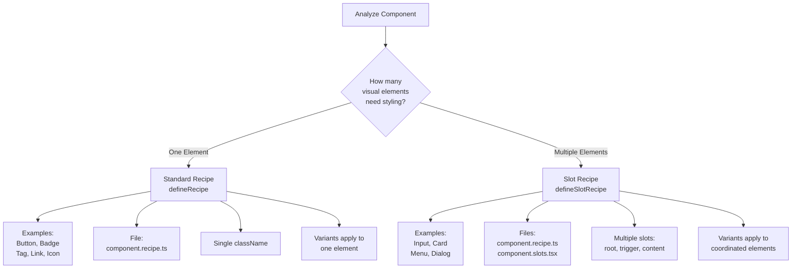

# Writing Recipes Skill

You are a Nimbus recipe specialist. This skill helps you create, update, or validate Chakra UI v3 recipes using Nimbus design tokens.

## Critical Requirement

**Nimbus uses Chakra UI v3 mechanics with Nimbus design tokens.** You MUST NOT use default Chakra tokens.

## Mode Detection

Parse the request to determine the operation:

- **create** - Generate new recipe files and registration
- **update** - Modify existing recipe (add variants, change styles)
- **validate** - Check recipe compliance with guidelines

If no mode is specified, default to **create**.

## Required Research (All Modes)

Before implementation, you MUST research in parallel:

1. **Read** `@docs/file-type-guidelines/recipes.md` for Nimbus patterns
2. **Query** Chakra UI v3 docs via context7 for recipe mechanics:
   ```
   Library: @chakra-ui/react
   Query: "defineRecipe defineSlotRecipe patterns"
   ```
3. **Analyze** existing recipes for consistency:
   ```bash
   ls packages/nimbus/src/components/*/recipes/*.recipe.ts
   cat packages/nimbus/src/components/button/recipes/button.recipe.ts
   ```
4. **Review** available Nimbus tokens:
   ```bash
   cat packages/tokens/src/index.ts
   ```

## Create Mode

### Recipe Type Decision Flow

Use this diagram to determine which recipe type to create:



### Recipe Type Decision

You MUST determine if the component needs:

- **Standard Recipe** (`defineRecipe`) - Single-element components
  - Examples: Button, Badge, Tag, Link
  - File: `{component}.recipe.ts`

- **Slot Recipe** (`defineSlotRecipe`) - Multi-part components
  - Examples: Input, Card, Menu, Dialog
  - Files: `{component}.recipe.ts` + `{component}.slots.tsx`

### File Structure

You MUST create files in this structure:

```
packages/nimbus/src/components/{component}/
├── recipes/
│   └── {component}.recipe.ts          # REQUIRED
├── {component}.types.ts               # MUST update with recipe types
└── {component}.slots.tsx              # REQUIRED for slot recipes
```

### Standard Recipe Template

```typescript
import { defineRecipe } from '@chakra-ui/react'

/**
 * Recipe for the {ComponentName} component.
 *
 * @see {@link https://nimbus.docs.link/{component}}
 */
export const {componentName}Recipe = defineRecipe({
  className: '{component-name}',
  description: 'Recipe for {ComponentName} component',

  base: {
    // Base styles - MUST use Nimbus tokens
  },

  variants: {
    size: {
      sm: { /* SHOULD define */ },
      md: { /* MUST define as default */ },
      lg: { /* SHOULD define */ },
    },
    appearance: {
      // MUST define at least one appearance
    },
  },

  defaultVariants: {
    // MUST specify defaults for all variants
    size: 'md',
  },
})
```

### Slot Recipe Template

```typescript
import { defineSlotRecipe } from '@chakra-ui/react'

/**
 * Recipe for the {ComponentName} component slots.
 *
 * @see {@link https://nimbus.docs.link/{component}}
 */
export const {componentName}Recipe = defineSlotRecipe({
  className: '{component-name}',
  description: 'Recipe for {ComponentName} component',

  slots: ['root', /* slot names */],

  base: {
    root: { /* base styles */ },
    // MUST define base for each slot
  },

  variants: {
    size: {
      md: {
        root: { /* MUST define for each slot */ },
      },
    },
  },

  defaultVariants: {
    size: 'md',
  },
})
```

### Type Integration

You MUST update the component's types file:

```typescript
import { type RecipeVariantProps } from '@chakra-ui/react'
import { type {componentName}Recipe } from './recipes/{component}.recipe'

/**
 * Recipe variant props for {ComponentName}.
 */
export type {ComponentName}RecipeProps = RecipeVariantProps<typeof {componentName}Recipe>

/**
 * Props for the {ComponentName} component.
 */
export type {ComponentName}Props = {ComponentName}RecipeProps & {
  // Component-specific props
}
```

### Slots File (Slot Recipes Only)

You MUST create a slots file for slot recipes:

```typescript
import { createSlotRecipeContext } from '@chakra-ui/react'
import { {componentName}Recipe } from './recipes/{component}.recipe'

const { withProvider, withContext } = createSlotRecipeContext({
  recipe: {componentName}Recipe,
})

export const {ComponentName}SlotProvider = withProvider(/* implementation */)
export const use{ComponentName}Styles = withContext
```

### Registration (CRITICAL)

You MUST register the recipe in `packages/nimbus/src/theme/recipes.ts`:

**For standard recipes:**
```typescript
export { {componentName}Recipe } from '../components/{component}/recipes/{component}.recipe'

// Add to recipes object:
recipes: {
  '{component-name}': {componentName}Recipe,
}
```

**For slot recipes:**
```typescript
export { {componentName}Recipe } from '../components/{component}/recipes/{component}.recipe'

// Add to slotRecipes object:
slotRecipes: {
  '{component-name}': {componentName}Recipe,
}
```

### Verification

You MUST run these commands after creation:

```bash
pnpm --filter @commercetools/nimbus typecheck
pnpm --filter @commercetools/nimbus build-theme-typings
pnpm --filter @commercetools/nimbus build
```

You MUST verify generated types exist:
```bash
ls packages/nimbus/styled-system/recipes/{component-name}.*
```

## Update Mode

### Process

1. You MUST read the current recipe file
2. You MUST analyze similar patterns in other recipes
3. You SHOULD preserve existing variant structure
4. You MUST maintain token consistency
5. You MUST update JSDoc if adding new capabilities

### Common Updates

- **Add variant** - New size, appearance, or state
- **Add compound variant** - Combination of existing variants
- **Modify base styles** - Change default styling
- **Add slots** - Convert standard to slot recipe (requires major refactor)

### Post-Update

You MUST verify the changes:
```bash
pnpm --filter @commercetools/nimbus typecheck
pnpm --filter @commercetools/nimbus build
```

## Validate Mode

### Validation Checklist

You MUST validate against these requirements:

#### File Structure
- [ ] Recipe file location MUST be: `packages/nimbus/src/components/{component}/recipes/{component}.recipe.ts`
- [ ] Import MUST be from `@chakra-ui/react`
- [ ] Export name MUST follow pattern: `{componentName}Recipe`

#### Recipe Definition
- [ ] MUST use `defineRecipe()` or `defineSlotRecipe()`
- [ ] MUST have `className` property (kebab-case)
- [ ] MUST have `description` property
- [ ] MUST have JSDoc comment with link

#### Token Usage (CRITICAL)
- [ ] MUST use Nimbus tokens, NOT Chakra defaults
- [ ] MUST NOT have hardcoded values: `blue.500`, `#fff`, `16px`
- [ ] MUST use token references: `colors.*`, `spacing.*`, `radii.*`

#### Variants
- [ ] MUST have `defaultVariants` defined
- [ ] Variant names SHOULD follow conventions (lowercase)
- [ ] Size variant SHOULD include: `sm`, `md`, `lg`
- [ ] Default size MUST be `md`

#### Registration (CRITICAL)
- [ ] Recipe MUST be exported from `packages/nimbus/src/theme/recipes.ts`
- [ ] Recipe MUST be in theme's `recipes` or `slotRecipes` object
- [ ] Generated types MUST exist in `styled-system/recipes/`

#### Type Integration
- [ ] `RecipeVariantProps` type MUST be defined
- [ ] Component props MUST extend recipe props

### Validation Report Format

```markdown
## Recipe Validation: {ComponentName}

### Status: [✅ PASS | ❌ FAIL | ⚠️ WARNING]

### Files Reviewed
- Recipe file
- Types file
- Slots file (if applicable)
- Theme registration

### ✅ Compliant
[List passing checks]

### ❌ Violations (MUST FIX)
- [Violation with guideline reference]

### ⚠️ Warnings (SHOULD FIX)
- [Non-critical improvements]

### Registration
- Recipe Type: [Standard | Slot]
- Registered: [YES | NO]
- Types Generated: [YES | NO]
```

## Token Requirements

### Prohibited Patterns

You MUST NOT use:
```typescript
// ❌ Chakra default tokens
color: 'blue.500'
bg: 'white'
padding: '16px'
borderRadius: '4px'
```

### Required Patterns

You MUST use Nimbus tokens:
```typescript
// ✅ Nimbus tokens
color: 'colors.primary.base'
bg: 'colors.surface.default'
padding: 'spacing.4'
borderRadius: 'radii.md'
```

### Token Categories

You SHOULD use these token patterns:

- **Colors**: `colors.{category}.{variant}`
- **Spacing**: `spacing.{size}` or `space.{size}`
- **Radii**: `radii.{size}`
- **Typography**: `fontSizes.{size}`, `fontWeights.{weight}`, `lineHeights.{size}`
- **Shadows**: `shadows.{level}`
- **Transitions**: `durations.{speed}`, `easings.{curve}`

## Common Variant Patterns

### Size Variants

You SHOULD follow this pattern:
```typescript
size: {
  sm: {
    height: 'spacing.8',
    fontSize: 'fontSizes.sm',
    px: 'spacing.3',
  },
  md: {
    height: 'spacing.10',
    fontSize: 'fontSizes.md',
    px: 'spacing.4',
  },
  lg: {
    height: 'spacing.12',
    fontSize: 'fontSizes.lg',
    px: 'spacing.6',
  },
}
```

### Appearance Variants

You SHOULD implement interactive states:
```typescript
appearance: {
  primary: {
    bg: 'colors.primary.base',
    color: 'colors.primary.contrast',
    _hover: {
      bg: 'colors.primary.hover',
    },
    _active: {
      bg: 'colors.primary.active',
    },
    _disabled: {
      opacity: 0.4,
      cursor: 'not-allowed',
    },
  },
}
```

### Compound Variants

You MAY use compound variants for combinations:
```typescript
compoundVariants: [
  {
    size: 'sm',
    appearance: 'primary',
    css: {
      // Specific combination styles
    },
  },
]
```

## Error Recovery

If verification fails:

1. You MUST check recipe syntax (commas, brackets)
2. You MUST verify theme export exists
3. You MUST ensure tokens are valid
4. You SHOULD check for circular dependencies
5. You MAY need to rebuild theme typings

## Reference Examples

You SHOULD reference these recipes:
- **Standard**: `packages/nimbus/src/components/button/recipes/button.recipe.ts`
- **Slot**: `packages/nimbus/src/components/input/recipes/input.recipe.ts`
- **Complex**: `packages/nimbus/src/components/badge/recipes/badge.recipe.ts`

## RFC 2119 Key Words

- **MUST** / **REQUIRED** / **SHALL** - Absolute requirement
- **MUST NOT** / **SHALL NOT** - Absolute prohibition
- **SHOULD** / **RECOMMENDED** - Should do unless valid reason not to
- **SHOULD NOT** / **NOT RECOMMENDED** - Should not do unless valid reason
- **MAY** / **OPTIONAL** - Truly optional

---

**Execute recipe operation for: $ARGUMENTS**
