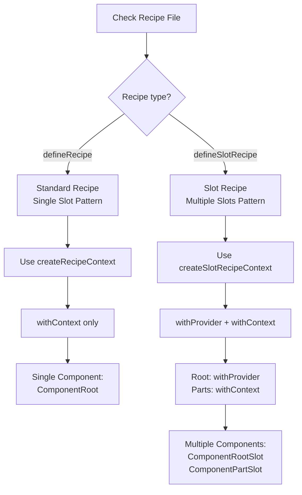

# Writing Slots Skill

You are a Nimbus slot component specialist. This skill helps you create, update,
or validate slot component files (`{component}.slots.tsx`) that bridge React
Aria components with the Nimbus Chakra UI v3 styling system.

## Critical Requirements

**Slot components inject recipe styling into React components.** They MUST
export both components AND types, use explicit return type annotations with
`SlotComponent` utility, and integrate properly with recipes.

## Mode Detection

Parse the request to determine the operation:

- **create** - Generate new slot components file
- **update** - Add new slots, enhance existing slots
- **validate** - Check slot components compliance with guidelines

If no mode is specified, default to **create**.

## Required Research (All Modes)

Before implementation, you MUST research in parallel:

1. **Read** slot component guidelines:

   ```bash
   cat docs/file-type-guidelines/slots.md
   ```

2. **Read** naming conventions:

   ```bash
   cat docs/naming-conventions.md
   ```

3. **Analyze** recipe slot definitions:

   ```bash
   cat packages/nimbus/src/components/{component}/{component}.recipe.ts
   ```

4. **Review** similar slot implementations:
   ```bash
   ls packages/nimbus/src/components/*/*.slots.tsx
   ```

## Slot Type Decision Flow

Use this diagram to determine which slot pattern to use:



## Slot Type Decision Matrix

### Standard Recipe (Single Slot)

**When:**

- Component has single visual element
- Uses `defineRecipe` in recipe file
- Simple styling needs

**Pattern:**

```typescript
const { withContext } = createRecipeContext({ recipe });
export const ComponentRoot = withContext("element", "root");
```

**Examples:** Button, Badge, Avatar

### Slot Recipe (Multiple Slots)

**When:**

- Component has multiple coordinated visual elements
- Uses `defineSlotRecipe` in recipe file
- Complex multi-element styling

**Pattern:**

```typescript
const { withProvider, withContext } = createSlotRecipeContext({ recipe });
export const ComponentRootSlot = withProvider("element", "root");
export const ComponentPartSlot = withContext("element", "part");
```

**Examples:** Menu, Input, Card, Dialog

## Mandatory Export Requirements (CRITICAL)

### MUST Export Both Components AND Types

**This is non-negotiable:**

```typescript
// ✅ CORRECT - Export both type and component
export type ButtonRootProps = HTMLChakraProps<"button">;
export const ButtonRoot: SlotComponent<HTMLButtonElement, ButtonRootProps> =
  withContext<HTMLButtonElement, ButtonRootProps>("button", "root");

// ❌ INCORRECT - Missing type export
export const ButtonRoot = withContext("button", "root");

// ❌ INCORRECT - Missing explicit return type annotation
export type ButtonRootProps = HTMLChakraProps<"button">;
export const ButtonRoot = withContext<HTMLButtonElement, ButtonRootProps>(
  "button",
  "root"
);
```

### Type Name MUST Equal Component Name + "Props"

| Component Name    | Type Name              | ✅/❌ |
| ----------------- | ---------------------- | ----- |
| `ButtonRoot`      | `ButtonRootProps`      | ✅    |
| `MenuTriggerSlot` | `MenuTriggerSlotProps` | ✅    |
| `ButtonRoot`      | `ButtonProps`          | ❌    |
| `MenuTriggerSlot` | `MenuTrigger`          | ❌    |

## SlotComponent Utility Type (CRITICAL)

**ALL slot component exports MUST include explicit return type annotation:**

```typescript
import type { SlotComponent } from "../utils/slot-types";

export const ComponentSlot: SlotComponent<TElement, TProps> = withContext<
  TElement,
  TProps
>("element", "slot");
```

### Why This Is Required

- TypeScript infers return types from `withProvider`/`withContext` that
  reference Chakra's internal generated types
- These inferred types create non-portable references to
  `node_modules/@chakra-ui/react/dist/types/styled-system/generated/recipes.gen`
- During declaration file (`.d.ts`) generation, this causes TS2742 errors
- Explicit return type annotations using `SlotComponent` create stable, portable
  types

### Type Definition

```typescript
// packages/nimbus/src/components/utils/slot-types.ts
export type SlotComponent<
  TElement = Element,
  TProps = Record<string, unknown>,
> = React.ForwardRefExoticComponent<
  React.PropsWithoutRef<TProps> & React.RefAttributes<TElement>
>;
```

## File Structure Patterns

### Pattern 1: Standard Recipe (Single Slot)

For components with `defineRecipe`:

```typescript
// button.slots.tsx
import {
  createRecipeContext,
  type HTMLChakraProps,
} from "@chakra-ui/react/styled-system";
import { buttonRecipe } from "./button.recipe";
import type { SlotComponent } from "../utils/slot-types";

const { withContext } = createRecipeContext({
  recipe: buttonRecipe,
});

// Export both type and component with explicit return type annotation
export type ButtonRootProps = HTMLChakraProps<"button">;
export const ButtonRoot: SlotComponent<HTMLButtonElement, ButtonRootProps> =
  withContext<HTMLButtonElement, ButtonRootProps>("button", "root");
```

### Pattern 2: Slot Recipe (Multiple Slots)

For components with `defineSlotRecipe`:

```typescript
// menu.slots.tsx
import {
  createSlotRecipeContext,
  type HTMLChakraProps,
} from "@chakra-ui/react/styled-system";
import { menuSlotRecipe } from "./menu.recipe";
import type { SlotComponent } from "../utils/slot-types";

const { withProvider, withContext } = createSlotRecipeContext({
  recipe: menuSlotRecipe,
});

// Root slot - provides context
export type MenuRootSlotProps = HTMLChakraProps<"div">;
export const MenuRootSlot: SlotComponent<HTMLDivElement, MenuRootSlotProps> =
  withProvider<HTMLDivElement, MenuRootSlotProps>("div", "root");

// Trigger slot - consumes context
export type MenuTriggerSlotProps = HTMLChakraProps<"button">;
export const MenuTriggerSlot: SlotComponent<
  HTMLButtonElement,
  MenuTriggerSlotProps
> = withContext<HTMLButtonElement, MenuTriggerSlotProps>("button", "trigger");

// Content slot
export type MenuContentSlotProps = HTMLChakraProps<"div">;
export const MenuContentSlot: SlotComponent<
  HTMLDivElement,
  MenuContentSlotProps
> = withContext<HTMLDivElement, MenuContentSlotProps>("div", "content");

// Item slot
export type MenuItemSlotProps = HTMLChakraProps<"div">;
export const MenuItemSlot: SlotComponent<HTMLDivElement, MenuItemSlotProps> =
  withContext<HTMLDivElement, MenuItemSlotProps>("div", "item");
```

## Context Patterns

### withProvider vs withContext

**`withProvider`:**

- Used for ROOT slot only
- Provides recipe context to children
- First slot in multi-slot components

**`withContext`:**

- Used for ALL child slots
- Consumes recipe context from provider
- Also used for single-slot components

```typescript
// Root provides context
export const ComponentRootSlot: SlotComponent<HTMLDivElement, RootProps> =
  withProvider<HTMLDivElement, RootProps>("div", "root");

// Children consume context
export const ComponentChildSlot: SlotComponent<HTMLSpanElement, ChildProps> =
  withContext<HTMLSpanElement, ChildProps>("span", "child");
```

### Context Propagation

Recipe context automatically flows through component tree:

```typescript
// In component implementation
<MenuRootSlot variant="outline" size="lg">  {/* Provides context */}
  <MenuTriggerSlot>  {/* Receives variant="outline" size="lg" */}
    Trigger
  </MenuTriggerSlot>
  <MenuContentSlot>  {/* Also receives context */}
    Content
  </MenuContentSlot>
</MenuRootSlot>
```

## Integration with React Aria

### Using asChild Pattern

Slot components use `asChild` prop to pass styles to React Aria components:

```typescript
// In component implementation
import { Button as RaButton } from 'react-aria-components';
import { ButtonRoot } from './button.slots';

export const Button = (props: ButtonProps) => {
  return (
    <ButtonRoot asChild>
      <RaButton {...props}>
        {props.children}
      </RaButton>
    </ButtonRoot>
  );
};
```

### Multiple Slots with React Aria

```typescript
// menu.root.tsx
export const MenuRoot = (props: MenuRootProps) => {
  return (
    <MenuRootSlot {...props}>
      <RaMenuTrigger>
        {props.children}
      </RaMenuTrigger>
    </MenuRootSlot>
  );
};

// menu.trigger.tsx
export const MenuTrigger = (props: MenuTriggerProps) => {
  return (
    <MenuTriggerSlot asChild>
      <RaButton {...props}>
        {props.children}
      </RaButton>
    </MenuTriggerSlot>
  );
};
```

## Type Patterns

### HTMLChakraProps

Use for components that accept all Chakra style props:

```typescript
import { type HTMLChakraProps } from "@chakra-ui/react/styled-system";

export type ComponentSlotProps = HTMLChakraProps<"div">;
// Includes all style props: backgroundColor, padding, margin, etc.
```

### Element Type Mapping

| HTML Element | Type Parameter | Element Type        |
| ------------ | -------------- | ------------------- |
| `<button>`   | `"button"`     | `HTMLButtonElement` |
| `<div>`      | `"div"`        | `HTMLDivElement`    |
| `<input>`    | `"input"`      | `HTMLInputElement`  |
| `<span>`     | `"span"`       | `HTMLSpanElement`   |
| `<a>`        | `"a"`          | `HTMLAnchorElement` |

### Type Examples

```typescript
// Button element
export type ButtonRootProps = HTMLChakraProps<"button">;
export const ButtonRoot: SlotComponent<HTMLButtonElement, ButtonRootProps> =
  withContext<HTMLButtonElement, ButtonRootProps>("button", "root");

// Div element
export type MenuContentSlotProps = HTMLChakraProps<"div">;
export const MenuContentSlot: SlotComponent<
  HTMLDivElement,
  MenuContentSlotProps
> = withContext<HTMLDivElement, MenuContentSlotProps>("div", "content");

// Input element
export type TextInputInputSlotProps = HTMLChakraProps<"input">;
export const TextInputInputSlot: SlotComponent<
  HTMLInputElement,
  TextInputInputSlotProps
> = withContext<HTMLInputElement, TextInputInputSlotProps>("input", "input");
```

## Naming Conventions (CRITICAL)

You MUST follow naming conventions from `docs/naming-conventions.md`, including:

- **Single-slot:** `{Component}Root`, `{Component}RootProps`
- **Multi-slot:** `{Component}{Part}Slot`, `{Component}{Part}SlotProps`
- **Slot names** must match recipe slot definitions exactly

See `docs/file-type-guidelines/slots.md` for complete slot patterns.

## Create Mode

### Step 1: Determine Recipe Type

Check the recipe file:

```typescript
// Standard recipe?
export const componentRecipe = defineRecipe({ ... });

// Slot recipe?
export const componentSlotRecipe = defineSlotRecipe({
  slots: ['root', 'part1', 'part2'],
  ...
});
```

### Step 2: Import Required Types

```typescript
import {
  createRecipeContext, // or createSlotRecipeContext
  type HTMLChakraProps,
} from "@chakra-ui/react/styled-system";
import { componentRecipe } from "./component.recipe"; // Import recipe
import type { SlotComponent } from "../utils/slot-types"; // MUST import
```

### Step 3: Create Context

**For standard recipe:**

```typescript
const { withContext } = createRecipeContext({
  recipe: componentRecipe,
});
```

**For slot recipe:**

```typescript
const { withProvider, withContext } = createSlotRecipeContext({
  recipe: componentSlotRecipe,
});
```

### Step 4: Create Slot Components

**For standard recipe (single slot):**

```typescript
export type ComponentRootProps = HTMLChakraProps<"element">;
export const ComponentRoot: SlotComponent<HTMLElementType, ComponentRootProps> =
  withContext<HTMLElementType, ComponentRootProps>("element", "root");
```

**For slot recipe (multiple slots):**

```typescript
// Root (provider)
export type ComponentRootSlotProps = HTMLChakraProps<"div">;
export const ComponentRootSlot: SlotComponent<
  HTMLDivElement,
  ComponentRootSlotProps
> = withProvider<HTMLDivElement, ComponentRootSlotProps>("div", "root");

// Each part (consumer)
export type ComponentPartSlotProps = HTMLChakraProps<"span">;
export const ComponentPartSlot: SlotComponent<
  HTMLSpanElement,
  ComponentPartSlotProps
> = withContext<HTMLSpanElement, ComponentPartSlotProps>("span", "part");
```

### Step 5: Verify Element and Slot Names

- Element type MUST match HTML element (`"button"`, `"div"`, etc.)
- Slot name MUST match recipe slots array
- TypeScript generic MUST match HTML element type (`HTMLButtonElement`,
  `HTMLDivElement`, etc.)

## Update Mode

### Process

1. You MUST read existing slots file
2. You MUST check recipe file for slot definitions
3. You SHOULD preserve existing structure
4. You MUST add explicit return type annotations if missing
5. You MUST export types if missing

### Common Updates

- **Add new slot** - Add to multi-slot component
- **Fix type exports** - Add missing type exports
- **Add return type annotations** - Add `SlotComponent` annotations
- **Update element types** - Change HTML element type
- **Fix naming** - Correct component/type names

## Validate Mode

### Validation Checklist

You MUST validate against these requirements:

#### File Structure

- [ ] Slots file exists with `.tsx` extension
- [ ] `SlotComponent` utility type imported from `../utils/slot-types`
- [ ] Recipe imported from recipe file
- [ ] Context created with appropriate function

#### Exports (CRITICAL)

- [ ] **All slot components have explicit return type annotations** using
      `SlotComponent<TElement, TProps>`
- [ ] **Types exported** alongside components
- [ ] **Type name = Component name + "Props"**
- [ ] Types use `HTMLChakraProps` or appropriate interface

#### Naming Conventions

- [ ] Single-slot: `{Component}Root` + `{Component}RootProps`
- [ ] Multi-slot root: `{Component}RootSlot` + `{Component}RootSlotProps`
- [ ] Multi-slot parts: `{Component}{Part}Slot` + `{Component}{Part}SlotProps`

#### Context Usage

- [ ] Root slot uses `withProvider` (for multi-slot)
- [ ] Child slots use `withContext` (for multi-slot)
- [ ] Single-slot uses `withContext`
- [ ] Context parameters correct (element type, slot name)

#### Type Safety

- [ ] Element types match HTML elements
- [ ] TypeScript generics match element types
- [ ] Slot names match recipe slot definitions
- [ ] Props interfaces appropriate for element type

#### Integration

- [ ] Recipe imported correctly
- [ ] Slot names match recipe slots array
- [ ] Types compatible with component usage
- [ ] asChild pattern supported where needed

### Validation Report Format

```markdown
## Slot Components Validation: {ComponentName}

### Status: [✅ PASS | ❌ FAIL | ⚠️ WARNING]

### Slot Type: [Standard Recipe | Slot Recipe]

### Slot Count: [1 | Multiple]

### Files Reviewed

- Slots file: `{component}.slots.tsx`
- Recipe file: `{component}.recipe.ts`
- Types file: `{component}.types.ts`

### ✅ Compliant

[List passing checks]

### ❌ Violations (MUST FIX)

- [Violation with guideline reference and line number]

### ⚠️ Warnings (SHOULD FIX)

- [Non-critical improvements]

### Slot Components Found

- [List slot components with their types and annotations]

### Missing Return Type Annotations

- [List components without SlotComponent annotation]

### Missing Type Exports

- [List components without corresponding type exports]

### Recommendations

- [Specific improvements needed]
```

## Error Recovery

If validation fails:

1. You MUST check SlotComponent imports
2. You MUST verify type exports exist
3. You MUST ensure return type annotations present
4. You MUST confirm slot names match recipe
5. You MUST validate element types match generics
6. You SHOULD rebuild to verify type generation

## Reference Examples

You SHOULD reference these slot files:

- **Standard**: `packages/nimbus/src/components/button/button.slots.tsx`
- **Multi-slot**: `packages/nimbus/src/components/menu/menu.slots.tsx`
- **Complex**: `packages/nimbus/src/components/text-input/text-input.slots.tsx`

## RFC 2119 Key Words

- **MUST** / **REQUIRED** / **SHALL** - Absolute requirement
- **MUST NOT** / **SHALL NOT** - Absolute prohibition
- **SHOULD** / **RECOMMENDED** - Should do unless valid reason not to
- **SHOULD NOT** / **NOT RECOMMENDED** - Should not do unless valid reason
- **MAY** / **OPTIONAL** - Truly optional

---

**Execute slot components operation for: $ARGUMENTS**
