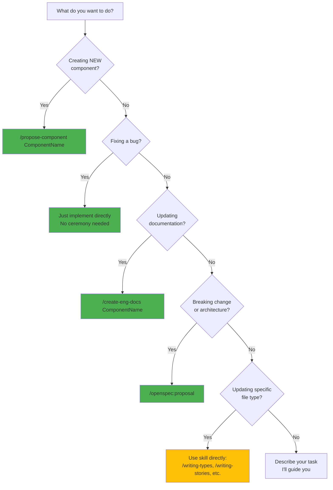

<!-- OPENSPEC:START -->

# OpenSpec Instructions

These instructions are for AI assistants working in this project.

Always open `@/openspec/AGENTS.md` when the request:

- Mentions planning or proposals (words like proposal, spec, change, plan)
- Introduces new capabilities, breaking changes, architecture shifts, or big
  performance/security work
- Sounds ambiguous and you need the authoritative spec before coding

Use `@/openspec/AGENTS.md` to learn:

- How to create and apply change proposals
- Spec format and conventions
- Project structure and guidelines

Keep this managed block so 'openspec update' can refresh the instructions.

<!-- OPENSPEC:END -->

## Quick Start: What Do You Want To Do?

Choose the command that matches your task:



**90% of the time, you need ONE of these:**

- **Creating a component?** → `/propose-component ComponentName`
- **Fixing a bug?** → Just implement directly (no ceremony)
- **Updating docs?** → `/create-eng-docs ComponentName`
- **Breaking change?** → `/openspec:proposal`

## Common Workflows

### Creating a New Component

Use the `/propose-component` command:

```
/propose-component Toast
```

This command will:

1. Invoke `/brainstorm` to clarify requirements
2. Validate against Nimbus standards
3. Create an OpenSpec proposal
4. Generate implementation tasks with TDD approach
5. Coordinate nimbus-coder to implement all required files
6. Invoke nimbus-reviewer to validate compliance

### Fixing a Bug

Just implement the fix directly:

```
Read the file, understand the issue, make the change, test it.
No OpenSpec proposal needed for bug fixes.
```

### Updating Documentation

Use the `/create-eng-docs` command:

```
/create-eng-docs Button
```

This creates both `.dev.mdx` and `.docs.spec.tsx` files with comprehensive
documentation.

### Making Breaking Changes

Use the `/openspec:proposal` command:

```
/openspec:proposal
```

This creates a change proposal for:

- Architecture changes
- Breaking API changes
- Cross-cutting concerns
- Performance optimizations

## Understanding How It Works (Optional)

### The Command → Agent → Skill Pipeline

**Commands** orchestrate complete workflows:

- `/propose-component` handles the full component creation process
- `/create-eng-docs` generates documentation
- `/openspec:proposal` creates change proposals

**Agents** handle multi-step phases (typically invoked BY commands):

- `nimbus-researcher` - Gathers documentation and patterns
- `nimbus-coder` - Implements features following guidelines
- `nimbus-reviewer` - Validates against Nimbus standards

**Skills** create specific file types (invoked by agents OR directly):

- `writing-types` - TypeScript type definitions
- `writing-stories` - Storybook stories with play functions
- `writing-recipes` - Chakra UI styling recipes
- `writing-slots` - Slot component wrappers
- `writing-developer-documentation` - Engineering docs
- `writing-designer-documentation` - Designer docs
- `writing-i18n` - Internationalization files
- `brainstorm` - Design exploration

**When to invoke directly:**

- **Commands**: Always (your main interface)
- **Agents**: Rarely (only for custom workflows)
- **Skills**: Sometimes (when updating single file types)

### When to Use OpenSpec

**Use `/propose-component`** for NEW UI components:

- Creates OpenSpec proposal + Nimbus component standards
- Validates against WCAG, React Aria, Chakra UI patterns
- Generates TDD task list with acceptance criteria

**Use `/openspec:proposal`** for everything else:

- Architecture changes
- Breaking API changes
- Cross-cutting concerns
- Performance optimizations
- New patterns (not components)

**Skip OpenSpec** for:

- Bug fixes (restoring intended behavior)
- Typos, formatting, comments
- Documentation updates
- Test additions for existing behavior
- Dependency updates (non-breaking)

## OpenSpec Proposal Guidance

For non-fix changes (new features, breaking changes, architecture shifts),
suggest creating an OpenSpec proposal via `/openspec:proposal` before
implementing. Proceed directly only for bug fixes, typos, config changes, and
tests for existing behavior.

## Project Overview

Nimbus is a multi-package design system monorepo containing React UI components,
design tokens, icons, and documentation. It uses pnpm workspaces and is built
with TypeScript, React Aria Components, and Chakra UI v3.

**Key Architecture:**

- **Monorepo Structure**: Uses pnpm workspaces with packages and apps
  directories
- **Component Library**: React components with WCAG 2.1 AA compliant
  implementation using React Aria patterns
- **Design System**: Design token-based theming system with Chakra UI v3 recipes
- **Internationalization**: Compile-time message compilation using
  `@internationalized/string` with `LocalizedStringDictionary` and Transifex
  support
- **Documentation**: JSDoc-extracted API documentation site and Storybook for
  component development

## Development Commands

### Setup and Installation

```bash
# Full initialization (clean install + build + playwright setup)
pnpm nimbus:init

# Reset project (remove node_modules and dist folders)
pnpm nimbus:reset

# Install dependencies only
pnpm install

# Install Playwright browsers (one-time setup)
pnpm playwright:install
```

### Development Server

```bash
# Start both docs site and Storybook
pnpm start

# Start documentation site only (http://localhost:5173)
pnpm start:docs

# Start Storybook only (http://localhost:6006)
pnpm start:storybook
```

### Build Commands

```bash
# Full build (tokens -> packages -> docs)
pnpm build

# Build packages only
pnpm build:packages

# Build documentation site only
pnpm build:docs

# Build/Generate design tokens
pnpm build:tokens
# or
pnpm generate:tokens
```

### Internationalization (i18n)

```bash
# Extract messages from .i18n.ts files and compile
pnpm extract-intl

# Compile only (after downloading translations from Transifex)
pnpm --filter @commercetools/nimbus-i18n build
```

### Testing

```bash
# Run all tests (both unit and Storybook tests)
pnpm test

# Run only unit tests (JSDOM-based, fast)
pnpm test:unit

# Run only Storybook tests (browser-based, slower)
pnpm test:storybook

# Run specific test file
pnpm test packages/nimbus/src/components/button/button.spec.tsx
pnpm test packages/nimbus/src/components/button/button.stories.tsx

# Run tests with minimal console output
pnpm test --silent

# Run specific test pattern
pnpm test --testNamePattern="Component.*TestName"

# Run tests in watch mode
pnpm test --watch

# Run tests with coverage
pnpm test --coverage
```

### Code Quality

```bash
# Lint all files
pnpm lint

# TypeScript type checking
pnpm typecheck

# Strict type checking (fails on errors)
pnpm typecheck:strict

# Package-specific commands
pnpm --filter @commercetools/nimbus typecheck
pnpm --filter @commercetools/nimbus build
pnpm --filter @commercetools/nimbus-tokens build
```

### Workspace-Specific Development

```bash
# Work with specific packages using --filter
pnpm --filter @commercetools/nimbus [command]
pnpm --filter @commercetools/nimbus-tokens [command]
pnpm --filter @commercetools/nimbus-icons [command]

# Common patterns for nimbus package development
pnpm --filter @commercetools/nimbus build
pnpm --filter @commercetools/nimbus typecheck
pnpm --filter @commercetools/nimbus storybook
pnpm --filter @commercetools/nimbus build-theme-typings

# Run commands for all packages
pnpm -r --filter './packages/*' build
pnpm -r --filter './packages/*' typecheck

# Component-specific testing patterns
pnpm test packages/nimbus/src/components/button/button.stories.tsx
pnpm test packages/nimbus/src/components/menu/menu.stories.tsx
pnpm test packages/nimbus/src/components/pagination/pagination.stories.tsx
```

### Release Management

```bash
# Create a changeset
pnpm changeset

# Version packages and format
pnpm changeset:version-and-format

# Check changeset status
pnpm changeset:status
```

## Code Architecture

### Package Structure

- **packages/nimbus**: Core UI component library with React Aria Components
- **packages/tokens**: Design tokens (colors, spacing, typography, animations)
- **packages/nimbus-icons**: SVG icons wrapped as React components (Material
  Icons + custom)
- **packages/color-tokens**: Brand-specific color definitions
- **packages/i18n**: Translation messages and internationalization support
- **apps/docs**: Documentation SPA with interactive examples and auto-generated
  content

### Chakra UI Imports (CRITICAL)

**NEVER use barrel imports from `@chakra-ui/react`.** Always use modular subpath
imports to avoid pulling in the entire component library:

```typescript
// ✅ Correct - modular imports
import { defineRecipe, HTMLChakraProps } from "@chakra-ui/react/styled-system";
import { Box } from "@chakra-ui/react/box";
import { Steps } from "@chakra-ui/react/steps";
import { useBreakpointValue } from "@chakra-ui/react/hooks";
import { mergeRefs } from "@/utils"; // local utility, not from Chakra

// ❌ WRONG - barrel import loads every component
import { defineRecipe, Box, mergeRefs } from "@chakra-ui/react";
```

### Component Development

For comprehensive component development guidance, see:

- Component Guidelines: `./docs/component-guidelines.md`
- Architecture Decisions:
  `./docs/file-type-guidelines/architecture-decisions.md`
- File Review Protocol: `./docs/file-review-protocol.md`

## MCP Server Tools

This project includes integrated MCP (Model Context Protocol) tooling that
provides automated development workflows. Leverage these tools for automated
tasks:

### Available MCP Servers

- **context7**: Primary interface for querying library documentation for React
  Aria, Chakra UI, and other libraries before implementing features.
- **playwright**: Browser automation for visual testing and web interaction to
  verify UI changes and test user flows.
- **sequential-thinking**: For complex planning and multi-step reasoning when
  tackling large features or architecture design decisions that require
  systematic analysis.

### Usage Guidelines

- **Always** use context7 to find relevant documentation before implementing new
  components or patterns
- **Proactively** use playwright to visually verify UI changes and capture
  screenshots for documentation
- **Leverage** sequential-thinking for breaking down complex tasks into
  manageable steps
- These tools are pre-configured and ready to use - no additional setup required

### Agent-Driven Development Workflow

**Use specialized agents proactively in an iterative cycle for all component
development:**

1. **Research Phase** (nimbus-researcher): Gather requirements, patterns,
   library documentation, and architectural guidance before writing any code
2. **Implementation Phase** (nimbus-coder): Write code strictly according to the
   guidelines and patterns identified in research
3. **Review Phase** (nimbus-reviewer): Validate code compliance against Nimbus
   standards and guidelines
4. **Iteration**: If review identifies non-compliance or improvement areas,
   return to implementation phase and repeat until all standards are met

Invoke agents autonomously when task complexity warrants it - don't wait for
explicit user requests. The goal is to leverage automation intelligently by
recognizing when a task's scope or requirements align with an agent's
capabilities.

## Development Workflow Best Practices

### Testing Strategy

The testing system uses Vitest with three distinct test categories:

| Category                          | File Pattern      | Purpose                                  | Audience     |
| --------------------------------- | ----------------- | ---------------------------------------- | ------------ |
| **Story Tests**                   | `*.stories.tsx`   | Internal component behavior testing      | Internal     |
| **Internal Unit Tests**           | `*.spec.tsx`      | Internal utility and hook testing        | Internal     |
| **Consumer Implementation Tests** | `*.docs.spec.tsx` | Documentation examples for consumer apps | **External** |

- **Story Tests**: Test component behavior with play functions in headless
  Chromium via Playwright. ALL component states, interactions, and a11y tested
  here.
- **Internal Unit Tests**: Fast JSDOM-based tests for utilities and hooks.
- **Consumer Implementation Tests**: Working code examples consumers can copy to
  test components in their apps. Injected into `.dev.mdx` docs at build time.

See [Testing Strategy Guide](./docs/file-type-guidelines/testing-strategy.md)
for detailed rules and examples.

### Build Dependencies

Understanding build order is crucial:

1. **Design tokens** (`packages/tokens`) - Must build first
2. **Packages** (`packages/*`) - Depend on tokens
3. **Documentation** (`apps/docs`) - Depends on packages
4. **i18n compilation** - Translation data for runtime
