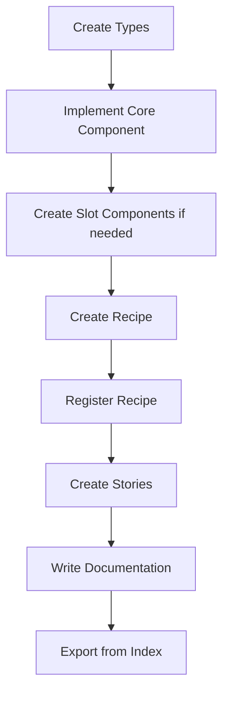

# Nimbus Component Creation Guide

This guide provides a comprehensive, standardized process for creating
components in the Nimbus design system. Follow these guidelines to ensure
consistency, accessibility, and maintainability across all components.

## Table of Contents

1. [Decision Framework](#decision-framework)
2. [File Structure & Organization](#file-structure--organization)
3. [Component Architecture](#component-architecture)
4. [Styling with Recipes](#styling-with-recipes)
5. [TypeScript Patterns](#typescript-patterns)
6. [Documentation Requirements](#documentation-requirements)
7. [Testing & Stories](#testing--stories)
8. [Development Workflow](#development-workflow)
9. [Validation Checklist](#validation-checklist)

---

## Decision Framework

### 1. React Aria Integration

**Rule**: React Aria integration is always the preferred approach if a component
has accessibility requirements.

**When to use React Aria:**

- Component needs keyboard navigation (buttons, menus, dialogs)
- Component has focus management requirements
- Component requires ARIA attributes for screen readers
- Multiple components need to work together (e.g., trigger + content)

**How to determine availability:**

1. Use the `context7` MCP server: `mcp__context7__resolve-library-id` to query
   React Aria documentation
2. Browse the React Aria website directly
3. Look for existing patterns in the codebase

**Implementation approach:**

- **Preferred**: Use React Aria components directly when they match requirements
- **If needed**: Compose React Aria components together
- **Last resort**: Create custom implementation if React Aria doesn't provide
  the needed functionality

**Import convention**: Use `Ra` prefix (e.g.,
`import { Button as RaButton } from 'react-aria-components'`)

### 2. Slot Components

**When to create slot components:**

- Complex component needs multiple DOM elements working together
- Need to centralize styling in the recipe file
- Recipe context (variants, size, etc.) needs to be shared between root and
  subcomponents
- Component requires multiple styleable parts

**When NOT to use slots:**

- Component doesn't need any CSS attached to it
- Simple single-element components (like Badge, Spinner)

**Naming convention**: `{ComponentName}{SubComponent}Slot` (e.g., `ButtonSlot`,
`MenuTriggerSlot`)

### 3. Compound vs Single Components

**Compound components** provide flexibility for:

- A/B testing and experimentation
- Product developer customization with style props
- Complex component hierarchies

**Decision criteria:**

- **Single component**: When standardization is more important (e.g.,
  DatePicker - one task, consistent look everywhere)
- **Compound component**: When flexibility is needed for different use cases

**Balance principle**: Always aim for a readable consumer API while allowing
necessary customization

---

## File Structure & Organization

### Standard Component Structure

```
component-name/
├── component-name.tsx              # Main component implementation
├── component-name.types.ts         # TypeScript interfaces
├── component-name.slots.tsx        # Slot components (if needed)
├── component-name.recipe.ts        # Chakra UI styling recipes
├── component-name.stories.tsx      # Storybook stories + tests (mandatory)
├── component-name.mdx             # Documentation
├── index.ts                       # Exports
├── components/                    # Compound component parts (if needed)
│   ├── sub-component.tsx
│   └── index.ts
├── hooks/                         # Component-specific hooks
│   ├── use-function.ts
│   └── index.ts
├── utils/                         # Component-specific utilities
│   ├── helper-function.ts
│   └── index.ts
└── constants/                     # Component-specific constants
    └── index.ts
```

### File Organization Rules

- **Compound sub-components**: Always go in the `components/` subfolder
- **Utilities**: Use `hooks/`, `utils/`, `constants/`, `config/` folders for
  consistency
- **Index files**: Always export both types and implementation
- **Internal APIs**: Only export what consumers need; keep implementation
  details private

---

## Component Architecture

### React Aria Integration Pattern

```typescript
import { Button as RaButton } from 'react-aria-components';
import { ComponentNameSlot } from './component-name.slots';

export const ComponentName = (props: ComponentNameProps) => {
  return (
    <ComponentNameSlot asChild>
      <RaButton {...props}>
        {props.children}
      </RaButton>
    </ComponentNameSlot>
  );
};
```

### Ref Handling

- **Single DOM node**: Forward ref to that element
- **Multiple DOM nodes**: Ref goes to the most logical element (may differ from
  style/recipe props target)
- **React 19**: Ref is part of props, no forwardRef needed

### Component API Design

- **Children handling**: Case-by-case basis, aim for readable consumer API
- **Style props**: Components typically support all available style props (camelCased CSS properties with design token access, e.g., `backgroundColor="primary.3"`, `padding="400"`, `borderRadius="200"`)
- **Props interface**: Use `ComponentNameProps` / `ComponentNameSlotProps`
  naming

---

## Styling with Recipes

### Recipe Types & Registration

**Standard recipes** (`packages/nimbus/src/theme/recipes/index.ts`):

- Components without slots
- Simple single-element styling

**Slot recipes** (`packages/nimbus/src/theme/slot-recipes/index.ts`):

- Components with slot components
- Multi-element styling needs

### Recipe Structure

**Standard Recipe** (for components without slots):

```typescript
// component-name.recipe.ts
import { defineRecipe } from "@chakra-ui/react/styled-system";

export const componentNameRecipe = defineRecipe({
  className: "nimbus-component-name",
  base: {
    /* base styles */
    display: "inline-flex",
    alignItems: "center",
    /* ... other base styles */
  },
  variants: {
    size: {
      md: {
        /* medium size styles */
      },
      sm: {
        /* small size styles */
      },
    },
    variant: {
      solid: {
        /* solid variant styles */
      },
      outline: {
        /* outline variant styles */
      },
    },
  },
  defaultVariants: {
    size: "md",
    variant: "solid",
  },
});
```

**Slot Recipe** (for components with slot components):

```typescript
// component-name.recipe.tsx
import { defineSlotRecipe } from "@chakra-ui/react/styled-system";

export const componentNameSlotRecipe = defineSlotRecipe({
  slots: ["root", "subElement"],
  className: "nimbus-component-name",
  base: {
    root: {
      /* base styles for root slot */
    },
    subElement: {
      /* base styles for sub-element slot */
    },
  },
  variants: {
    size: {
      md: {
        /* medium size styles for all slots */
      },
      sm: {
        /* small size styles for all slots */
      },
    },
  },
  defaultVariants: {
    size: "md",
  },
});
```

### Recipe Context Sharing

- Recipe context is shared automatically through Chakra UI's recipe system
- Variants and size from root component are available in slot components
- No manual context passing required

### Recipe Registration Validation

- No automated validation exists yet
- If recipe isn't registered, styles won't apply (obvious to developer)
- Manual registration in appropriate index file is required

---

## TypeScript Patterns

### Interface Definitions

```typescript
// component-name.types.ts
import { type ComponentProps } from "react";
import { type RecipeVariantProps } from "@chakra-ui/react";

export interface ComponentNameProps
  extends ComponentProps<"button">,
    RecipeVariantProps<typeof componentNameRecipe> {
  /**
   * Component-specific prop documentation
   */
  customProp?: string;
}

export interface ComponentNameSlotProps extends ComponentProps<"span"> {
  // Slot-specific props
}
```

### Export Patterns

- Always export both implementation and types from `index.ts`
- Use named exports whenever possible
- Import types with `import { type FooBar }` annotation

### Generic Components

- Decision is case-by-case basis
- Some components benefit from generics (e.g., `Button<T>`), others don't
- Consider API complexity vs. type safety benefits

---

## Documentation Requirements

### MDX Frontmatter Schema

Based on `apps/docs/src/schemas/mdx-document.ts`, include these required fields:

```yaml
---
id: Components-ComponentName # Unique identifier
title: Component Name # Component display name
description: Brief component description # One sentence summary
lifecycleState: Alpha|Beta|Stable # Optional lifecycle state
documentState: ReviewedInternal # Document review state
documentAudiences: [] # Target audiences
order: 999 # Menu display order (999 = default)
menu: # Menu hierarchy
  - Components
  - Category
  - Component Name
tags: # Search tags
  - component
  - interactive
figmaLink: >- # Optional Figma design link
  https://www.figma.com/design/...
---
```

### Content Structure

Follow existing component documentation patterns:

1. **Overview**: Component purpose and basic usage
2. **Resources**: Figma links and design resources
3. **Variables/Examples**: Code examples showing different variants
4. **Guidelines**: Usage guidelines, do's and don'ts
5. **Specs**: Props table (`<PropsTable id="ComponentName" />`)
6. **Accessibility**: Accessibility standards and keyboard interactions

### Style Props Documentation

- Components typically support all available style props
- Style props documentation is found in MDX files with menu property starting
  with `- Style Props`
- Use existing components as reference for style props patterns

---

## Testing & Stories

### Storybook Requirements

**Story structure** (start simple, add complexity):

1. **Default story**: Most basic usage
2. **Visual permutations**: All variants, sizes, states
3. **Functionality showcase**: Interactive features and capabilities
4. **Play functions**: Test component functionality

**Story organization**:

- No grouping needed between stories
- Progressive complexity: simple → variants → advanced features
- Each story should be self-contained and clear

### Accessibility Testing

- Accessibility tests run automatically with Storybook tests
- Tests fail if a11y issues are found
- Use React Aria components to get built-in accessibility compliance
- Test keyboard navigation and screen reader compatibility

### Test Coverage

- Stories serve as visual tests and documentation
- Complex components should have stories covering edge cases
- Test both controlled and uncontrolled modes when applicable

---

## Development Workflow

### 1. Planning Phase

Before coding:

1. Research React Aria component availability using `context7` MCP server
2. Analyze similar existing components for patterns
3. Decide on component architecture (single vs compound, slots needed)
4. Plan file structure based on complexity

### 2. Implementation Order



### 3. Recipe Registration

**Manual process**:

1. Create recipe in `component-name.recipe.ts`
2. Import and register in appropriate index:
   - `packages/nimbus/src/theme/recipes/index.ts` (standard recipes)
   - `packages/nimbus/src/theme/slot-recipes/index.ts` (slot recipes)

**Validation**:

- No automated checks exist
- Missing registration is obvious (no styles applied)
- Check manually that styles render correctly

### 4. Code Quality

Run these commands to ensure code quality:

- `pnpm lint` - Linting
- `pnpm build:packages` - Build validation
- `pnpm test:storybook` - Story and accessibility tests

### 5. Export Management

**Index file exports**:

```typescript
// index.ts
export { ComponentName } from "./component-name";
export { type ComponentNameProps } from "./component-name.types";
export * from "./components"; // If compound components exist
```

**Package exports**:

- Components automatically exported from main package
- Types exported for TypeScript support
- Internal implementation details kept private

---

## Validation Checklist

### ✅ Architecture Validation

- [ ] React Aria integration decision documented and implemented
- [ ] Slot components created only when needed
- [ ] Component architecture matches complexity requirements
- [ ] Ref forwarding implemented correctly

### ✅ File Structure

- [ ] All required files created with correct naming
- [ ] Compound components in `components/` folder
- [ ] Utilities in appropriate subfolders
- [ ] Index files export both types and implementation

### ✅ Styling

- [ ] Recipe created with appropriate variants and sizes
- [ ] Recipe registered in correct index file
- [ ] Recipe context sharing works for slot components
- [ ] Styles render correctly in browser

### ✅ TypeScript

- [ ] Props interfaces with JSDoc documentation
- [ ] Named exports used consistently
- [ ] Type imports use `import { type }` syntax
- [ ] Generic types only when beneficial

### ✅ Documentation

- [ ] MDX file with complete frontmatter
- [ ] All required frontmatter fields included
- [ ] Code examples for main use cases
- [ ] Guidelines with do's and don'ts
- [ ] Props table included
- [ ] Accessibility section complete

### ✅ Testing

- [ ] Storybook stories cover all variants
- [ ] Stories progress from simple to complex
- [ ] Play functions test interactivity
- [ ] Accessibility tests pass
- [ ] Manual testing in browser complete

### ✅ Quality Assurance

- [ ] `pnpm lint` passes
- [ ] `pnpm build:packages` succeeds
- [ ] `pnpm test:storybook` passes
- [ ] Component works in controlled and uncontrolled modes
- [ ] No TypeScript errors in IDE

---

## Quick Reference

### Common Patterns

**React Aria Component with Slot Component**:

```typescript
<ButtonSlot asChild>
  <RaButton {...props}>{children}</RaButton>
</ButtonSlot>
```

**Standard Recipe Registration**:

```typescript
// In packages/nimbus/src/theme/recipes/index.ts
export { componentNameRecipe } from "../components/component-name/component-name.recipe";
```

**Slot Recipe Registration**:

```typescript
// In packages/nimbus/src/theme/slot-recipes/index.ts
export { componentNameSlotRecipe } from "../components/component-name/component-name.recipe";
```

**Props Interface**:

```typescript
interface ComponentProps
  extends ComponentProps<"button">,
    RecipeVariantProps<typeof componentNameRecipe> {
  // Component-specific props
}
```

### Resources

- **Context7 MCP**: Query React Aria documentation
- **Existing Components**: Use as reference for patterns
- **Chakra UI v3**: Recipe documentation and examples
- **React Aria**: Component documentation and accessibility guidelines

---

This guide ensures consistent, accessible, and maintainable component
development across the Nimbus design system. Always refer to existing components
as examples and don't hesitate to ask questions when patterns are unclear.
