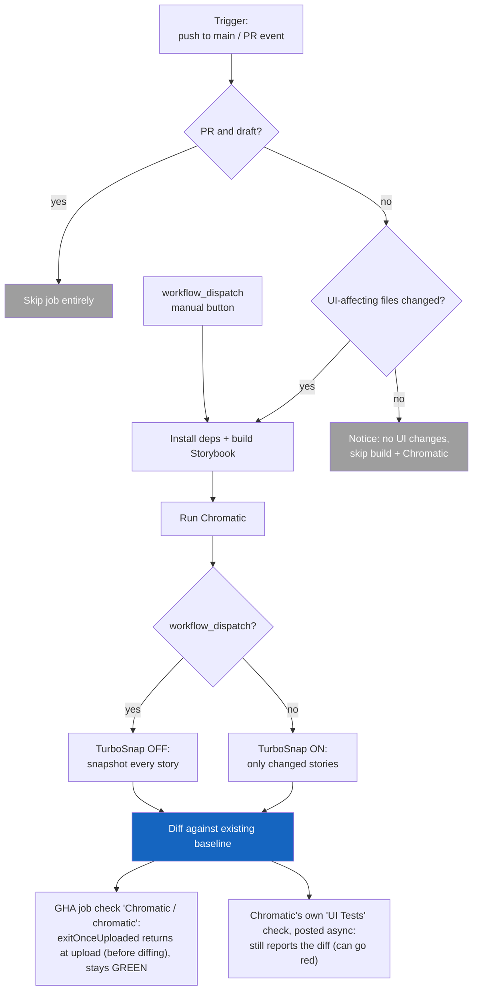

# Chromatic CI Runbook

Nimbus runs [Chromatic](https://www.chromatic.com/) to catch unintended visual
changes in components. It builds Storybook, uploads it to Chromatic, and
snapshots each story in a consistent cloud browser, then diffs those snapshots
against a stored baseline. The workflow lives in
[`.github/workflows/chromatic.yml`](../.github/workflows/chromatic.yml).

This doc is the CI runbook: how runs are triggered, how baselines work, when to
click the manual button, and what does (and doesn't) block a merge. The YAML
comments stay intentionally thin and point here.

> **Authoring or auditing stories?** You want
> [`chromatic-visual-testing.md`](./chromatic-visual-testing.md) instead - which
> stories to snapshot and why. Nothing on this page changes how you write one.

## How a run is decided

## When it runs

Triggers (the `on:` block):

- **`push` to `main`** - runs Chromatic on `main`'s history, the source of the
  baseline other branches inherit. A push builds and diffs; the baseline
  advances only on acceptance (see
  [Baselines and acceptance](#baselines-and-acceptance)).
- **`pull_request`** (`opened`, `synchronize`, `reopened`, `ready_for_review`) -
  `synchronize` is the workhorse (fires on every new commit pushed to the PR).
  `ready_for_review` matters because draft PRs are skipped, so it's what fires
  the first run when a draft is marked ready.
- **`workflow_dispatch`** - the manual "Run workflow" button. See
  [The manual button](#the-manual-button).

Two filters decide whether the job actually does work:

1. **Draft skip** (job-level `if:`) - draft PRs are skipped; pushes and manual
   runs always proceed.
2. **Changed-files gate** - Chromatic only builds when files that affect
   rendered output changed.

### The changed-files gate

The gate watches the paths whose contents feed rendered output:

| Path                       | Why it's watched                                                 |
| -------------------------- | ---------------------------------------------------------------- |
| `packages/nimbus/**`       | Component source + Storybook globals (`preview.tsx`, decorators) |
| `packages/tokens/**`       | Design tokens (colors, spacing, type)                            |
| `packages/nimbus-icons/**` | Icons rendered inside components                                 |
| `pnpm-lock.yaml`           | Dependency version changes that can shift rendered output        |

`color-tokens` and `design-token-ts-plugin` are deliberately **not** watched:
`color-tokens` isn't consumed by any rendered package, and the TS plugin is
editor-only autocomplete tooling. Neither changes rendered pixels.

Two files inside the watched packages are ignored because they don't change how
components look: `chromatic.config.json` and `.storybook/main.ts`.

The changesets **"Version Packages" release PR** (`changeset-release/main`) is a
special case: its only diff is version bumps and `CHANGELOG.md` under
`packages/nimbus/**`, which would open the gate for zero rendered-output change.
It's routed to the skip-path instead (build + Chromatic steps carry
`github.head_ref != 'changeset-release/main'`), posting a passing `UI Tests`
status without building - so it stays unblocked if `UI Tests` becomes required
(see [Merge gating](#merge-gating)). The release commit still gets a real build
on the `push` to `main`.

**What the gate diffs depends on the event** (`since_last_remote_commit` is
`${{ github.event_name == 'push' }}`): `push` compares only the newest commit,
`pull_request` compares the whole PR (`base...head`).

That PR behavior matters. Diffing only the newest commit would let a PR that
touched `button.tsx` first and `README.md` last **skip** Chromatic on the final
push, leaving the head with no build.

## TurboSnap

TurboSnap (`onlyChanged`) snapshots only the stories affected by the git diff,
traced through the module graph. This keeps normal PR runs fast and cheap.

Two things defeat it, both by design:

- **Storybook config files.** `preview.tsx` and other `.storybook/` globals are
  injected at the document level, so no story imports them and Chromatic can't
  link them to specific stories. Any change disables TurboSnap for that build.
  Batch such edits into one commit so only one full build fires.
- **Dependency bumps.** The gate watches `pnpm-lock.yaml`, and a lockfile change
  can't be traced to specific stories. That's the safe scope anyway - a React
  Aria or Chakra bump can shift pixels anywhere. Grouped Dependabot PRs keep
  this to a handful of full builds rather than one per package.

## Baselines and acceptance

A baseline isn't a build you designate - it's **the last accepted snapshot on
the branch's git ancestry**:

- Every build **diffs against** the existing baseline; running doesn't make it
  the new one.
- A baseline **moves only on acceptance** in the dashboard. Accepting on a
  branch makes that snapshot what its descendants inherit, so accepting on a PR
  branch (or on `main`) is what future branches pick up after merge.
- **Merging does not auto-accept.** No `autoAcceptChanges` is set, so a diff
  that lands on `main` unaccepted keeps resurfacing on every later build until a
  human accepts it. (`exitZeroOnChanges` only affects the CLI exit code, and
  isn't set either.)

## The manual button

`workflow_dispatch` (the "Run workflow" button in the Actions tab) forces a
**full** Chromatic build:

- Turns TurboSnap **off** (`onlyChanged: false`), so **every** story is
  snapshotted, not just changed ones.
- Bypasses the changed-files gate, so it runs even with no UI diff.

Reach for it to:

- **Re-seed a baseline** - run a full snapshot, then accept the snapshots in
  Chromatic. The button alone does not reset the baseline; acceptance is what
  establishes it. Run it on `main` to re-seed the baseline everyone inherits;
  run it on a feature branch and it only diffs against that branch's baseline.
- **Cover a TurboSnap gap** - force a full snapshot when you suspect its
  diff-tracing missed an affected story.

You can also run Chromatic locally
(`pnpm --filter @commercetools/nimbus chromatic`), but it needs
`CHROMATIC_PROJECT_TOKEN` set locally plus `--no-only-changed` to force the full
snapshot, so the button is usually the easier path.

### Config lives in two places (by design)

`packages/nimbus/chromatic.config.json` (`storybookBaseDir`, `buildScriptName`,
`zip`) drives **local** runs from inside `packages/nimbus`. The **CI** action
runs at the repo root and does not load that config, so the workflow mirrors the
values as `with:` inputs. `storybookBaseDir` and `zip` are identical - **keep
them in sync**. `buildScriptName` differs by design: CI resolves it at the root
(`build:storybook`), the config file inside `packages/nimbus`
(`build-storybook`).

## Two checks on the PR (read this before merge gating)

A PR shows **two distinct Chromatic rows**, and they mean different things.
Conflating them is the most common source of confusion:

| Check on the PR                        | What it is                                                                                         | What controls its color                                                                                                                                            |
| -------------------------------------- | -------------------------------------------------------------------------------------------------- | ------------------------------------------------------------------------------------------------------------------------------------------------------------------ |
| `Chromatic / chromatic (pull_request)` | The **GHA job** in this workflow                                                                   | The action's exit code. With `exitOnceUploaded: true` the job returns at upload - _before_ diffing - so it's **green whenever the upload succeeds**, diffs or not. |
| `UI Tests` (orange Chromatic icon)     | A status check **posted by Chromatic's servers**, asynchronously (the `exitOnceUploaded` behavior) | Chromatic's own verdict. It **still reports the diff** and goes red on an unaccepted diff, independent of the GHA job.                                             |

So "the check stays green" refers **only** to the GHA job row:
`exitOnceUploaded: true` makes the action exit before Chromatic diffs.
(`exitZeroOnChanges` is **not** set; it would only matter if we dropped
`exitOnceUploaded`.)

That row answers **"did the job run without breaking?"**, not "are there visual
changes?" Genuine breakage still turns it red: Storybook fails to build,
dependency install / `./.github/actions/ci` fails, `chromaui/action` errors
(missing or invalid `CHROMATIC_PROJECT_TOKEN`, upload/network/API failure), or a
malformed workflow. It can also show **cancelled** when
`concurrency: cancel-in-progress` supersedes the run with a newer push, or on
timeout.

## Merge gating

**Current state: `UI Tests` reports on every PR but is not a required check, so
nothing Chromatic-related blocks a merge.** Branch protection on `main` requires
only `build-and-test` (confirmed against both classic protection and rulesets);
merges are gated today only by review approval.

Two workflow pieces already make `UI Tests` a reliable gate candidate:

- **`exitZeroOnChanges` is not set**, so diffs surface on the async `UI Tests`
  check while the GHA job stays green via `exitOnceUploaded: true`. Genuine
  build failures still turn the GHA job red.
- **The skip path posts its own `UI Tests` status.** With no UI changes
  Chromatic never runs and never posts `UI Tests`, and a required check that
  never reports blocks the PR forever ("Expected - waiting for status to be
  reported") - which would wedge every docs-only PR. So the "No UI changes
  detected" step posts a passing `UI Tests` (context must match Chromatic's
  exactly) on the PR head SHA. Net: always reported, never stuck.

### Turning gating on

One switch remains: add **`UI Tests`** to the required status checks on `main`
(Settings -> Branches, or a ruleset). Point branch protection at the async
`UI Tests` check, **not** the `Chromatic / chromatic` GHA job - that one goes
green at upload, before the verdict exists, so requiring it would let a PR merge
before Chromatic finishes diffing.

Caveats:

- **Coverage is opt-in.** Only stories with `disableSnapshot: false` snapshot,
  so a regression in an un-instrumented component won't block anything until its
  stories opt in.
- **Admins bypass.** `enforce_admins` is off, so an admin can still merge past a
  red `UI Tests`.
- **Context-name coupling.** The skip-path status hardcodes the `UI Tests`
  context to match Chromatic's. If that name changes, update both the workflow
  step and the required-check config.
