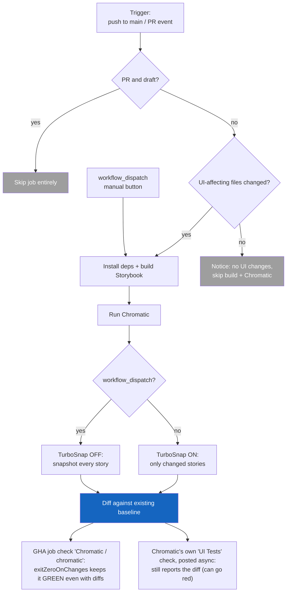

# Chromatic Visual Regression Testing

Nimbus runs [Chromatic](https://www.chromatic.com/) to catch unintended visual
changes in components. It builds Storybook, uploads it to Chromatic, and
snapshots each story in a consistent cloud browser, then diffs those snapshots
against a stored baseline. The workflow lives in
[`.github/workflows/chromatic.yml`](../.github/workflows/chromatic.yml).

This doc is the runbook: how runs are triggered, how baselines work, when to
click the manual button, and what does (and doesn't) block a merge. The YAML
comments stay intentionally thin and point here.

## How a run is decided

## When it runs

Triggers (the `on:` block):

- **`push` to `main`** - keeps `main`'s baseline current.
- **`pull_request`** (`opened`, `synchronize`, `reopened`, `ready_for_review`) -
  `synchronize` is the workhorse (fires on every new commit pushed to the PR).
  `ready_for_review` matters because draft PRs are skipped, so it's what fires
  the first run when a draft is marked ready.
- **`workflow_dispatch`** - the manual "Run workflow" button. See
  [The manual button](#the-manual-button).

Two filters decide whether the job actually does work:

1. **Draft skip** (job-level `if:`) - draft PRs are skipped; pushes and manual
   runs always proceed.
2. **Changed-files gate** - Chromatic only builds when files that affect
   rendered output changed.

### The changed-files gate

The gate watches the packages whose output feeds a rendered component:

| Path                       | Why it's watched                                                                      |
| -------------------------- | ------------------------------------------------------------------------------------- |
| `packages/nimbus/**`       | Component source + Storybook globals (`preview.tsx`, decorators, `preview-head.html`) |
| `packages/tokens/**`       | Design tokens (colors, spacing, type)                                                 |
| `packages/nimbus-icons/**` | Icons rendered inside components                                                      |

`color-tokens` and `design-token-ts-plugin` are deliberately **not** watched:
`color-tokens` isn't consumed by any rendered package, and the TS plugin is
editor-only autocomplete tooling. Neither changes rendered pixels.

Some files inside the watched packages are ignored because they don't change how
components look: `chromatic.config.json`, `.storybook/main.ts`, and
`package.json`. The `package.json` ignore is a **deliberate blind spot** - see
below.

**What the gate diffs against depends on the event** (`since_last_remote_commit`
is set to `${{ github.event_name == 'push' }}`):

- **`push`** - compares only the newest commit.
- **`pull_request`** - compares the whole PR (`base...head`), _not_ just the
  latest commit.

The PR behavior matters: if the gate only diffed the newest commit, a PR whose
first commit touched `button.tsx` and whose later commit touched only
`README.md` would **skip** Chromatic on that later push, leaving the PR head
with no Chromatic build. Diffing `base...head` means any UI change anywhere in
the PR keeps the gate open through the final commit.

## TurboSnap

TurboSnap (`onlyChanged`) tells Chromatic to snapshot only the stories affected
by the git diff, instead of every story. It traces the dependency graph from
changed files to the stories that render them. This keeps normal PR runs fast
and cheap.

**Storybook config files force a full build:** TurboSnap traces the JavaScript
module graph (`import` chains) to determine which stories are affected by a
change. Files like `preview-head.html`, `preview.tsx`, and other `.storybook/`
globals are injected at the document level - they are not imported by any story
file, so Chromatic cannot link them to specific stories. Any change to these
files disables TurboSnap for that build, snapshotting all stories instead. Avoid
editing `.storybook/` files unnecessarily mid-PR; batch those changes into a
single commit so only one full build is triggered.

**The dep-bump blind spot:** because `packages/nimbus/package.json` is ignored
by the changed-files gate, a runtime dependency bump (a new React Aria or Chakra
version that shifts pixels) will **not** trigger a normal run, and TurboSnap
wouldn't reliably scope it even if it did. After updating runtime deps, click
the manual button to force a full snapshot.

## Baselines and acceptance

A "baseline" in Chromatic is not a build you designate. It is **the last
accepted snapshot on the branch's git ancestry.** Understanding this avoids a
common misconception:

- Every build **diffs against the existing baseline.** A build does not become
  the new baseline just by running.
- A baseline only **moves when snapshots are accepted** - either explicitly in
  the Chromatic dashboard, or by changes landing on `main` (which future
  branches then inherit from).
- Because this project sets `exitZeroOnChanges: true`, diffs never auto-accept -
  a human accepts them in the dashboard.

## The manual button

`workflow_dispatch` (the "Run workflow" button in the Actions tab) forces a
**full** Chromatic build:

- Turns TurboSnap **off** (`onlyChanged: false`), so **every** story is
  snapshotted, not just changed ones.
- Bypasses the changed-files gate, so it runs even with no UI diff.

Reach for it to:

- **Re-seed a baseline** - run a full snapshot, then accept the snapshots in
  Chromatic. The button alone does not reset the baseline; acceptance is what
  establishes it. Run it on `main` to re-seed the baseline everyone inherits;
  run it on a feature branch and it only diffs against that branch's baseline.
- **Cover a TurboSnap blind spot** - most importantly after a runtime dep bump.

You can also run Chromatic locally
(`pnpm --filter @commercetools/nimbus chromatic`), but it needs
`CHROMATIC_PROJECT_TOKEN` set locally plus `--no-only-changed` to force the full
snapshot, so the button is usually the easier path.

### Config lives in two places (by design)

`packages/nimbus/chromatic.config.json` (`storybookBaseDir`, `buildScriptName`,
`zip`) drives **local** runs, which execute inside `packages/nimbus` where that
file is found. The **CI** action runs at the repo root and does not load that
config, so the workflow passes the same values as `with:` inputs. They are
intentionally mirrored, not redundant - **keep the two in sync** when either
changes.

## Two checks on the PR (read this before merge gating)

A PR shows **two distinct Chromatic rows**, and they mean different things.
Conflating them is the most common source of confusion:

| Check on the PR                        | What it is                                                                                         | What controls its color                                                                                  |
| -------------------------------------- | -------------------------------------------------------------------------------------------------- | -------------------------------------------------------------------------------------------------------- |
| `Chromatic / chromatic (pull_request)` | The **GHA job** in this workflow                                                                   | The action's exit code. `exitZeroOnChanges: true` keeps it **green even when diffs exist**.              |
| `UI Tests` (orange Chromatic icon)     | A status check **posted by Chromatic's servers**, asynchronously (the `exitOnceUploaded` behavior) | Chromatic's own verdict. It **still reports the diff** and can go red regardless of `exitZeroOnChanges`. |

So "the check stays green" refers **only** to the GHA job row.
`exitZeroOnChanges` does not touch the `UI Tests` row.

The `Chromatic / chromatic` check answers **"did the job run without
breaking?"** - not "are there visual changes?" `exitZeroOnChanges` only
suppresses the visual-diff failure; genuine breakage still turns it red:

- Storybook fails to build (`build-storybook` errors).
- Dependency install / the `./.github/actions/ci` step fails.
- The `chromaui/action` itself errors: missing/invalid
  `CHROMATIC_PROJECT_TOKEN`, upload failure, network or API error.
- A malformed workflow.

It can also show as **cancelled** (not a pass) when
`concurrency: cancel-in-progress` supersedes the run with a newer push, or on
timeout. Visual changes, by contrast, never turn this check red - they live on
the `UI Tests` check.

## Merge gating

**Current state (pre-stabilization): nothing Chromatic-related blocks a merge.**

- `exitZeroOnChanges: true` keeps the **`Chromatic / chromatic` GHA check**
  green even with visual diffs. (Genuine build failures - Storybook won't build,
  install fails - still turn that job red.)
- The **`UI Tests`** check may still report diffs, but neither Chromatic check
  is a **required** status check on `main` (branch protection requires only
  `build-and-test`, confirmed against both classic protection and rulesets), so
  neither gates a merge. Merges are blocked today only by the review-approval
  rule, not by Chromatic.

### Turning gating on later

Making Chromatic block merges is **two switches, not one**:

1. Remove `exitZeroOnChanges: true` from the workflow so diffs exit non-zero.
2. Add Chromatic's check (e.g. `UI Tests`) to the **required status checks** on
   `main` in branch protection. Point branch protection at the async Chromatic
   check, not just this job's status - otherwise a PR could merge green before
   Chromatic finishes.

Flipping only step 1 does nothing on its own, because the check isn't required.

## Writing stories for Chromatic (best practices from Chromatic's docs)

What Chromatic's docs say, and how it maps to how we author Nimbus stories.

### Directly relevant to our setup

**Snapshot is taken only at the end of the play function.** "Chromatic waits for
the entire play function to execute and captures a snapshot only at the end."
Two consequences for us:

- IconButton's `Base`, with its six `step()`s, produces exactly one snapshot -
  the final resting state (button focused after the space-bar step). That's
  precisely why the `afterEach` blur (in `preview.tsx`) matters: the end state
  is what gets captured.
- If you want a snapshot of an intermediate state, the docs say to break it into
  multiple stories rather than expect mid-play captures. So splitting `Base`
  would only be worth it if you wanted to snapshot a state that isn't its final
  one - which we don't.

**Disabling snapshots is a first-class, recommended mechanism.**
`chromatic.disableSnapshot` is settable "at story, component, and project
levels." That's exactly our layering: project default `disableSnapshot: true` in
`preview.tsx`, overridden to `false` on the VRT stories. The docs explicitly
call out disabling for interaction-focused / behavior tests to "prevent false
positives" - which validates leaving `WithRef` (and Button's context /
DOM-filtering stories) un-snapshotted.

**Cost is controlled by TurboSnap and matrix-packing, not by dropping visual
states.** TurboSnap bills unchanged snapshots at 1/5 cost, and packing a whole
`colorPalette × size × variant × state` grid into one `SmokeTest` render keeps
combinatorial coverage down to a single billable snapshot. Those are the levers.
The `vrt` selection is therefore not "snapshot fewer states" - every visual
state must still be covered - it's "don't re-snapshot a state an on-snapshot
already covers." Turning an individual per-axis story's snapshot off loses no
coverage _when_ its states are already captured elsewhere - by the matrix, or by
a dedicated story like `Disabled` for the uniform states the matrix omits; the
per-component audit is what confirms that. Dropping a state no snapshot covers
does lose coverage. Never trade a visual state away to save cost.

**One matrix beats many individual snapshots for the routine combinations.**
Folding the size/variant/palette/state grid into a single `SmokeTest` render
keeps it to one billable snapshot rather than one per combination, and a
reviewer catches cross-axis regressions in a single image because every state
sits next to its neighbors. The tradeoff is granularity: a diff in any one cell
flags the whole snapshot, and editing the matrix re-snapshots the entire grid
(Chromatic can't sub-diff within one image). So reserve standalone snapshots for
states that need distinct setup or deserve isolated review (`Focused`,
`DisabledGroup`, an open menu), not for states that are straight recipe output.

**Hover and pressed are a known coverage gap.** They are genuine visual states,
but neither is currently captured, and it's an infra limitation, not a choice:

- **Hover** can't be landed from a play function in the snapshot browser. A
  spike confirmed `userEvent.hover` produces neither a real CSS `:hover` nor
  React Aria's `data-hovered`, and a synthetic `pointerenter` doesn't set it
  either. Capturing it needs the `storybook-addon-pseudo-states` addon to force
  the state **plus** recipe normalization, because our button-family recipes are
  split between Chakra `_hover` (compiles to `:hover, [data-hover]`) and React
  Aria's `[data-hovered]` attribute - an addon forces one convention, so the
  recipes have to converge on it. Track this as a cross-cutting foundation task,
  not per-component work.
- **Pressed** needs nothing: no button-family recipe styles `:active`/pressed,
  so there is no visual state to capture.

### Broader best practices

- **Cover every visual state/variation** - "the more things we have in
  Storybook, the more coverage we get." This is the governing rule: the
  `SmokeTest` matrix must be **exhaustive** over the axes that _interact_
  (`colorPalette × size × variant`, plus selected/unselected for toggles), and
  any state the matrix can't render in one static image (focus ring,
  disabled-but-focusable, open tooltip/popover, special layouts) gets its own
  snapshotted story. Coverage is the target; the matrix is just the most
  efficient container for the interacting axes.
- **Fold an axis into the matrix only if it interacts.** An axis whose
  combination with the others yields a distinct visual belongs in the grid; one
  that applies a **uniform, axis-independent transform** does not. `disabled` is
  the canonical example: it resolves to a single shared `layerStyle`
  (`opacity: 0.5` + `cursor: not-allowed`) identical across every
  palette/size/variant, so a `Disabled`/`DisabledGroup` story captures it once
  instead of the matrix re-rendering every cell at half opacity for no new
  coverage.
- **Use `play` for functional testing alongside visual** - the two aren't in
  tension; a story can both assert behavior and be snapshotted.
- **Pause JS-driven animations manually** - Chromatic auto-pauses CSS
  animations/transitions, videos, GIFs, but not JS animations. Worth remembering
  if any button state animates via JS.
- **Fonts/async loading can shift tooltips/menus** - relevant to IconButton's
  `ColorPalettes` story (it wraps each button in a `Tooltip`). Preload fonts or
  add a delay if those snapshots turn out flaky.
- **`preview.js` barrel imports trigger full rebuilds under TurboSnap** - not
  our concern in the stories, but a caution for the shared `preview.tsx`.

### Net for the `Base` question

Our instinct is aligned with the docs: keep `Base` as one multi-step play
function (one end-state snapshot), don't split it just for VRT, and rely on
`disableSnapshot` + the `afterEach` blur to control what the single snapshot
captures. Splitting would only make sense to capture a different intermediate
state as its own baseline.

### Sources

- [Visual tests](https://www.chromatic.com/docs/visual/)
- [Snapshots](https://www.chromatic.com/docs/snapshots/)
- [Interaction tests](https://www.chromatic.com/docs/interactions/)
- [Disable snapshots](https://www.chromatic.com/docs/disable-snapshots/)
- [TurboSnap](https://www.chromatic.com/docs/turbosnap/)
