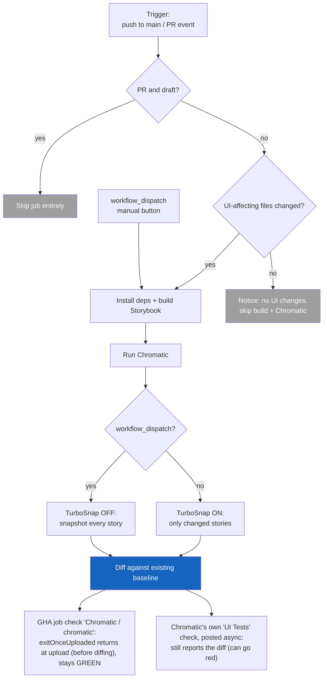

# Chromatic Visual Regression Testing

Nimbus runs [Chromatic](https://www.chromatic.com/) to catch unintended visual
changes in components. It builds Storybook, uploads it to Chromatic, and
snapshots each story in a consistent cloud browser, then diffs those snapshots
against a stored baseline. The workflow lives in
[`.github/workflows/chromatic.yml`](../.github/workflows/chromatic.yml).

This doc is the runbook: how runs are triggered, how baselines work, when to
click the manual button, and what does (and doesn't) block a merge. The YAML
comments stay intentionally thin and point here.

## How a run is decided



## When it runs

Triggers (the `on:` block):

- **`push` to `main`** - runs Chromatic on `main`'s history, the source of the
  baseline other branches inherit. A push builds and diffs; the baseline
  advances only on acceptance (see
  [Baselines and acceptance](#baselines-and-acceptance)).
- **`pull_request`** (`opened`, `synchronize`, `reopened`, `ready_for_review`) -
  `synchronize` is the workhorse (fires on every new commit pushed to the PR).
  `ready_for_review` matters because draft PRs are skipped, so it's what fires
  the first run when a draft is marked ready.
- **`workflow_dispatch`** - the manual "Run workflow" button. See
  [The manual button](#the-manual-button).

Two filters decide whether the job actually does work:

1. **Draft skip** (job-level `if:`) - draft PRs are skipped; pushes and manual
   runs always proceed.
2. **Changed-files gate** - Chromatic only builds when files that affect
   rendered output changed.

### The changed-files gate

The gate watches the paths whose contents feed rendered output:

| Path                       | Why it's watched                                                                      |
| -------------------------- | ------------------------------------------------------------------------------------- |
| `packages/nimbus/**`       | Component source + Storybook globals (`preview.tsx`, decorators, `preview-head.html`) |
| `packages/tokens/**`       | Design tokens (colors, spacing, type)                                                 |
| `packages/nimbus-icons/**` | Icons rendered inside components                                                      |
| `pnpm-lock.yaml`           | Dependency version changes that can shift rendered output                             |

`color-tokens` and `design-token-ts-plugin` are deliberately **not** watched:
`color-tokens` isn't consumed by any rendered package, and the TS plugin is
editor-only autocomplete tooling. Neither changes rendered pixels.

Some files inside the watched packages are ignored because they don't change how
components look: `chromatic.config.json` and `.storybook/main.ts`.

**What the gate diffs against depends on the event** (`since_last_remote_commit`
is set to `${{ github.event_name == 'push' }}`):

- **`push`** - compares only the newest commit.
- **`pull_request`** - compares the whole PR (`base...head`), _not_ just the
  latest commit.

The PR behavior matters: if the gate only diffed the newest commit, a PR whose
first commit touched `button.tsx` and whose later commit touched only
`README.md` would **skip** Chromatic on that later push, leaving the PR head
with no Chromatic build. Diffing `base...head` means any UI change anywhere in
the PR keeps the gate open through the final commit.

## TurboSnap

TurboSnap (`onlyChanged`) tells Chromatic to snapshot only the stories affected
by the git diff, instead of every story. It traces the dependency graph from
changed files to the stories that render them. This keeps normal PR runs fast
and cheap.

**Storybook config files force a full build:** TurboSnap traces the JavaScript
module graph (`import` chains) to determine which stories are affected by a
change. Files like `preview-head.html`, `preview.tsx`, and other `.storybook/`
globals are injected at the document level - they are not imported by any story
file, so Chromatic cannot link them to specific stories. Any change to these
files disables TurboSnap for that build, snapshotting all stories instead. Avoid
editing `.storybook/` files unnecessarily mid-PR; batch those changes into a
single commit so only one full build is triggered.

**Dependency bumps force a full snapshot:** the gate watches `pnpm-lock.yaml`,
so any dependency change (Dependabot or housekeeping) triggers a build. Because
TurboSnap can't trace a lockfile change to specific stories, it snapshots every
story instead. This is intentional: a runtime bump (a new React Aria or Chakra
version) can shift pixels anywhere, so a full snapshot is the only safe scope.
Grouped Dependabot PRs keep this to a handful of full builds rather than one per
package.

## Baselines and acceptance

A "baseline" in Chromatic is not a build you designate. It is **the last
accepted snapshot on the branch's git ancestry.** Understanding this avoids a
common misconception:

- Every build **diffs against the existing baseline.** A build does not become
  the new baseline just by running.
- A baseline only **moves when snapshots are accepted** in the Chromatic
  dashboard. Accepting on a branch makes that snapshot the baseline its
  descendants inherit, so accepting on a PR branch (or on `main` itself) is what
  future branches pick up after merge.
- **Merging does not auto-accept.** This project sets no `autoAcceptChanges`, so
  a diff that lands on `main` unaccepted stays that way - `main`'s baseline does
  not advance, and the same diff resurfaces on every later build until a human
  accepts it. (`exitZeroOnChanges` is unrelated to acceptance; it only affects
  the CLI exit code, and it isn't set here either.)

## The manual button

`workflow_dispatch` (the "Run workflow" button in the Actions tab) forces a
**full** Chromatic build:

- Turns TurboSnap **off** (`onlyChanged: false`), so **every** story is
  snapshotted, not just changed ones.
- Bypasses the changed-files gate, so it runs even with no UI diff.

Reach for it to:

- **Re-seed a baseline** - run a full snapshot, then accept the snapshots in
  Chromatic. The button alone does not reset the baseline; acceptance is what
  establishes it. Run it on `main` to re-seed the baseline everyone inherits;
  run it on a feature branch and it only diffs against that branch's baseline.
- **Cover a TurboSnap gap** - force a full snapshot when you suspect its
  diff-tracing missed an affected story.

You can also run Chromatic locally
(`pnpm --filter @commercetools/nimbus chromatic`), but it needs
`CHROMATIC_PROJECT_TOKEN` set locally plus `--no-only-changed` to force the full
snapshot, so the button is usually the easier path.

### Config lives in two places (by design)

`packages/nimbus/chromatic.config.json` (`storybookBaseDir`, `buildScriptName`,
`zip`) drives **local** runs from inside `packages/nimbus`. The **CI** action
runs at the repo root and does not load that config, so the workflow mirrors the
values as `with:` inputs. `storybookBaseDir` and `zip` are identical - **keep
them in sync**. `buildScriptName` differs by design: CI resolves it at the root
(`build:storybook`), the config file inside `packages/nimbus`
(`build-storybook`).

## Two checks on the PR (read this before merge gating)

A PR shows **two distinct Chromatic rows**, and they mean different things.
Conflating them is the most common source of confusion:

| Check on the PR                        | What it is                                                                                         | What controls its color                                                                                                                                            |
| -------------------------------------- | -------------------------------------------------------------------------------------------------- | ------------------------------------------------------------------------------------------------------------------------------------------------------------------ |
| `Chromatic / chromatic (pull_request)` | The **GHA job** in this workflow                                                                   | The action's exit code. With `exitOnceUploaded: true` the job returns at upload - _before_ diffing - so it's **green whenever the upload succeeds**, diffs or not. |
| `UI Tests` (orange Chromatic icon)     | A status check **posted by Chromatic's servers**, asynchronously (the `exitOnceUploaded` behavior) | Chromatic's own verdict. It **still reports the diff** and goes red on an unaccepted diff, independent of the GHA job.                                             |

So "the check stays green" refers **only** to the GHA job row - visual diffs
never touch it, because `exitOnceUploaded: true` makes the action exit before
Chromatic diffs. (`exitZeroOnChanges` is **not** set; it would only matter if we
dropped `exitOnceUploaded` and let the job wait for the verdict.)

The `Chromatic / chromatic` check answers **"did the job run without
breaking?"** - not "are there visual changes?" Genuine breakage still turns it
red:

- Storybook fails to build (`build:storybook` errors).
- Dependency install / the `./.github/actions/ci` step fails.
- The `chromaui/action` itself errors: missing/invalid
  `CHROMATIC_PROJECT_TOKEN`, upload failure, network or API error.
- A malformed workflow.

It can also show as **cancelled** (not a pass) when
`concurrency: cancel-in-progress` supersedes the run with a newer push, or on
timeout. Visual changes, by contrast, never turn this check red - they live on
the `UI Tests` check.

## Merge gating

**Current state: `UI Tests` reports on every PR, but it is not yet a required
check, so nothing Chromatic-related blocks a merge.** Branch protection on
`main` requires only `build-and-test` (confirmed against both classic protection
and rulesets); merges are gated today only by the review-approval rule.

Two workflow pieces already make `UI Tests` a reliable gate candidate:

- **`exitZeroOnChanges` is not set.** Diffs surface on the async `UI Tests`
  check, not the GHA job (see "Two checks" above); the GHA job stays green via
  `exitOnceUploaded: true`. Genuine build failures - Storybook won't build,
  install fails - still turn the GHA job red.
- **The skip path posts its own `UI Tests` status.** When the changed-files gate
  finds no UI changes, Chromatic doesn't run and never posts `UI Tests`. A
  required check that never reports blocks the PR forever ("Expected - waiting
  for status to be reported"), which would wedge every docs-only PR. So the "No
  UI changes detected" step posts a passing `UI Tests` status (context must
  match Chromatic's exactly) on the PR head SHA. Net: `UI Tests` is green-or-red
  on UI PRs and instantly green on non-UI PRs - always reported, never stuck.

### Turning gating on

One switch remains:

- Add **`UI Tests`** to the **required status checks** on `main` (Settings ->
  Branches, or a ruleset). Point branch protection at the async `UI Tests`
  check, **not** the `Chromatic / chromatic` GHA job - with
  `exitOnceUploaded: true` the job goes green at upload, before the verdict
  exists, so requiring it would let a PR merge before Chromatic finishes
  diffing.

Caveats:

- **Coverage is opt-in.** Only stories with `disableSnapshot: false` snapshot,
  so only those components can produce a blocking diff (today: avatar + the
  button family). A regression in an un-instrumented component won't block
  anything until its stories opt in.
- **Admins bypass.** `enforce_admins` is off, so an admin can still merge past a
  red `UI Tests`. Tighten only if you want it airtight.
- **Context-name coupling.** The skip-path status hardcodes the `UI Tests`
  context to match Chromatic's. If Chromatic's check name ever changes, update
  both the workflow step and the required-check config.

## Deterministic dates in snapshots (the `Date` shim)

`.storybook/preview-head.html` overrides `window.Date` in the Chromatic browser
so date-dependent components snapshot the same image every day. Without it,
anything that renders "today" or a relative time drifts the baseline and shows a
spurious diff on every run. Two things read the clock: React Aria date
components read a live "today" at render (Calendar's highlighted cell), and
story args compute `today()` at module load and bake it into the output.

**Why offset instead of freeze.** The obvious fix, freezing `Date.now()` to a
constant, stabilizes the date but breaks every component that depends on time
_elapsing_, because they compute duration as `Date.now() - startTime`:

- Async loads, debounces (`use-debounce`), and `setTimeout` logic see
  `now - start === 0` forever, so they never resolve; the play function hangs
  and the snapshot captures a stuck loading state.
- Code that mints IDs from `Date.now()` returns the same value on every call,
  producing duplicate React keys / colliding IDs.

So the shim **anchors** now to a fixed instant (May 15, 2026, 12:00 UTC) and
lets real time flow forward from it:

```
anchoredNow() = ANCHOR + (realNow() - start)
```

A snapshot run lasts seconds, so `ANCHOR + a few seconds` is still May 15 (the
date is deterministic), while `Date.now()` keeps increasing, so timers resolve,
async loads finish, and `Date.now()` IDs stay unique. Freeze gives a
deterministic date but frozen time; offset gives a deterministic date _and_
elapsing time.

**Two implementation details:**

- It runs in `preview-head.html`, not a decorator, because `today()` is read at
  module-load time. `window.Date` must be replaced before any story module
  evaluates, and the `<head>` script is the only hook that runs before the
  bundle; a decorator or `beforeEach` runs too late.
- It's gated to Chromatic (`navigator.userAgent` / `chromatic=true`) and only
  overrides the no-arg path. `new Date("2020-01-01")` passes straight through,
  so explicit dates are untouched and normal interactive Storybook keeps the
  real clock.

## Writing stories for Chromatic (best practices from Chromatic's docs)

What Chromatic's docs say, and how it maps to how we author Nimbus stories.

### Directly relevant to our setup

**Snapshot is taken only at the end of the play function.** "Chromatic waits for
the entire play function to execute and captures a snapshot only at the end."
Two consequences for us:

- IconButton's `Base`, with its six `step()`s, produces exactly one snapshot -
  its final resting state. Nothing blurs the element for you, so whatever state
  the last step leaves (including a focus ring) is exactly what gets captured;
  end the play function in the state you want snapshotted.
- If you want a snapshot of an intermediate state, the docs say to break it into
  multiple stories rather than expect mid-play captures. So splitting `Base`
  would only be worth it if you wanted to snapshot a state that isn't its final
  one - which we don't.

**Disabling snapshots is a first-class, recommended mechanism.**
`chromatic.disableSnapshot` is settable "at story, component, and project
levels." That's exactly our layering: project default `disableSnapshot: true` in
`preview.tsx`, overridden to `false` on the VRT stories. The docs explicitly
call out disabling for interaction-focused / behavior tests to "prevent false
positives" - which validates leaving `WithRef` (and Button's context /
DOM-filtering stories) un-snapshotted.

**Crop padding is applied to every story, globally.** Chromatic crops each
snapshot to the story's rendered content, so an outline/selection/focus ring
(painted outside layout as a box-shadow or CSS outline) clips at the crop edge
when content sits flush against it - body or `layout: "padded"` padding sits
outside the crop and can't reach in. A `preview.tsx` decorator therefore wraps
every non-`fullscreen` story in `1rem` of padding, giving rings room in the crop
and keeping the canvas from jumping as you browse. It's independent of
`disableSnapshot` - not something you opt into per story. `fullscreen` stories
are exempt because they're meant to touch the edges.

**Cost is controlled by TurboSnap and matrix-packing, not by dropping visual
states.** TurboSnap bills unchanged snapshots at 1/5 cost, and packing a whole
`colorPalette × size × variant × state` grid into one `SmokeTest` render keeps
combinatorial coverage down to a single billable snapshot. Those are the levers.
The `vrt` selection is therefore not "snapshot fewer states" - every visual
state must still be covered - it's "don't re-snapshot a state an on-snapshot
already covers." Turning an individual per-axis story's snapshot off loses no
coverage _when_ its states are already captured elsewhere - by the matrix, or by
a dedicated story like `Disabled` for the uniform states the matrix omits; the
per-component audit is what confirms that. Dropping a state no snapshot covers
does lose coverage. Never trade a visual state away to save cost.

**One matrix beats many individual snapshots for the routine combinations.**
Folding the size/variant/palette/state grid into a single `SmokeTest` render
keeps it to one billable snapshot rather than one per combination, and a
reviewer catches cross-axis regressions in a single image because every state
sits next to its neighbors. The tradeoff is granularity: a diff in any one cell
flags the whole snapshot, and editing the matrix re-snapshots the entire grid
(Chromatic can't sub-diff within one image). So reserve standalone snapshots for
states that need distinct setup or deserve isolated review (`Focused`,
`DisabledGroup`, an open menu), not for states that are straight recipe output.

**Hover and pressed are a known coverage gap.** They are genuine visual states,
but neither is currently captured, and it's an infra limitation, not a choice:

- **Hover** can't be landed from a play function in the snapshot browser. A
  spike confirmed `userEvent.hover` produces neither a real CSS `:hover` nor
  React Aria's `data-hovered`, and a synthetic `pointerenter` doesn't set it
  either. Capturing it needs the `storybook-addon-pseudo-states` addon to force
  the state **plus** recipe normalization, because our button-family recipes are
  split between Chakra `_hover` (compiles to `:hover, [data-hover]`) and React
  Aria's `[data-hovered]` attribute - an addon forces one convention, so the
  recipes have to converge on it. Track this as a cross-cutting foundation task,
  not per-component work.
- **Pressed** needs nothing: no button-family recipe styles `:active`/pressed,
  so there is no visual state to capture.

### Broader best practices

- **Cover every visual state/variation** - "the more things we have in
  Storybook, the more coverage we get." This is the governing rule: the
  `SmokeTest` matrix must be **exhaustive** over the axes that _interact_
  (`colorPalette × size × variant`, plus selected/unselected for toggles), and
  any state the matrix can't render in one static image (focus ring,
  disabled-but-focusable, open tooltip/popover, special layouts) gets its own
  snapshotted story. Coverage is the target; the matrix is just the most
  efficient container for the interacting axes.
- **Fold an axis into the matrix only if it interacts.** An axis whose
  combination with the others yields a distinct visual belongs in the grid; one
  that applies a **uniform, axis-independent transform** does not. `disabled` is
  the canonical example: it resolves to a single shared `layerStyle`
  (`opacity: 0.5` + `cursor: not-allowed`) identical across every
  palette/size/variant, so a `Disabled`/`DisabledGroup` story captures it once
  instead of the matrix re-rendering every cell at half opacity for no new
  coverage.
- **Not every component needs a `SmokeTest` matrix.** A matrix earns its place
  only when the axes _interact_. When they're independent (Avatar's `size` /
  `colorPalette` / content mode don't combine into novel visuals), skip the
  matrix and opt the existing showcase stories into snapshots directly; fold a
  family of near-identical or purely behavioral stories into one labeled
  snapshot (Avatar's `AllFallbacks`) when it aids review without losing
  coverage.
- **Use `play` for functional testing alongside visual** - the two aren't in
  tension; a story can both assert behavior and be snapshotted.
- **Pause JS-driven animations manually** - Chromatic auto-pauses CSS
  animations/transitions, videos, GIFs, but not JS animations. Worth remembering
  if any button state animates via JS.
- **Fonts/async loading can shift tooltips/menus** - relevant to IconButton's
  `ColorPalettes` story (it wraps each button in a `Tooltip`). Preload fonts or
  add a delay if those snapshots turn out flaky.
- **Images need care.** Chromatic waits for images to load before capturing, but
  not for state your component _derives_ from that load (Avatar hides its
  `` until `onLoad`, and swaps to a fallback on error). Serve images
  locally (`staticDirs`) to avoid a flaky network dependency, and wait in the
  play function for any post-load / post-error state you mean to snapshot. See
  [stories.md](./file-type-guidelines/stories.md) for the pattern.
- **`preview.js` barrel imports trigger full rebuilds under TurboSnap** - not
  our concern in the stories, but a caution for the shared `preview.tsx`.

### Sources

- [Visual tests](https://www.chromatic.com/docs/visual/)
- [Snapshots](https://www.chromatic.com/docs/snapshots/)
- [Interaction tests](https://www.chromatic.com/docs/interactions/)
- [Disable snapshots](https://www.chromatic.com/docs/disable-snapshots/)
- [TurboSnap](https://www.chromatic.com/docs/turbosnap/)
