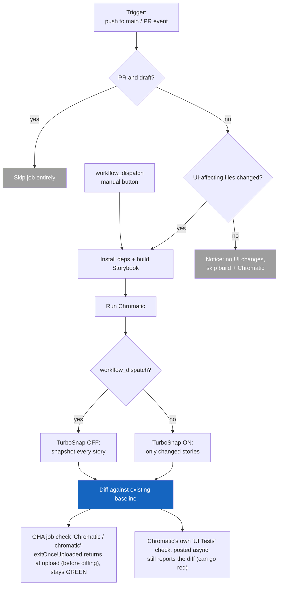

# Chromatic Visual Regression Testing

Nimbus runs [Chromatic](https://www.chromatic.com/) to catch unintended visual
changes in components. It builds Storybook, uploads it to Chromatic, and
snapshots each story in a consistent cloud browser, then diffs those snapshots
against a stored baseline. The workflow lives in
[`.github/workflows/chromatic.yml`](../.github/workflows/chromatic.yml).

This doc is the runbook: how runs are triggered, how baselines work, when to
click the manual button, and what does (and doesn't) block a merge. The YAML
comments stay intentionally thin and point here.

> **Authoring or auditing stories?** Read the per-story mechanics first: the
> Chromatic section of [`stories.md`](./file-type-guidelines/stories.md) and the
> [`writing-stories` skill](../.claude/skills/writing-stories/SKILL.md). This
> doc is the _why_ behind them.

## How a run is decided


```mermaid
flowchart TD
    A[Trigger:<br/>push to main / PR event] --> B{PR and draft?}
    B -->|yes| S[Skip job entirely]
    B -->|no| C{UI-affecting files changed?}
    M[workflow_dispatch<br/>manual button] --> D
    C -->|no| N["Notice: no UI changes,<br/>skip build + Chromatic"]
    C -->|yes| D[Install deps + build Storybook]
    D --> R[Run Chromatic]
    R --> E{workflow_dispatch?}
    E -->|yes| F[TurboSnap OFF:<br/>snapshot every story]
    E -->|no| G[TurboSnap ON:<br/>only changed stories]
    F --> H[Diff against existing baseline]
    G --> H
    H --> I["GHA job check 'Chromatic / chromatic':<br/>exitOnceUploaded returns at upload (before diffing), stays GREEN"]
    H --> K["Chromatic's own 'UI Tests' check, posted async:<br/>still reports the diff (can go red)"]

    style S fill:#9e9e9e,color:#fff
    style N fill:#9e9e9e,color:#fff
    style H fill:#1565C0,color:#fff
```

## When it runs

Triggers (the `on:` block):

- **`push` to `main`** - runs Chromatic on `main`'s history, the source of the
  baseline other branches inherit. A push builds and diffs; the baseline
  advances only on acceptance (see
  [Baselines and acceptance](#baselines-and-acceptance)).
- **`pull_request`** (`opened`, `synchronize`, `reopened`, `ready_for_review`) -
  `synchronize` is the workhorse (fires on every new commit pushed to the PR).
  `ready_for_review` matters because draft PRs are skipped, so it's what fires
  the first run when a draft is marked ready.
- **`workflow_dispatch`** - the manual "Run workflow" button. See
  [The manual button](#the-manual-button).

Two filters decide whether the job actually does work:

1. **Draft skip** (job-level `if:`) - draft PRs are skipped; pushes and manual
   runs always proceed.
2. **Changed-files gate** - Chromatic only builds when files that affect
   rendered output changed.

### The changed-files gate

The gate watches the paths whose contents feed rendered output:

| Path                       | Why it's watched                                                 |
| -------------------------- | ---------------------------------------------------------------- |
| `packages/nimbus/**`       | Component source + Storybook globals (`preview.tsx`, decorators) |
| `packages/tokens/**`       | Design tokens (colors, spacing, type)                            |
| `packages/nimbus-icons/**` | Icons rendered inside components                                 |
| `pnpm-lock.yaml`           | Dependency version changes that can shift rendered output        |

`color-tokens` and `design-token-ts-plugin` are deliberately **not** watched:
`color-tokens` isn't consumed by any rendered package, and the TS plugin is
editor-only autocomplete tooling. Neither changes rendered pixels.

Two files inside the watched packages are ignored because they don't change how
components look: `chromatic.config.json` and `.storybook/main.ts`.

The changesets **"Version Packages" release PR** (`changeset-release/main`) is a
special case: its only diff is version bumps and `CHANGELOG.md` under
`packages/nimbus/**`, which would open the gate for zero rendered-output change.
It's routed to the skip-path instead (build + Chromatic steps carry
`github.head_ref != 'changeset-release/main'`), posting a passing `UI Tests`
status without building - so it stays unblocked if `UI Tests` becomes required
(see [Merge gating](#merge-gating)). The release commit still gets a real build
on the `push` to `main`.

**What the gate diffs depends on the event** (`since_last_remote_commit` is
`${{ github.event_name == 'push' }}`): `push` compares only the newest commit,
`pull_request` compares the whole PR (`base...head`).

That PR behavior matters. Diffing only the newest commit would let a PR that
touched `button.tsx` first and `README.md` last **skip** Chromatic on the final
push, leaving the head with no build.

## TurboSnap

TurboSnap (`onlyChanged`) snapshots only the stories affected by the git diff,
traced through the module graph. This keeps normal PR runs fast and cheap.

Two things defeat it, both by design:

- **Storybook config files.** `preview.tsx` and other `.storybook/` globals are
  injected at the document level, so no story imports them and Chromatic can't
  link them to specific stories. Any change disables TurboSnap for that build.
  Batch such edits into one commit so only one full build fires.
- **Dependency bumps.** The gate watches `pnpm-lock.yaml`, and a lockfile change
  can't be traced to specific stories. That's the safe scope anyway - a React
  Aria or Chakra bump can shift pixels anywhere. Grouped Dependabot PRs keep
  this to a handful of full builds rather than one per package.

## Baselines and acceptance

A baseline isn't a build you designate - it's **the last accepted snapshot on
the branch's git ancestry**:

- Every build **diffs against** the existing baseline; running doesn't make it
  the new one.
- A baseline **moves only on acceptance** in the dashboard. Accepting on a
  branch makes that snapshot what its descendants inherit, so accepting on a PR
  branch (or on `main`) is what future branches pick up after merge.
- **Merging does not auto-accept.** No `autoAcceptChanges` is set, so a diff
  that lands on `main` unaccepted keeps resurfacing on every later build until a
  human accepts it. (`exitZeroOnChanges` only affects the CLI exit code, and
  isn't set either.)

## The manual button

`workflow_dispatch` (the "Run workflow" button in the Actions tab) forces a
**full** Chromatic build:

- Turns TurboSnap **off** (`onlyChanged: false`), so **every** story is
  snapshotted, not just changed ones.
- Bypasses the changed-files gate, so it runs even with no UI diff.

Reach for it to:

- **Re-seed a baseline** - run a full snapshot, then accept the snapshots in
  Chromatic. The button alone does not reset the baseline; acceptance is what
  establishes it. Run it on `main` to re-seed the baseline everyone inherits;
  run it on a feature branch and it only diffs against that branch's baseline.
- **Cover a TurboSnap gap** - force a full snapshot when you suspect its
  diff-tracing missed an affected story.

You can also run Chromatic locally
(`pnpm --filter @commercetools/nimbus chromatic`), but it needs
`CHROMATIC_PROJECT_TOKEN` set locally plus `--no-only-changed` to force the full
snapshot, so the button is usually the easier path.

### Config lives in two places (by design)

`packages/nimbus/chromatic.config.json` (`storybookBaseDir`, `buildScriptName`,
`zip`) drives **local** runs from inside `packages/nimbus`. The **CI** action
runs at the repo root and does not load that config, so the workflow mirrors the
values as `with:` inputs. `storybookBaseDir` and `zip` are identical - **keep
them in sync**. `buildScriptName` differs by design: CI resolves it at the root
(`build:storybook`), the config file inside `packages/nimbus`
(`build-storybook`).

## Two checks on the PR (read this before merge gating)

A PR shows **two distinct Chromatic rows**, and they mean different things.
Conflating them is the most common source of confusion:

| Check on the PR                        | What it is                                                                                         | What controls its color                                                                                                                                            |
| -------------------------------------- | -------------------------------------------------------------------------------------------------- | ------------------------------------------------------------------------------------------------------------------------------------------------------------------ |
| `Chromatic / chromatic (pull_request)` | The **GHA job** in this workflow                                                                   | The action's exit code. With `exitOnceUploaded: true` the job returns at upload - _before_ diffing - so it's **green whenever the upload succeeds**, diffs or not. |
| `UI Tests` (orange Chromatic icon)     | A status check **posted by Chromatic's servers**, asynchronously (the `exitOnceUploaded` behavior) | Chromatic's own verdict. It **still reports the diff** and goes red on an unaccepted diff, independent of the GHA job.                                             |

So "the check stays green" refers **only** to the GHA job row:
`exitOnceUploaded: true` makes the action exit before Chromatic diffs.
(`exitZeroOnChanges` is **not** set; it would only matter if we dropped
`exitOnceUploaded`.)

That row answers **"did the job run without breaking?"**, not "are there visual
changes?" Genuine breakage still turns it red: Storybook fails to build,
dependency install / `./.github/actions/ci` fails, `chromaui/action` errors
(missing or invalid `CHROMATIC_PROJECT_TOKEN`, upload/network/API failure), or a
malformed workflow. It can also show **cancelled** when
`concurrency: cancel-in-progress` supersedes the run with a newer push, or on
timeout.

## Merge gating

**Current state: `UI Tests` reports on every PR but is not a required check, so
nothing Chromatic-related blocks a merge.** Branch protection on `main` requires
only `build-and-test` (confirmed against both classic protection and rulesets);
merges are gated today only by review approval.

Two workflow pieces already make `UI Tests` a reliable gate candidate:

- **`exitZeroOnChanges` is not set**, so diffs surface on the async `UI Tests`
  check while the GHA job stays green via `exitOnceUploaded: true`. Genuine
  build failures still turn the GHA job red.
- **The skip path posts its own `UI Tests` status.** With no UI changes
  Chromatic never runs and never posts `UI Tests`, and a required check that
  never reports blocks the PR forever ("Expected - waiting for status to be
  reported") - which would wedge every docs-only PR. So the "No UI changes
  detected" step posts a passing `UI Tests` (context must match Chromatic's
  exactly) on the PR head SHA. Net: always reported, never stuck.

### Turning gating on

One switch remains: add **`UI Tests`** to the required status checks on `main`
(Settings -> Branches, or a ruleset). Point branch protection at the async
`UI Tests` check, **not** the `Chromatic / chromatic` GHA job - that one goes
green at upload, before the verdict exists, so requiring it would let a PR merge
before Chromatic finishes diffing.

Caveats:

- **Coverage is opt-in.** Only stories with `disableSnapshot: false` snapshot,
  so a regression in an un-instrumented component won't block anything until its
  stories opt in.
- **Admins bypass.** `enforce_admins` is off, so an admin can still merge past a
  red `UI Tests`.
- **Context-name coupling.** The skip-path status hardcodes the `UI Tests`
  context to match Chromatic's. If that name changes, update both the workflow
  step and the required-check config.

## Deterministic dates in snapshots

Date-dependent stories are made deterministic per story: snapshotted stories pin
a fixed date anchor (a `CalendarDate` / `CalendarDateTime` in the story args or
`defaultValue` / `defaultFocusedValue`), while stories that render a live
"today" opt out of snapshots (`tags: ["vrt"]` is omitted) and verify their
behavior with a play function instead.

## Writing stories for Chromatic (best practices from Chromatic's docs)

What Chromatic's docs say, and how it maps to how we author Nimbus stories.

### Directly relevant to our setup

**Snapshot is taken only at the end of the play function.** "Chromatic waits for
the entire play function to execute and captures a snapshot only at the end."
Two consequences:

- IconButton's `Base`, with its six `step()`s, produces exactly one snapshot -
  its final resting state. Nothing blurs the element for you, so whatever the
  last step leaves (a stray focus ring, a cleared value, a left-open overlay) is
  what gets captured. This is a separate axis from assertion-honesty: a play can
  assert exactly what its step names claim and still leave the wrong picture, so
  confirm each snapshotted story's **final state is the visual its name
  implies** - it's why an honest-looking `ReadOnly`/`Clearable` can snapshot a
  focused or emptied control.
- For an intermediate state, the docs say split it into its own story rather
  than expect a mid-play capture.

**Disabling snapshots is a first-class mechanism.** `chromatic.disableSnapshot`
is settable "at story, component, and project levels" - exactly our layering:
project default `disableSnapshot: true` in `preview.tsx`, overridden to `false`
on the VRT stories. The docs explicitly recommend disabling for
interaction-focused tests to "prevent false positives," which validates leaving
`WithRef` and Button's context/DOM-filtering stories un-snapshotted.

**Crop padding is applied to every story, globally.** Chromatic crops each
snapshot to the story's rendered content, so an outline/selection/focus ring
(painted outside layout as a box-shadow or CSS outline) clips at the crop edge
when content sits flush against it - body or `layout: "padded"` padding sits
outside the crop and can't reach in. A `preview.tsx` decorator therefore wraps
every non-`fullscreen` story in `1rem` of padding, giving rings room in the crop
and keeping the canvas from jumping as you browse. It's independent of
`disableSnapshot` - not something you opt into per story. `fullscreen` stories
are exempt because they're meant to touch the edges.

**Cost is TurboSnap and matrix-packing, never dropping states.** TurboSnap bills
unchanged snapshots at 1/5, and folding a
`colorPalette × size × variant × state` grid into one `SmokeTest` keeps
combinatorial coverage to a single billable snapshot (a reviewer also catches
cross-axis regressions in one image). Those are the only levers. The `vrt`
selection means "don't re-snapshot a state an on-snapshot already covers" -
never "snapshot fewer states"; dropping a state no snapshot covers does lose
coverage. The matrix's tradeoff is granularity: a diff in any cell flags the
whole snapshot, and editing it re-snapshots the whole grid, so reserve
standalone snapshots for states needing distinct setup or isolated review
(`Focused`, `DisabledGroup`, an open menu), not straight recipe output.

**Hover and pressed are a known coverage gap.** They are genuine visual states,
but neither is currently captured, and it's an infra limitation, not a choice:

- **Hover** can't be landed from a play function. A spike confirmed
  `userEvent.hover` produces neither a real CSS `:hover` nor React Aria's
  `data-hovered`, and a synthetic `pointerenter` doesn't either. Capturing it
  needs `storybook-addon-pseudo-states` to force the state **plus** recipe
  normalization: our button-family recipes are split between Chakra `_hover`
  (compiles to `:hover, [data-hover]`) and React Aria's `[data-hovered]`, and an
  addon forces one convention. Cross-cutting foundation work, not per-component.
- **Pressed** needs nothing _for the button family_ - none of its recipes paint
  `:active` (Button sets `data-pressed` but no rule styles it). Don't
  generalize: NumberInput's steppers set `_active` (`bg: neutral.4`), a real
  pressed visual, and for components like it pressed is a genuine uncaptured
  state deferred alongside hover. Check the recipe rather than assuming pressed
  is a no-op.

**If a play can drive the real interaction, snapshot the result and leave it
settled** - drag-over (`data-drop-target`), option focus (`data-focused`),
selection (`aria-selected`). The gap is `:hover`/`:active` and `data-hovered`,
which no play-dispatchable event sets.

### Broader best practices

- **Enumerate surfaces from source, not memory.** Read the recipe (every
  painting selector - `_hover`, `_focusWithin`, `_disabled`, `_active`,
  `data-invalid`, `data-readonly`, ... - and every `variant`/`size` key) and the
  component (every conditional render or prop, e.g.
  `isDisabled={x || isReadOnly}`). Coverage is the **cross-product** of recipe
  states × conditional branches, not the states alone: a read-only field that
  stays undimmed but disables its trailing button is a distinct surface even
  though the field "looks like default." Any "renders like default" call must
  name the exact delta you checked. Also account for **ambient axes** no prop
  names - RTL/`dir` (mirrored adornment layout), locale, theme - and for
  built-in adornments. Then **diff against sibling components' story sets**: a
  surface a peer snapshots but yours doesn't (e.g. `RTLSupport`) is a gap until
  you can name why it doesn't apply.
- **One focus snapshot per reachable focus surface.** A component with multiple
  independent focus targets - fused/adjacent focusable sub-controls, or
  `_focusWithin` on more than one region - needs a focus story per target, since
  each side's ring clears the seam differently. There is no "all focused" state
  to capture: only one element holds focus at a time, so the per-target stories
  are the complete set (don't add a combined-ring snapshot). Confirm the ring
  actually renders first: if it's on a slot that never gets the focus state, the
  snapshot captures nothing (DropZone: ring on the root, focus on a hidden inner
  element).
- **Cover every visual state/variation** - "the more things we have in
  Storybook, the more coverage we get." This is the governing rule: the
  `SmokeTest` matrix must be **exhaustive** over the axes that _interact_
  (`colorPalette × size × variant`, plus selected/unselected for toggles), and
  any state the matrix can't render in one static image (focus ring,
  disabled-but-focusable, open tooltip/popover, special layouts) gets its own
  snapshotted story. Coverage is the target; the matrix is just the most
  efficient container for the interacting axes. A single-axis showcase varies
  one axis with the rest at defaults, so a cell like
  `size="2xs" variant="ghost" colorPalette="critical"` is captured by
  **nothing** but the matrix - exactly where recipe regressions hide. Axis
  arrays must span the **full supported range**; a trimmed or commented-out
  value leaves those cells covered by nothing. Scope call: matrices iterate the
  6 `SEMANTIC_COLOR_PALETTES`; the `BRAND` (3) and `SYSTEM` (25) palettes run
  the same token machinery and are deliberately not snapshotted.
- **An inherited token makes a cross-cell neither audit covers.** `colorPalette`
  cascades, so a child with no palette default takes its host's -
  FormActionBar's spinner strokes `primary.10` in save, `critical.10` in delete.
  One frame per host palette.
- **Fold an axis into the matrix only if it interacts.** An axis whose
  combination with the others yields a distinct visual belongs in the grid; one
  that applies a **uniform, axis-independent transform** does not. `disabled` is
  the canonical example: it resolves to a single shared `layerStyle`
  (`opacity: 0.5` + `cursor: not-allowed`) identical across every
  palette/size/variant, so a `Disabled`/`DisabledGroup` story captures it once
  instead of the matrix re-rendering every cell at half opacity for no new
  coverage.
- **An axis the recipe hardcodes is not a matrix axis.** The
  `size × variant × colorPalette` grid only spans the axes the component
  actually varies. When a recipe pins one of them to a single value, that axis
  drops out entirely - MultilineTextInput hardcodes `colorPalette: "neutral"`,
  so its matrix is `state × size × variant` with no palette axis at all. This is
  distinct from the uniform-transform case above: `disabled` is a real axis
  folded out because it multiplies cells without adding signal; a hardcoded
  palette was never an axis to begin with. Don't force the full
  `SEMANTIC_COLOR_PALETTES` sweep onto a component whose recipe can only ever
  render one.
- **Cover distinct state-combinations, not just single flags.** When a component
  has multiple boolean states (selected, disabled, invalid, read-only), each
  combination that renders differently needs its own coverage. Selected-disabled
  is visually distinct from unselected-disabled, so a `Disabled` story showing
  only the unselected case leaves a gap.
- **A single state can render more than one distinct surface - give each its own
  story, not a gallery frame.** Before assuming one `Focused` / `Disabled` /
  `ReadOnly` / `Invalid` story covers a state, check whether the component
  renders it more than one way (mode-/variant-driven); if so, each distinct
  recipe surface gets its own snapshotted story. MoneyInput renders focus and
  disabled two ways - dropdown mode (a currency Select) and label mode
  (`currencies={[]}`, a static label with its own
  `currencyLabel[data-disabled] { opacity: 0.5 }` rule) - so it carries
  `Focused` and `FocusedWithCurrencyLabel`, `DisabledState` and
  `DisabledWithCurrencyLabel`. Independent surfaces don't interact the way
  matrix axes do, so folding them into one render trades away their independent
  baselines and per-surface triage. Snapshot count isn't a performance concern
  (Chromatic parallelizes; TurboSnap keeps a stable extra story near free).
- **A state that renders identically to the default gets no snapshot at all.**
  The flip side: before adding a `ReadOnly` / `Disabled` / `Invalid` story,
  confirm the recipe renders that state distinctly. With no rule for it, it
  looks exactly like the default, and a dedicated snapshot is a redundant
  baseline, not coverage. Read-only is the common trap because the call is
  component-dependent: MoneyInput styles it distinctly (it disables the currency
  Select) so it carries `ReadOnlyState`, but MultilineTextInput / NumberInput /
  TextInput have no `data-readonly` rule, so read-only renders identically to
  default and they correctly have no read-only snapshot. Same state, opposite
  call, decided purely by whether a distinct recipe surface exists.
- **Modes are for global config, not component props.** Chromatic
  [modes](https://www.chromatic.com/docs/modes/) (`chromatic.modes`) capture the
  same story under different _global_ settings - viewport, theme, locale - each
  independently baselined. A difference you produce by passing props
  (MoneyInput's dropdown vs. label mode) is a separate **story**, not a mode. We
  don't use modes at launch (single desktop viewport, light theme only); they're
  the tool if dark-mode or multi-viewport coverage lands.
- **Snapshot the component, not the harness.** Anything in the render tree lands
  in the baseline, so a snapshotted story must render the component
  **directly** - no debug read-outs, value dumps, or controls scaffolding in the
  frame. Those aids are fine on un-snapshotted behavioral stories (MoneyInput's
  `MoneyInputExample` renders a `JSON.stringify(value)` panel), but snapshotting
  one would bake the read-out into the baseline and flap on every value change.
  The line is **load-bearing and static**, not "is it a wrapper": a wrapper the
  component needs to resolve at all (DefaultPage's fixed-height `overflow: auto`
  Box), or visible children for a component that paints nothing (PageContent's
  placeholder boxes). Both are static; a read-out isn't.
- **Thin wrappers get no matrix.** A component that only constrains or forwards
  a wrapped component's props re-covers nothing by re-rendering the wrapped
  grid. FloatingActionButton wraps IconButton with a fixed circular shape, so it
  snapshots only `ColorPalettes` + `Focused` + `Disabled`, not a size × variant
  matrix - those are IconButton's states, already covered there. (Distinct from
  the independent-axes case below: there the axes don't interact; here the
  wrapper delegates them wholesale to a component that already snapshots them.)
- **A composition pattern owns the values it hardcodes.** Same paint-vs-forward
  test as the primitives, one level up: FormActionBar fixes the button set,
  order and palettes; PublicPageLayout fixes `gap`, `maxW`, `minHeight`.
  Snapshot those. Delegate what the children paint, and anything the consumer
  passes in.
- **Composed field patterns snapshot the composition, not its parts.** A
  `*Field` (`src/patterns/fields/`) has no recipe - it wraps `FormField` around
  an input - so it takes two snapshots: composed resting field, composed error
  state. Delegate the rest: layout / `direction` / `size` to FormField's
  `SmokeTest`, the InfoButton to its `OpenInfoBox`, disabled and read-only to
  the input (FormField's recipe styles neither), and every input-painted surface
  to that input's audit. Read propagation from `FormField.Input`, not the
  pattern's JSX: `cloneElement(child, inputProps)` delivers `isInvalid` /
  `isDisabled` / `isRequired` / `isReadOnly` by context, so the prop list will
  tell you a state isn't forwarded when it is.
- **A play's end state is never a reason to skip a snapshot.** Adjust the play
  to land on the frame, or author one that does. "Ends focused", "ends open",
  "ends cleaned up", "drifts because nothing is pinned" are work to do.
  Conversely a snapshotted story that ends focused needs `blur()`, or the ring
  and caret land in the baseline.
- **A compound component's unit is the recipe rule, not the realistic
  composition.** With several optional slots the pull is to snapshot every
  plausible arrangement - DefaultPage's info/form/tabular x main/detail. Slot
  presence only makes a new surface where a **rule keys off it** (there, two
  `:has()` selectors); the rest is the same slots in a different grid row. Ask
  which rule the frame alone fires - "it's a realistic page" means
  documentation, not a snapshot. It cost three of twelve first-pass opt-ins.
- **A state can be inert in the default frame - snapshot the condition that
  fires it.** Nothing looks wrong: the prop is set, the story renders, and the
  baseline records the state being _off_ while reading as coverage.
  `position: sticky` (a recipe variant in DefaultPage, an inline prop on
  PageContent.Column) paints nothing until content passes beneath it, so scroll
  in the play and capture pinned - that needs a **bounded scroll port**
  (`height: 100%` resolves against nothing otherwise) and an
  **`offsetHeight`-derived** target, so a padding-token change can't silently
  stop it scrolling past. Overflow is the other trigger seen so far:
  `scrollBehavior="inside"` is only `maxH` + `overflow: auto`, so it wants tall
  content, not a scroll.
- **Primitives with no painted surface get no VRT at all.** The test isn't "has
  a `.recipe.ts`" - it's **does it paint, and is there a state space to
  enumerate?** Three shapes fail it, and each gets zero snapshots plus a
  one-line `meta` note so the omission reads as deliberate:
  - **Pass-through style-prop primitives** (Box, Flex, Stack, Grid, SimpleGrid,
    Spacer - a `<div>`, no recipe). Every appearance comes from consumer style
    props, so a snapshot tests Chakra + tokens, not the component.
  - **A recipe that paints nothing** (Group: `inline-flex` + `alignItems`, zero
    variants). The recipe's existence isn't the point - it sets no color,
    border, or spacing, so the pixels are the children's.
  - **Headless / layout-transparent** (Region: `display: contents`). No box is
    rendered, so there's nothing to capture; the stories assert _where content
    lands_, which is DOM containment.

  The inverse is the more common case: a primitive whose recipe **does** paint
  gets a normal audit - Separator's `orientation` over a `colorPalette.6` fill,
  Icon's six-value `size`.

- **A matrix is only for _interacting_ axes.** When axes are independent - one
  just scales or recolors the other (Badge/Avatar `size × colorPalette`, Switch
  `size × on/off`) - snapshot each as its own showcase; the cross-product adds
  cells, not coverage. **Name the matrix `SmokeTest` and render it last** - the
  role name stays accurate as axes change; the axis list goes in the doc
  comment. (Older components use names like `VariantsSizesAndStates` - being
  reconciled.)
- **Use `play` for functional testing alongside visual** - the two aren't in
  tension; a story can both assert behavior and be snapshotted.
- **Animated components: know where Chromatic pauses.** It auto-pauses CSS
  transitions, CSS/SVG animations, and videos (not JS animations - pause those
  manually) and seeks a **fixed** frame, so the capture is deterministic. The
  default pause point is the **last** frame of the cycle
  (`pauseAnimationAtEnd: false` switches it to the first). The trap is an
  `iteration-count: infinite` animation whose endpoints both hide the content:
  `progress-indeterminate` sweeps a 40% pill `translateX(-100% → 300%)`, so both
  endpoints park it off the track and the default snapshot is an empty track.
  Then **pin a representative frame** in the play (`animation: none` + an
  explicit transform), as ProgressBar's `Indeterminate` does with
  `translateX(75%)`. A full-turn `spin` needs no pin - both endpoints render
  identically. The docs don't spell out the infinite case, so confirm the paused
  frame on the first run.
- **Portal-rendered components (Toast, overlays).** Chromatic captures the whole
  page, so portal content is in-frame even though it renders outside the story
  root. Hold transient UI open for the shot (`duration: Infinity` for toasts),
  await it, and clean up between stories (Toast's `clearToasts()`) so nothing
  leaks into the next capture. A portal component can be focusable in its own
  right (Toast's root has `tabIndex=0` + `focusRing: outside`) - reach it the
  real way (hotkey + Tab), not a synthetic `.focus()`.
- **Overlays: snapshot the _open_ state.** A portal component's primary visual
  is its open state, so render it open - `defaultOpen` (Dialog/Drawer/Menu) or
  open it in the play and await the portal - and leave it open; the entrance
  animation settles on its last frame. Give each distinct open surface its own
  story: open dialogs/drawers fill the viewport with a backdrop and can't share
  a frame, so there's no `SmokeTest` matrix (independent recipe variants become
  separate open showcases). open/close, focus trap, and dismissal stay
  behavioral.
- **Snapshot `placement` only when it changes the _layout_, not when it merely
  repositions the same box.** The test isn't "is it a recipe variant" - it's
  "does the box render differently, or just sit somewhere else?"
  - **Drawer** placement swaps the layout (full-height side panel ↔ full-width
    top/bottom bar) - a different shape per placement → one open snapshot each.
  - **Dialog** placement is a recipe variant but only shifts vertical position
    (`alignItems` + margin; the same box, higher/lower) → snapshot **center
    only**; top/bottom add no new visual.
  - **Menu/Tooltip** placement is React Aria positioning (same box repositioned,
    no arrow) → behavioral, no per-placement snapshot.
- **Hide the blinking text caret on a focused input.** A `Focused` snapshot
  captures the focus ring, but focusing also paints the browser's native caret,
  which Chromatic can't stabilize (its
  [animations docs](https://www.chromatic.com/docs/animations/) cover only CSS
  and JS animations), so the snapshot diffs on whichever blink phase it lands
  on. Hide it in the `Focused` play; `caret-color` inherits, so one line on the
  canvas cascades to the input. Scoped to the story rather than the shared
  `preview.tsx`:

  ```typescript
  play: async ({ canvasElement }) => {
    canvasElement.style.caretColor = "transparent"; // native caret can't be paused
    await userEvent.tab();
    // ...assert the ring
  },
  ```

- **Fonts/async loading can shift tooltips/menus** - relevant to IconButton's
  `ColorPalettes` story (it wraps each button in a `Tooltip`). Preload fonts or
  add a delay if those snapshots turn out flaky.
- **Images need care.** Chromatic waits for images to load before capturing, but
  not for state your component _derives_ from that load (Avatar hides its
  `` until `onLoad`, and swaps to a fallback on error). Serve images
  locally (`staticDirs`) to avoid a flaky network dependency, and wait in the
  play function for any post-load / post-error state you mean to snapshot. See
  [stories.md](./file-type-guidelines/stories.md) for the pattern.
- **`preview.js` barrel imports trigger full rebuilds under TurboSnap** - not
  our concern in the stories, but a caution for the shared `preview.tsx`.

### Sources

- [Visual tests](https://www.chromatic.com/docs/visual/)
- [Snapshots](https://www.chromatic.com/docs/snapshots/)
- [Interaction tests](https://www.chromatic.com/docs/interactions/)
- [Disable snapshots](https://www.chromatic.com/docs/disable-snapshots/)
- [TurboSnap](https://www.chromatic.com/docs/turbosnap/)
- [Modes](https://www.chromatic.com/docs/modes/)
