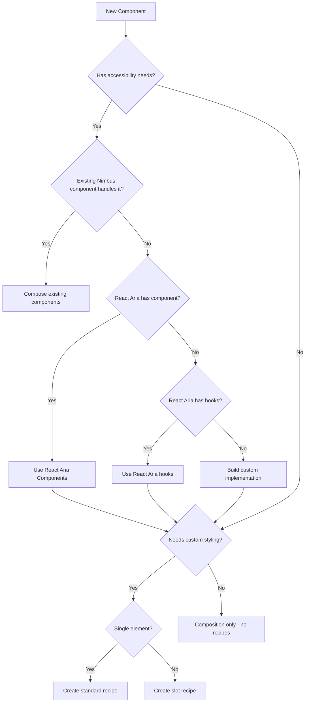

# Architecture Decisions Guidelines

[← Back to Index](../component-guidelines.md) |
[Previous: Context Files](./context-files.md)

## Purpose

This guide provides a decision matrix for determining component architecture,
including when to use React Aria, create recipes/slots, build compound
components, and other key architectural choices.

## Decision Flow



## React Aria Integration Matrix

### When to Use React Aria

| Scenario                                           | Use React Aria? | Approach                        |
| -------------------------------------------------- | --------------- | ------------------------------- |
| **New interaction pattern** not in Nimbus          | ✅ Yes          | React Aria Components preferred |
| **Keyboard navigation** not in existing components | ✅ Yes          | React Aria Components or hooks  |
| **Focus management** (trap, restoration)           | ✅ Yes          | React Aria focus hooks          |
| **ARIA attributes** not handled by Nimbus          | ✅ Yes          | React Aria Components           |
| **Composing existing Nimbus components**           | ❌ No           | Use Nimbus components directly  |
| **Simple HTML with no interaction**                | ❌ No           | Use basic HTML elements         |

### React Aria Decision Priority

1. **First check**: Can this be built with existing Nimbus components?
2. **If no**: Does React Aria Components have what you need?
3. **If no**: Can React Aria hooks provide the functionality?
4. **Last resort**: Build custom implementation

### Import Convention

Always use `Ra` prefix:

```typescript
import { Button as RaButton } from "react-aria-components";
import { Select as RaSelect } from "react-aria-components";
```

## Recipe & Slot Decision Matrix

### When to Create Recipes/Slots

| Scenario                                             | Create Recipe? | Recipe Type         |
| ---------------------------------------------------- | -------------- | ------------------- |
| **New visual styling** (colors, spacing, layout)     | ✅ Yes         | Depends on elements |
| **Variants/sizes** needed                            | ✅ Yes         | Standard or Slot    |
| **Single DOM element**                               | ✅ Yes         | Standard Recipe     |
| **Multiple DOM elements**                            | ✅ Yes         | Slot Recipe         |
| **Pure composition with existing styled components** | ❌ No          | Use existing styles |
| **No new visual styling**                            | ❌ No          | No recipe needed    |

### Examples

```typescript
// Example 1: Needs recipe - component with new visual styling
// First create cardRecipe with custom styling, then use CardSlot
export const CustomCard = () => {
  return (
    <CardSlot>  {/* CardSlot wraps your cardRecipe styling */}
      <div>Content</div>
    </CardSlot>
  );
};

// Example 2: No recipe needed - pure composition of existing styled components
// Note: This is a hypothetical example to illustrate the pattern
export const SearchField = () => {
  return (
    <Stack direction="row">  {/* Stack already has styling from Nimbus */}
      <TextInput placeholder="Search..." />  {/* Already styled */}
      <Button>Search</Button>  {/* Already styled */}
    </Stack>
  );
};
```

## Component API Decision Matrix

### Single vs Compound Components

| Criteria          | Single Component      | Compound Component         |
| ----------------- | --------------------- | -------------------------- |
| **Use cases**     | Fixed, consistent     | Variable, flexible         |
| **Composition**   | Not needed            | Required                   |
| **Parts**         | Single responsibility | Multiple coordinated parts |
| **Customization** | Props only            | Structure + props          |
| **Examples**      | Button, Input, Badge  | Menu, Select, Accordion    |

### Decision Factors

Choose **Single Component** when:

- Standardization is critical
- Single use case
- No composition flexibility needed
- Simpler API preferred

Choose **Compound Component** when:

- Flexible arrangements needed
- Multiple interactive parts
- Different layouts per use case
- Composition control important

### Critical Rule for Compound Components

**MUST have `.Root` component as first property:**

```typescript
export const Menu = {
  Root: MenuRoot, // FIRST property
  Trigger: MenuTrigger,
  Content: MenuContent,
};
```

## File Organization Decision Tree

### When to Create Subfolders

| Folder        | Create When                                       |
| ------------- | ------------------------------------------------- |
| `components/` | Building compound component with multiple parts   |
| `hooks/`      | Complex logic needs encapsulation in custom hooks |
| `utils/`      | Pure helper functions used multiple times         |
| `constants/`  | Configuration values, enums, patterns needed      |

### File Location Rules

| File Type           | Location                         | When                   |
| ------------------- | -------------------------------- | ---------------------- |
| **Main component**  | Root (`component.tsx`)           | Single component       |
| **Main component**  | Root (exports only)              | Compound component     |
| **Implementations** | `components/`                    | Compound components    |
| **Hooks**           | `hooks/`                         | ALWAYS (never in root) |
| **Context**         | Root (`{component}-context.tsx`) | State sharing needed   |
| **Utils**           | `utils/`                         | Pure functions         |
| **Constants**       | `constants/`                     | Static values          |

## State Management Decisions

### Local vs Context vs External

| State Type                 | Approach            | When to Use               |
| -------------------------- | ------------------- | ------------------------- |
| **Local component state**  | `useState`          | Single component needs    |
| **Parent-child sharing**   | Props               | Direct relationship       |
| **Compound parts sharing** | Context             | Multiple parts coordinate |
| **Cross-component**        | Context or external | Unrelated components      |
| **Complex/async**          | Custom hooks        | Encapsulation needed      |

### Controlled vs Uncontrolled

Support both patterns when:

- Component manages significant state
- Users might want control
- Forms or inputs involved

```typescript
type Props = {
  value?: string; // Controlled
  defaultValue?: string; // Uncontrolled
  onChange?: (value: string) => void;
};
```

## Complexity Levels

### Simple Component

**Characteristics:**

- Single file implementation
- Basic props interface
- Optional recipe for styling
- No subfolders needed

**File structure:**

```
button/
├── button.tsx
├── button.types.ts
├── button.recipe.ts
├── button.slots.tsx
├── button.stories.tsx
├── button.mdx
└── index.ts
```

### Compound Component

**Characteristics:**

- Multiple coordinated parts
- Components subfolder required
- Slot recipes for styling
- Possible context for state

**File structure:**

```
menu/
├── menu.tsx (exports only)
├── menu.types.ts
├── menu.recipe.ts
├── menu.slots.tsx
├── menu-context.tsx
├── components/
│   ├── menu.root.tsx
│   ├── menu.trigger.tsx
│   └── menu.item.tsx
├── menu.stories.tsx
├── menu.mdx
└── index.ts
```

### Complex Composition

**Characteristics:**

- Combines multiple patterns
- Multiple hooks and utils
- Complex state management
- Extensive type definitions

**File structure:**

```
date-picker/
├── date-picker.tsx
├── date-picker.types.ts
├── date-picker.recipe.ts
├── date-picker.slots.tsx
├── date-picker-context.tsx
├── components/
│   ├── date-picker.root.tsx
│   ├── date-picker.input.tsx
│   └── date-picker.calendar.tsx
├── hooks/
│   ├── use-date-picker.ts
│   └── use-calendar-navigation.ts
├── utils/
│   ├── date-formatters.ts
│   └── date-validators.ts
├── constants/
│   └── calendar-config.ts
├── date-picker.stories.tsx
├── date-picker.mdx
└── index.ts
```

## Quick Decision Checklist

### Starting a New Component

1. **Accessibility needs?**
   - [ ] Check existing Nimbus components first
   - [ ] Look for React Aria Components
   - [ ] Consider React Aria hooks
   - [ ] Last resort: custom implementation

2. **Visual styling needed?**
   - [ ] New styles → Create recipe
   - [ ] Single element → Standard recipe
   - [ ] Multiple elements → Slot recipe
   - [ ] Using existing components → No recipe

3. **Component structure?**
   - [ ] Fixed structure → Single component
   - [ ] Flexible composition → Compound component
   - [ ] Compound needs `.Root` first

4. **State management?**
   - [ ] Local state → useState
   - [ ] Shared between parts → Context
   - [ ] Complex logic → Custom hooks

5. **File organization?**
   - [ ] Compound → `components/` folder
   - [ ] Hooks → `hooks/` folder (always)
   - [ ] Helpers → `utils/` folder
   - [ ] Config → `constants/` folder

## Common Architecture Patterns

### Wrapper Pattern

Wrapping React Aria with Nimbus styling:

```typescript
export const Button = (props: ButtonProps) => {
  return (
    <ButtonSlot asChild>
      <RaButton {...props} />
    </ButtonSlot>
  );
};
```

### Composition Pattern

Combining existing components:

```typescript
// Note: This is a hypothetical example to illustrate the pattern
export const SearchField = (props: SearchFieldProps) => {
  return (
    <Stack direction="row">
      <TextInput {...props.inputProps} />
      <IconButton {...props.buttonProps} />
    </Stack>
  );
};
```

### Provider Pattern

Root component with context:

```typescript
export const AccordionRoot = (props: AccordionRootProps) => {
  return (
    <AccordionProvider {...props}>
      <AccordionRootSlot>
        {props.children}
      </AccordionRootSlot>
    </AccordionProvider>
  );
};
```

## Migration Strategies

### From Single to Compound

1. Keep backward compatibility with default export
2. Add compound exports gradually
3. Deprecate old API over time

```typescript
// Phase 1: Add compound alongside single
export const Menu = MenuRoot; // Backward compat
export const MenuCompound = {
  Root: MenuRoot,
  Trigger: MenuTrigger,
  Content: MenuContent,
};

// Phase 2: Switch primary export
export const Menu = {
  Root: MenuRoot,
  Trigger: MenuTrigger,
  Content: MenuContent,
};
export const MenuLegacy = MenuRoot; // Deprecated

// Phase 3: Remove legacy
export const Menu = {
  Root: MenuRoot,
  Trigger: MenuTrigger,
  Content: MenuContent,
};
```

## Related Guidelines

- [Main Component](./main-component.md) - Implementation patterns
- [Compound Components](./compound-components.md) - Multi-part components
- [Recipes](./recipes.md) - Styling decisions
- [Context Files](./context-files.md) - State sharing patterns

## Validation Checklist

- [ ] React Aria decision documented
- [ ] Recipe need evaluated
- [ ] Component API type decided
- [ ] File structure planned
- [ ] State management approach chosen
- [ ] Complexity level appropriate
- [ ] Patterns consistent with codebase
- [ ] No over-engineering
- [ ] Migration path considered (if needed)

---

[← Back to Index](../component-guidelines.md) |
[Previous: Context Files](./context-files.md)
