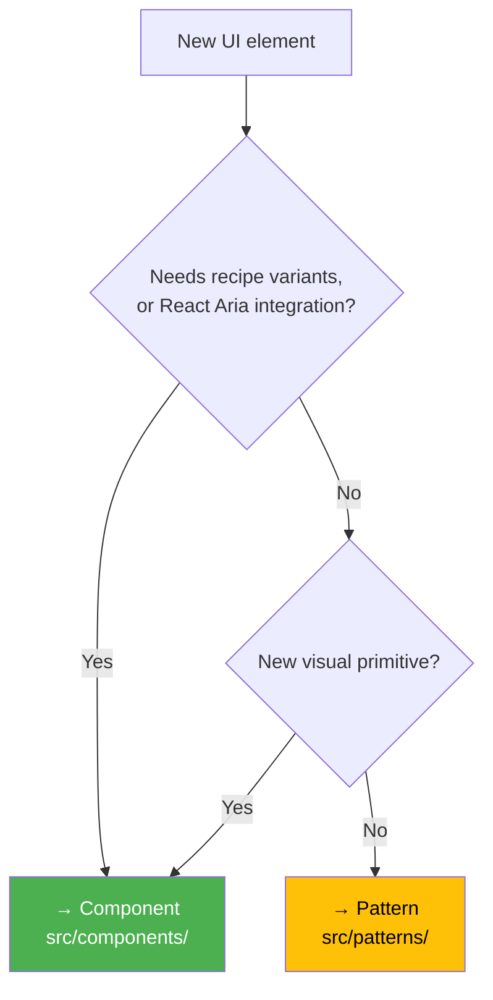

# Component vs Pattern

[← Back to Index](../component-guidelines.md) |
[Previous: Architecture Decisions](./architecture-decisions.md)

## Purpose

Nimbus ships two kinds of exports: **Components** and **Patterns**. This guide
explains the distinction for both consumers browsing the docs and contributors
deciding where new code belongs.

## For Consumers

The Nimbus docs site has two top-level sections: **Components** and
**Patterns**.

**Components** are building blocks. Each one introduces its own visual design
(colors, spacing, layout) and/or interaction behavior (keyboard navigation,
focus management, ARIA roles). They are independently themed and can be composed
together to build any UI.

**Patterns** show how to compose existing components for common use cases. Some
patterns are exported as convenience wrappers with a flat-props API (like
`TextInputField`). Others are documented as guides with copyable examples for
arrangements that vary by context.

For example:

- `TextInput` is a **component** — it has its own styled slots, React Aria
  integration, and recipe variants.
- `TextInputField` is a **pattern** — it composes `FormField` + `TextInput` into
  a single element with a flat-props API (`label`, `description`, `errors`,
  `value`, `onChange`). No new styling or interaction behavior is introduced.

You can always replace a pattern with the underlying components when you need
more control over structure or behavior.

## For Contributors

### The core question

**Am I creating a new primitive, or composing existing ones?**

If the answer is "composing existing ones," it's a pattern.

### It's a Component when

- It introduces a **new visual primitive** not covered by existing components
- It requires **new React Aria integration** (keyboard navigation, focus
  management, ARIA roles)
- It needs **new styled slots** (`defineSlotRecipe` or `defineRecipe`)
- It needs to be **independently themed** with recipe variants (size, variant,
  colorPalette)

### It's a Pattern when

- It **composes existing Nimbus components** (FormField + TextInput, Dialog +
  Buttons)
- It does **not need its own recipe** — styling comes from the composed
  components
- Its interaction behavior is **fully delegated** to the composed components

> **Layout-only exception.** A pattern MAY define a slot recipe
> (`defineSlotRecipe`) and a compound `.Root`/part API purely to encapsulate a
> **reusable layout** — provided it introduces **no recipe variants** and **no
> new interaction behavior**. The recipe carries structural styles only (flex
> layout, gap, wrapping); all visual treatment (bg, border, radius, padding)
> stays with the consumer via forwarded style props. `FeedbackCard`
> (`src/patterns/feedback/feedback-card/`) is the reference example. It remains
> a pattern because it composes existing primitives and adds no new themed
> primitive — the slot recipe is a layout convenience, not an independent visual
> identity.

### Decision flow



A **layout-only slot recipe with no variants** does not trigger the Component
branch — answer Q1 "No" for it (see the layout-only exception above).
`FeedbackCard` takes this path: it has a slot recipe but no variants and no
React Aria integration, so it stays a Pattern.

### Where code lives

The directory determines how the docs site categorizes the export:

- `src/components/` → appears under **Components** on the docs site
- `src/patterns/` → appears under **Patterns** on the docs site

### File structure

**Component** — full infrastructure with recipe, slots, and documentation:

```
src/components/component-name/
├── index.ts                        # Barrel exports
├── component-name.tsx              # Implementation
├── component-name.types.ts         # TypeScript interfaces
├── component-name.recipe.ts        # Styling recipe
├── component-name.slots.tsx        # Styled slot components
├── component-name.i18n.ts          # Internationalization (if needed)
├── component-name.stories.tsx      # Storybook stories
├── component-name.mdx              # Designer documentation
├── component-name.dev.mdx          # Engineering documentation
├── component-name.docs.spec.tsx    # Consumer implementation tests
├── components/                     # Compound sub-parts (if compound)
└── hooks/                          # Component-specific hooks (if needed)
```

**Pattern (shipped)** — simpler file set, no recipe or slots:

```
src/patterns/pattern-name/
├── index.ts                        # Barrel exports
├── pattern-name.tsx                # Composition implementation
├── pattern-name.types.ts           # TypeScript interfaces
├── pattern-name.stories.tsx        # Storybook stories
├── pattern-name.mdx                # Designer documentation
└── pattern-name.dev.mdx            # Engineering documentation
```

Key differences from a component: no `.recipe.ts`, no `.slots.tsx`, no
`components/` subfolder. The props type typically extends or picks from the
composed components' props.

**Pattern (with a layout-only slot recipe)** — the layout-only exception above:
a shipped pattern MAY add a slot recipe + compound parts when it encapsulates a
reusable layout with **no variants**:

```
src/patterns/category/pattern-name/
├── index.ts                        # Barrel exports
├── pattern-name.tsx                # Compound object { Root, ... }
├── pattern-name.types.ts           # TypeScript interfaces
├── pattern-name.recipe.ts          # defineSlotRecipe — layout only, NO variants
├── pattern-name.slots.tsx          # Styled slot components
├── pattern-name.stories.tsx        # Storybook stories
├── pattern-name.mdx                # Designer documentation
├── pattern-name.dev.mdx            # Engineering documentation
├── pattern-name.docs.spec.tsx      # Consumer implementation tests
└── components/                     # Compound sub-parts
```

`FeedbackCard` (`src/patterns/feedback/feedback-card/`) is the reference. The
recipe is registered in the theme like any other, but carries only structural
styles (flex layout, gap, wrapping); consumers supply all visual treatment via
forwarded style props. This stays a pattern because it adds no recipe variants
and no new interaction behavior.

**Pattern (documented only)** — documentation files only, no exported code:

```
src/patterns/pattern-name/
├── pattern-name.mdx                # Designer documentation
└── pattern-name.dev.mdx            # Engineering documentation with examples
```

No implementation, no types, no barrel export. Consumers use the documented
examples as a starting point and adapt them to their context.

## Reference Examples

### TextInput (Component) vs TextInputField (Pattern)

**TextInput** is a component because it has its own slot recipe, integrates
React Aria's `TextField`, and introduces styled slots for the input, prefix, and
suffix elements.

**TextInputField** is a pattern because it composes `FormField` + `TextInput`
into a flat-props API. All styling comes from FormField and TextInput. All
interaction behavior is delegated to those components.

```typescript
// TextInputField composes existing components — no new visuals or interactions
export const TextInputField = ({
  label, description, errors, touched, value, onChange, ...rest
}: TextInputFieldProps) => (
  <FormField.Root {...formFieldProps}>
    <FormField.Label>{label}</FormField.Label>
    <FormField.Input>
      <TextInput value={value} onChange={onChange} {...rest} />
    </FormField.Input>
    {description && <FormField.Description>{description}</FormField.Description>}
    {hasErrors && <FormField.Error><FieldErrors errors={errors} /></FormField.Error>}
  </FormField.Root>
);
```

### Dialog (Component) vs ConfirmationDialog (hypothetical Pattern)

**Dialog** is a component because it integrates React Aria's dialog and modal
overlay primitives, has its own slot recipe with styled slots (overlay, content,
header, footer), and manages focus trapping and keyboard dismissal.

A **ConfirmationDialog** would be a pattern because it composes Dialog parts +
Buttons into a fixed structure (`title → message → cancel/confirm`) with a flat
API (`title`, `message`, `onConfirm`, `onCancel`). No new recipe or interaction
behavior needed.

## Promotion

A pattern can be promoted to a component when it outgrows composition.

**Signals that promotion is needed:**

- You need to add a `.recipe.ts` **with variants** for custom styling
- You need `.slots.tsx` for styled sub-elements **that carry variants**
- You need React Aria integration for new interaction patterns
- The pattern's props are fighting against the composed components' APIs
- Consumers need recipe variants (size, variant) on the pattern itself

> A **layout-only slot recipe with no variants** (the `FeedbackCard` exception)
> is **not** a promotion signal on its own. Promotion is driven by needing
> recipe **variants** or **React Aria integration** — not by the mere presence
> of a structural recipe.

**Steps:**

1. Move the directory from `src/patterns/` to `src/components/`
2. Create a recipe (standard or slot) for the new visual styling
3. Add slot components if multiple styled elements are needed
4. Register the recipe in the theme
5. Update barrel exports

Demotion (component → pattern) is the reverse: if a component's recipe is
removed and it becomes pure composition, move it to `src/patterns/`.

## Classification

### Components (`src/components/`)

All current components have their own recipes, slot styling, or React Aria
integrations:

| Component   | Key Reason                                     |
| ----------- | ---------------------------------------------- |
| Accordion   | Slot recipe, React Aria disclosure             |
| Alert       | Slot recipe with icon/content/action slots     |
| Avatar      | Own recipe with size/variant styling           |
| Badge       | Own recipe with color/size variants            |
| Button      | React Aria Button, own recipe                  |
| Calendar    | React Aria Calendar, complex slot recipe       |
| Card        | Slot recipe with header/body/footer slots      |
| Checkbox    | React Aria Checkbox, own recipe                |
| ComboBox    | React Aria ComboBox, complex slot recipe       |
| DataTable   | Complex slot recipe, keyboard navigation       |
| DatePicker  | React Aria DatePicker, complex slot recipe     |
| Dialog      | React Aria Dialog/Modal, slot recipe           |
| FormField   | Slot recipe for label/description/error layout |
| Menu        | React Aria Menu, compound slot recipe          |
| NumberInput | React Aria NumberField, slot recipe            |
| Pagination  | React Aria integration, slot recipe            |
| Select      | React Aria Select, compound slot recipe        |
| Tabs        | React Aria Tabs, compound slot recipe          |
| TextInput   | React Aria TextField, slot recipe              |
| Toast       | Slot recipe with icon/content/action slots     |
| Tooltip     | React Aria Tooltip, own recipe                 |

_(Representative subset. See `src/components/` for the full list.)_

### Patterns (`src/patterns/`)

All current patterns compose existing components with flat-props APIs:

| Pattern                 | Composes                                       |
| ----------------------- | ---------------------------------------------- |
| TextInputField          | FormField + TextInput                          |
| NumberInputField        | FormField + NumberInput                        |
| PasswordInputField      | FormField + PasswordInput                      |
| SearchInputField        | FormField + SearchInput                        |
| MultilineTextInputField | FormField + MultilineTextInput                 |
| MoneyInputField         | FormField + MoneyInput                         |
| DateRangePickerField    | FormField + DateRangePicker                    |
| FeedbackCard¹           | Layout of consumer content + a consumer Button |

¹ **Exception:** `FeedbackCard` ships a layout-only slot recipe and a compound
`Root`/`Content`/`Action` API. It remains a pattern because the recipe has **no
variants** and it adds **no new interaction behavior** — see the
[layout-only exception](#its-a-pattern-when) above.

## Related Guidelines

- [Architecture Decisions](./architecture-decisions.md) — decision matrix for
  component design
- [Component Guidelines](../component-guidelines.md) — central hub for all
  component documentation
- [Types Architecture](../types-architecture.md) — type tier system
- [Main Component](./main-component.md) — implementation patterns

---

[← Back to Index](../component-guidelines.md) |
[Previous: Architecture Decisions](./architecture-decisions.md)
