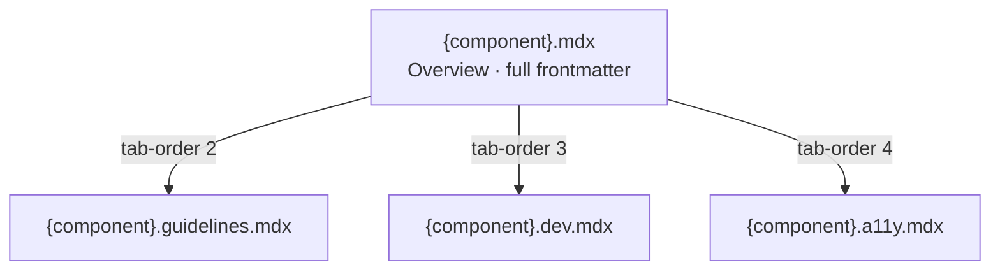

# Component Documentation (MDX) Guidelines

[← Back to Index](../component-guidelines.md) |
[Previous: Stories](./stories.md) | [Next: Recipes →](./recipes.md)

## Purpose

A component is documented on the docs site by **up to four MDX files**, each
rendered as a tab. They share one component page but serve different audiences:

| File                         | Tab            | `tab-order` | Audience                           | Focus                                            |
| ---------------------------- | -------------- | ----------- | ---------------------------------- | ------------------------------------------------ |
| `{component}.mdx`            | Overview       | 1           | Designers                          | Design purpose, visual variants, when to use it  |
| `{component}.guidelines.mdx` | Guidelines     | 2           | Designers, product teams           | Do/Don't, best practices, when **not** to use it |
| `{component}.dev.mdx`        | Implementation | 3           | Consumers (integrating developers) | API, code examples, integration, testing         |
| `{component}.a11y.mdx`       | Accessibility  | 4           | All roles                          | WCAG conformance, keyboard, screen reader, ARIA  |

> **Terminology:** the `.dev.mdx` audience is **consumers** — developers
> integrating Nimbus into their apps — not Nimbus's own contributors. Avoid the
> ambiguous word "developer" in prose; the [writing style](../writing-style.md)
> terminology table is the source of truth. The `.dev.mdx` extension and `dev`
> tab key themselves stay — they are a build-system contract (see
> [The tabbed model](#the-tabbed-model)).

> **Prose style:** this guide covers the **structure and format** of the MDX
> files. For the **writing** itself — voice, mood, normative keywords,
> terminology — follow the house [writing style](../writing-style.md): its
> universal core plus the matching overlay. The **designer overlay** governs
> `.mdx`, `.guidelines.mdx`, and `.a11y.mdx`; the **engineering overlay**
> governs `.dev.mdx`.

## The tabbed model

The four files are **not** independent pages and they are **not** one monolithic
file. The main `{component}.mdx` is the canonical page and carries all metadata;
the other three are **view files** that contribute additional tabs to it.

- The docs build (`@commercetools/nimbus-docs-build`, `parse-mdx.ts`) reads the
  main `.mdx`, then discovers sibling view files matching
  `{component}.{key}.mdx` (keys: `guidelines`, `dev`, `a11y`).
- Each view file declares only `tab-title` + `tab-order`; everything else (id,
  title, menu, tags, …) is inherited from the main file.
- Tabs always render in `tab-order`, so a component shows the same tab sequence
  regardless of which view files exist.



### Which files are required

Every public-facing component **must** have `{component}.mdx` and
`{component}.dev.mdx`. The `guidelines` and `a11y` tabs are **strongly
recommended** and present on most components, but **may** be omitted where they
add nothing:

- **No Guidelines** — layout/utility primitives (`Box`, `Flex`, `Stack`,
  `Grid`), providers (`NimbusProvider`), and internal-only components.
- **No Accessibility** — components with no interaction or a11y surface of their
  own (simple presentational primitives).

Internal utility components and non-exported components don't require MDX at
all.

## Frontmatter

### Main file (`{component}.mdx`) — full metadata

```yaml
---
id: Components-ComponentName # Required: unique, "Components-{ComponentName}"
title: Component Name # Required: display name
exportName: ComponentName # Required: PascalCased name as exported from @commercetools/nimbus
description: Brief one-line description # Required
order: 999 # Required: menu order (999 = default)
menu: # Required: menu hierarchy
  - Components
  - Category Name # Inputs, Data Display, Navigation, Feedback, Overlay, Layout, Typography
  - Component Name
tags: # Required: search tags (always include 'component')
  - component
  - relevant-keywords
lifecycleState: Stable # Optional: Experimental|Alpha|Beta|Stable|Deprecated|EOL
figmaLink: >- # Optional: design resource
  https://www.figma.com/design/...
---
```

### View files (`.guidelines.mdx`, `.dev.mdx`, `.a11y.mdx`) — minimal

View files carry only the tab metadata. Do **not** repeat `id`, `menu`, `tags`,
etc. — they are inherited from the main file.

```yaml
---
tab-title: Guidelines # "Guidelines" | "Implementation" | "Accessibility"
tab-order: 2 # Guidelines=2, Implementation=3, Accessibility=4
---
```

The body of every file starts with `## ` content — the `# Title` is rendered
from the main file's frontmatter, so never add a top-level `# Component Name`
heading.

## Per-file guidance

### Overview (`{component}.mdx`)

The designer-facing landing tab. Sections:

- **Overview** — design purpose, primary use cases, key visual characteristics.
- **Resources** (recommended) — Figma library, React Aria / ARIA pattern links.
- **Variables** (or **Examples**) — visual variants demonstrated with `jsx live`
  blocks. Show all values of one axis (sizes, variants, colors) in a **single**
  block for easy comparison.
- **Specs** (optional) — `<PropsTable id="ComponentName" />` when a props
  summary belongs on the overview.

Use `jsx live` blocks (not `jsx live-dev`). Keep it design-focused, not
implementation detail. Real examples: `badge/badge.mdx`, `button/button.mdx`,
`text-input/text-input.mdx`.

### Guidelines (`{component}.guidelines.mdx`)

Design-decision guidance: how a designer or product owner should reason about
using the component.

- **Best practices** — concrete do's (content length, visual hierarchy,
  localization, error handling).
- **When to use / When not to use** — GitHub-style alert blocks (`> [!TIP]` /
  `> [!CAUTION]`), each with a short bulleted list and, where useful, a
  `jsx live` comparison.
- **Component-specific guidance** — e.g. button labels and icon placement, input
  label-vs-placeholder, select width rules.

Real examples: `button/button.guidelines.mdx`, `select/select.guidelines.mdx`,
`text/text.guidelines.mdx`.

### Implementation (`{component}.dev.mdx`)

The source of truth for the component's API, consumed by the engineering-docs
validation system and validated against the actual TypeScript types. Audience:
**consumers** integrating the component.

- **Getting started** — import + basic usage.
- **Usage examples** — sizes, variants, colors, icons, states, controlled vs.
  uncontrolled, composition. Prefer `jsx live-dev` blocks here.
- **API reference** — `<PropsTable id="ComponentName" />` (base namespace for
  compound components, e.g. `id="Menu"`, not `"Menu.Root"`).
- **Integration patterns** — React Aria, hooks, context, forms.
- **Testing** — copy-paste consumer tests via the
  `{{docs-tests: {component}.docs.spec.tsx}}` build token (see
  [testing-strategy.md](./testing-strategy.md)).
- **Accessibility (implementation)** — ARIA wiring specifics a consumer must
  preserve. User-facing a11y belongs in the `.a11y.mdx` tab.

Real examples: `text/text.dev.mdx`, `button/button.dev.mdx`,
`accordion/accordion.dev.mdx`.

### Accessibility (`{component}.a11y.mdx`)

WCAG 2.1 AA conformance and assistive-technology behavior, written for all
roles.

- **Accessibility standards** — the WCAG criteria met (contrast ratios, semantic
  structure, focus management, no unexpected context changes).
- **Keyboard navigation** — a key/action table for interactive components.
- **Screen reader support** — role, state, and live-region announcements.
- **ARIA attributes** — roles/attributes used and why (for custom
  implementations).

Use `jsx live` for any examples. Real examples: `button/button.a11y.mdx`,
`select/select.a11y.mdx`, `text/text.a11y.mdx`.

## Shared authoring rules

### `jsx live` blocks

Interactive examples render live in the docs site.

- `jsx live` — overview, guidelines, and a11y tabs.
- `jsx live-dev` — the implementation tab (`.dev.mdx`).
- Every block defines an `App` component.
- All Nimbus components (`Button`, `Stack`, `Icons`, …) and `useState` are
  available globally — **no imports**.
- Use plain ` ```jsx ` / ` ```tsx ` (no `live`) for non-interactive snippets.

```jsx live
const App = () => (
  <Stack direction="row" gap="400" alignItems="center">
    <Badge size="sm">Small</Badge>
    <Badge size="md">Medium</Badge>
    <Badge size="lg">Large</Badge>
  </Stack>
);
```

MDX files are documentation. Storybook content belongs in `.stories.tsx` (see
[Stories](./stories.md)); consumer test examples belong in `.docs.spec.tsx` (see
[Testing Strategy](./testing-strategy.md)).

### PropsTable

`<PropsTable id="ComponentName" />` auto-generates a props table from the
component's TypeScript interface.

- `id` is case-sensitive and must match the export name; for compound components
  use the base namespace (`"Menu"`, not `"Menu.Root"`).
- Requires an exported `{ComponentName}Props` interface (see
  [Types](./types.md)).

### Available MDX features

- **Globals without imports** — `<PropsTable />`, all Nimbus components,
  `useState`.
- **GitHub-style alerts** — `> [!TIP]`, `> [!CAUTION]`, `> [!WARNING]`,
  `> [!NOTE]`; end a line with `\` for a line break inside an alert.
- **Markdown tables** — keyboard maps, specs, comparisons.
- **Frontmatter** — YAML; use `>-` for long single-line values such as Figma
  URLs.

## Validation checklist

### Files & tabs

- [ ] `{component}.mdx` exists with **full** frontmatter (id, title, exportName,
      description, order, menu, tags).
- [ ] `{component}.dev.mdx` exists.
- [ ] `{component}.guidelines.mdx` present (or intentionally omitted per
      [Which files are required](#which-files-are-required)).
- [ ] `{component}.a11y.mdx` present (or intentionally omitted).
- [ ] View files carry only `tab-title` + `tab-order`; orders are Guidelines=2,
      Implementation=3, Accessibility=4.
- [ ] No top-level `# Title` heading in any body (comes from frontmatter).

### Overview (`.mdx`)

- [ ] Overview section explaining design purpose.
- [ ] Variables/Examples with `jsx live` blocks; sizes and variants each shown
      in a **single** block.
- [ ] Resources links where applicable (Figma, React Aria, ARIA pattern).

### Guidelines (`.guidelines.mdx`)

- [ ] Best practices and when-to-use / when-not-to-use guidance.
- [ ] Design-focused, not implementation detail.

### Implementation (`.dev.mdx`)

- [ ] Getting-started import + basic usage.
- [ ] `<PropsTable id="ComponentName" />` API reference.
- [ ] `jsx live-dev` examples for key patterns and states.
- [ ] Integration and testing guidance where applicable.

### Accessibility (`.a11y.mdx`)

- [ ] WCAG conformance statement.
- [ ] Keyboard navigation table (interactive components).
- [ ] Screen reader / ARIA notes.

### Quality

- [ ] All `jsx live`/`jsx live-dev` blocks define `App` and run as written.
- [ ] No imports in live blocks; no Storybook-only constructs.
- [ ] Prose follows the [writing style](../writing-style.md) (correct overlay).

## Related Guidelines

- [Stories](./stories.md) — Storybook stories for testing
- [Testing Strategy](./testing-strategy.md) — `.docs.spec.tsx` consumer tests
- [Types](./types.md) — props definitions for PropsTable
- [Writing Style](../writing-style.md) — prose voice and per-audience overlays
- [Main Component](./main-component.md) — the component being documented

---

[← Back to Index](../component-guidelines.md) |
[Previous: Stories](./stories.md) | [Next: Recipes →](./recipes.md)
