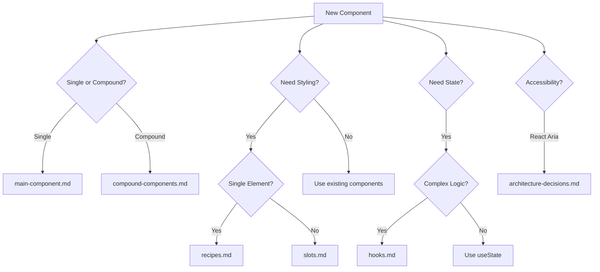

# File Type Guidelines Directory

This directory contains detailed guidelines for each type of file that can be
part of a Nimbus component. Each guide provides specific patterns, requirements,
and examples.

[← Back to Component Guidelines](../component-guidelines.md)

## Available Guidelines

### Core Component Files

- **[barrel-exports.md](./barrel-exports.md)** - Index files and public API
  design
- **[main-component.md](./main-component.md)** - Main component file patterns
- **[types.md](./types.md)** - TypeScript type definitions
- **[stories.md](./stories.md)** - Storybook stories and tests
- **[documentation.md](./documentation.md)** - MDX documentation

### Styling System

- **[recipes.md](./recipes.md)** - Chakra UI recipe patterns
- **[slots.md](./slots.md)** - Slot component guidelines

### Component Organization

- **[compound-components.md](./compound-components.md)** - Multi-part components
- **[hooks.md](./hooks.md)** - React hooks patterns
- **[utils-and-constants.md](./utils-and-constants.md)** - Utilities and
  constants

### Advanced Patterns

- **[context-files.md](./context-files.md)** - React context patterns
- **[architecture-decisions.md](./architecture-decisions.md)** - Component
  architecture matrix

## Quick Decision Tree

## File Type Categories

### Always Required

Every component must have these files:

1. Main component file
2. Type definitions
3. Storybook stories
4. Documentation (MDX)
5. Barrel export (index)

### Conditionally Required

Based on component needs:

- **Recipes/Slots**: When creating new visual styles
- **Compound structure**: When component has multiple parts
- **Hooks**: When complex logic needs encapsulation
- **Context**: When state needs to be shared between parts

### Optional

For complex components only:

- Utils folder
- Constants folder
- Custom context wrappers

## Common Patterns by Component Type

### Simple Display Component (e.g., Badge)

- main-component.md
- types.md
- recipes.md
- stories.md
- documentation.md

### Interactive Component (e.g., Button)

- main-component.md
- types.md
- recipes.md
- slots.md
- stories.md (with play functions)
- documentation.md

### Compound Component (e.g., Menu)

- compound-components.md
- types.md
- slots.md
- stories.md (with interaction tests)
- documentation.md

### Complex Component (e.g., DatePicker)

- All of the above plus:
- hooks.md
- context-files.md
- utils-and-constants.md

---

For questions about which guidelines to follow, start with
[architecture-decisions.md](./architecture-decisions.md).
