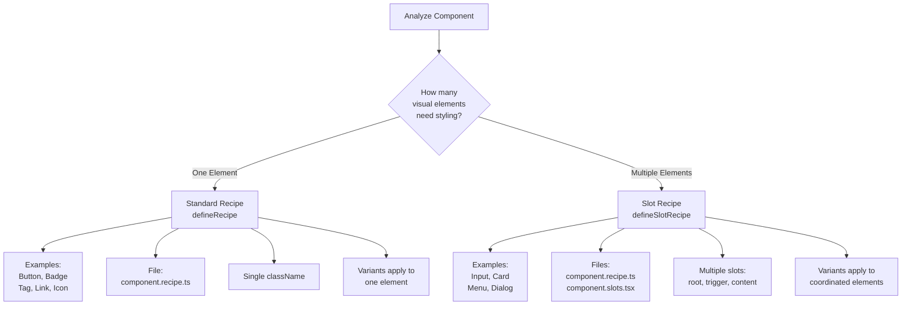

# Recipe Guidelines

[← Back to Index](../component-guidelines.md) |
[Previous: Documentation](./documentation.md) | [Next: Slots →](./slots.md)

## Purpose

Recipe files `{component-name}.recipe.ts` define component styling variants,
sizes, and visual states using Chakra UI's recipe system. They enable
consistent, theme-aware styling across components.

**File Extension:** Use `.ts` for pure TypeScript recipes.

## When to Use

### Create a Recipe When:

- Component needs **new visual styling** (custom CSS)
- Component has **variants** (solid, outline, ghost)
- Component has **sizes** (sm, md, lg)
- Component needs **state-based styles** (hover, focus, disabled)
- Building a **primitive component** others will use

## Recipe Types

### Recipe Type Decision Flow

Use this diagram to determine which recipe type your component needs:



**Decision Criteria:**

- **Standard Recipe** (`defineRecipe`) - Choose when:
  - Component has a single styled element
  - Examples: Button, Badge, Tag, Link, Icon
  - Creates: `{component}.recipe.ts` only
  - Single className applied
  - All variants affect the same element

- **Slot Recipe** (`defineSlotRecipe`) - Choose when:
  - Component has multiple styled parts that need coordination
  - Examples: Input (root, field, addon), Card (root, header, body), Menu (root,
    trigger, content, item), Dialog (root, backdrop, content, header, footer)
  - Creates: `{component}.recipe.ts` + `{component}.slots.tsx`
  - Multiple slots defined: `['root', 'trigger', 'content']`
  - Variants can affect different parts independently

### Standard Recipe (Single Element)

For components with a single styled element:

```typescript
// button.recipe.ts
import { defineRecipe } from "@chakra-ui/react/styled-system";

export const buttonRecipe = defineRecipe({
  className: "nimbus-button",
  base: {
    display: "inline-flex",
    alignItems: "center",
    justifyContent: "center",
    fontWeight: "500",
    borderRadius: "200",
    transitionProperty: "color",
    transitionDuration: "fast",
    cursor: "pointer",

    _disabled: {
      opacity: 0.5,
      cursor: "not-allowed",
    },
  },
  variants: {
    variant: {
      solid: {
        backgroundColor: "primary.9",
        color: "primary.contrast",
        _hover: {
          backgroundColor: "primary.10",
        },
      },
      outline: {
        borderWidth: "1px",
        borderColor: "primary.9",
        color: "primary.11",
        _hover: {
          backgroundColor: "primary.2",
        },
      },
      ghost: {
        color: "primary.11",
        _hover: {
          backgroundColor: "primary.2",
        },
      },
    },
    size: {
      sm: {
        paddingX: "300",
        fontSize: "350",
      },
      md: {
        paddingX: "400",
        fontSize: "400",
      },
      lg: {
        paddingX: "500",
        fontSize: "450",
      },
    },
  },
  defaultVariants: {
    variant: "solid",
    size: "md",
  },
});
```

### Slot Recipe (Multiple Elements)

For components with multiple styled parts:

```typescript
// menu.recipe.ts
import { defineSlotRecipe } from "@chakra-ui/react/styled-system";

export const menuSlotRecipe = defineSlotRecipe({
  slots: ["root", "trigger", "content", "item", "separator"],
  className: "nimbus-menu",
  base: {
    root: {
      position: "relative",
    },
    trigger: {
      display: "inline-flex",
      alignItems: "center",
      gap: "200",
      cursor: "pointer",
    },
    content: {
      backgroundColor: "bg",
      borderRadius: "200",
      boxShadow: "lg",
      padding: "200",
      minWidth: "200px",
    },
    item: {
      padding: "200 300",
      borderRadius: "100",
      cursor: "pointer",
      _hover: {
        backgroundColor: "neutral.3",
      },
      _disabled: {
        opacity: 0.5,
        cursor: "not-allowed",
      },
    },
    separator: {
      height: "1px",
      backgroundColor: "neutral.6",
      marginY: "100",
    },
  },
  variants: {
    size: {
      sm: {
        trigger: {
          fontSize: "350",
        },
        item: {
          fontSize: "350",
        },
      },
      md: {
        trigger: {
          fontSize: "400",
        },
        item: {
          fontSize: "400",
        },
      },
    },
  },
  defaultVariants: {
    size: "md",
  },
});
```

## Recipe Structure

### Base Styles

Always define base styles that apply regardless of variants:

```typescript
base: {
  // Layout
  display: "flex",
  alignItems: "center",

  // Spacing (use design tokens)
  padding: "400",
  gap: "200",

  // Typography
  fontSize: "400",
  fontWeight: "500",

  // Colors
  color: "fg",
  backgroundColor: "bg",

  // Borders
  borderRadius: "200",
  borderWidth: "1px",

  // Transitions
  transitionProperty: "colors",
  transitionDuration: "fast",

  // States
  _hover: {
    backgroundColor: "neutral.2",
  },
  _focus: {
    outline: "2px solid",
    outlineColor: "primary.9",
    outlineOffset: "2px",
  },
  _disabled: {
    opacity: 0.5,
    cursor: "not-allowed",
  },
}
```

### Variants

Define visual variations:

```typescript
variants: {
  variant: {
    primary: { /* styles */ },
    secondary: { /* styles */ },
    danger: { /* styles */ },
  },
  size: {
    sm: { /* styles */ },
    md: { /* styles */ },
    lg: { /* styles */ },
  },
  // Can have multiple variant categories
  appearance: {
    rounded: { borderRadius: "full" },
    square: { borderRadius: "0" },
  },
}
```

### Default Variants

Always specify defaults:

```typescript
defaultVariants: {
  variant: "primary",
  size: "md",
  appearance: "rounded",
}
```

## Design Token Usage

### Use Semantic Tokens

```typescript
// ✅ Good - uses design tokens
base: {
  padding: "400",                // Spacing token
  fontSize: "400",               // Typography token
  fontWeight: "500",             // Font weight token
  color: "fg",                   // Semantic color (foreground)
  backgroundColor: "bg",         // Semantic color (background)
  borderRadius: "200",           // Radius token
}

// ✅ Color palette usage examples
variants: {
  colorPalette: {
    primary: {
      backgroundColor: "primary.9",      // Semantic palette
      color: "primary.contrast",
    },
    critical: {
      backgroundColor: "critical.9",     // Semantic palette
      color: "critical.contrast",
    },
    brand: {
      backgroundColor: "ctviolet.9",     // Brand palette
      color: "ctviolet.contrast",
    },
    decorative: {
      backgroundColor: "blue.9",         // System palette
      color: "blue.contrast",
    },
  },
}

```

**CSS Custom Properties:** When using CSS variables in recipes, namespace them
with the component name in kebab-case (e.g., `--accordion-font-size`,
`--menu-item-padding`) to prevent collisions.

### Token Categories

- **Spacing**: `100`, `200`, `300`, `400`, `500`, `600`, etc.
- **Semantic Colors**: `fg` (foreground text), `bg` (background), `border` (with
  variants)
- **Color Palettes** (all use steps `1` through `12` + `contrast`):
  - **Semantic**: `primary`, `neutral`, `info`, `positive`, `warning`,
    `critical`
  - **Brand**: `ctviolet`, `ctteal`, `ctyellow`
  - **System** (25 colors): `tomato`, `red`, `ruby`, `crimson`, `pink`, `plum`,
    `purple`, `violet`, `iris`, `indigo`, `blue`, `cyan`, `teal`, `jade`,
    `green`, `grass`, `bronze`, `gold`, `brown`, `orange`, `amber`, `yellow`,
    `lime`, `mint`, `sky`
  - **Blacks & Whites**: `blackAlpha`, `whiteAlpha` (do not adapt to color mode)
  - **Interchangeability**: All color scales are interchangeable based on
    contrast (e.g., `red.9` = `blue.9` = `primary.9` in contrast level)
- **Typography (fontSize)**: `250`, `300`, `350`, `400`, `450`, `500`, `600`,
  `750`, `900`, etc.
- **Typography (fontWeight)**: `100`, `200`, `300`, `400`, `500`, `600`, `700`,
  `800`, `900`
- **Radii**: `50`, `100`, `150`, `200`, `300`, `400`, `500`, `600`, `full`
- **Shadows**: `1`, `2`, `3`, `4`, `5`, `6`
- **Transitions (duration)**: `fastest`, `faster`, `fast`, `moderate`, `slow`,
  `slower`, `slowest`

## State Modifiers

### CSS Pseudo Selectors

```typescript
base: {
  // Hover state
  _hover: {
    backgroundColor: "neutral.2",
    transform: "translateY(-1px)",
  },

  // Focus state
  _focus: {
    outline: "2px solid",
    outlineColor: "primary.9",
  },

  // Active state
  _active: {
    transform: "scale(0.98)",
  },

  // Disabled state
  _disabled: {
    opacity: 0.5,
    cursor: "not-allowed",
    pointerEvents: "none",
  },

  // Focus visible (keyboard focus)
  _focusVisible: {
    focusRing: "outside",
  },
}
```

### Data Attributes

```typescript
base: {
  // Custom data attributes
  _data-[state=open]: {
    backgroundColor: "primary.2",
  },

  _data-[orientation=horizontal]: {
    flexDirection: "row",
  },
}
```

## Registration (CRITICAL)

### Recipe Registration is REQUIRED

Recipes must be registered in the theme configuration or they won't work:

#### Standard Recipes

```typescript
// packages/nimbus/src/theme/recipes/index.ts
export { buttonRecipe } from "@/components/button/button.recipe";
export { badgeRecipe } from "@/components/badge/badge.recipe";
// ... other standard recipes
```

#### Slot Recipes

```typescript
// packages/nimbus/src/theme/slot-recipes/index.ts
export { menuSlotRecipe } from "@/components/menu/menu.recipe";
export { selectSlotRecipe } from "@/components/select/select.recipe";
// ... other slot recipes
```

### Registration Validation

**WARNING**: No automated validation exists!

- Missing registration = no styles applied
- Component renders unstyled
- Check browser DevTools for missing CSS classes

## Compound Variants

For complex style combinations:

```typescript
export const buttonRecipe = defineRecipe({
  // ... base and variants

  compoundVariants: [
    {
      variant: "solid",
      size: "sm",
      css: {
        // Specific styles for solid + small
        borderRadius: "100",
      },
    },
    {
      variant: ["outline", "ghost"],
      size: "lg",
      css: {
        // Styles for (outline OR ghost) + large
        fontWeight: "600",
      },
    },
  ],
});
```

## Common Patterns from Nimbus

### Button (Standard Recipe)

```typescript
export const buttonRecipe = defineRecipe({
  className: "nimbus-button",
  base: {
    display: "inline-flex",
    alignItems: "center",
    justifyContent: "center",
    gap: "200",
    fontWeight: "500",
    borderRadius: "200",
    transitionProperty: "colors",
    transitionDuration: "fast",
  },
  variants: {
    variant: {
      solid: {
        /* ... */
      },
      outline: {
        /* ... */
      },
      ghost: {
        /* ... */
      },
    },
    size: {
      sm: { paddingX: "300", fontSize: "350" },
      md: { paddingX: "400", fontSize: "400" },
      lg: { paddingX: "500", fontSize: "450" },
    },
  },
  defaultVariants: {
    variant: "solid",
    size: "md",
  },
});
```

### Menu (Slot Recipe)

```typescript
export const menuSlotRecipe = defineSlotRecipe({
  slots: ["root", "trigger", "content", "item"],
  className: "nimbus-menu",
  base: {
    root: { position: "relative" },
    trigger: { cursor: "pointer" },
    content: {
      backgroundColor: "bg",
      boxShadow: "lg",
    },
    item: {
      padding: "200 300",
      _hover: { backgroundColor: "neutral.2" },
    },
  },
  // ... variants
});
```

## Related Guidelines

- [Slots](./slots.md) - Creating slot components
- [Main Component](./main-component.md) - Using recipes in components
- [Types](./types.md) - Recipe variant types

## Validation Checklist

- [ ] Recipe file exists with `.ts` extension (or `.tsx` if JSX is used)
- [ ] Correct recipe type (standard vs slot)
- [ ] `className` with "nimbus-" prefix
- [ ] Base styles defined
- [ ] Variants defined (if applicable)
- [ ] Default variants specified
- [ ] Design tokens used (not hardcoded values)
- [ ] **CSS custom properties namespaced with component name in kebab-case** (if
      used)
- [ ] **Recipe registered in theme configuration**
- [ ] State modifiers properly defined
- [ ] Dark mode styles included (if needed)
- [ ] Responsive styles (if needed)

---

[← Back to Index](../component-guidelines.md) |
[Previous: Documentation](./documentation.md) | [Next: Slots →](./slots.md)
