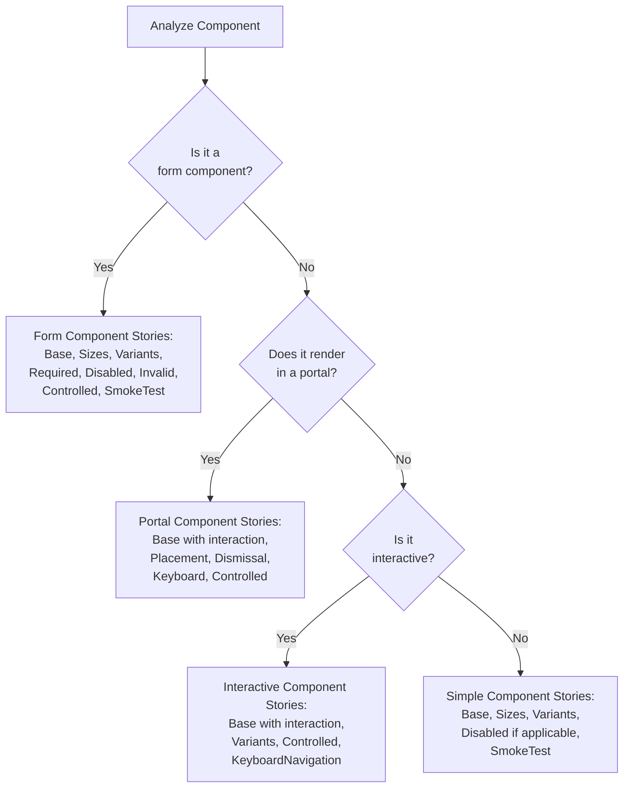

# Storybook Stories Guidelines

[← Back to Index](../component-guidelines.md) | [Previous: Types](./types.md) |
[Next: Documentation →](./documentation.md)

## Purpose

Storybook stories (`{component-name}.stories.tsx`) serve as both visual
documentation and automated tests for components. They showcase component
variations, test interactions, and ensure accessibility compliance.

## When to Use

**Always required** - Every component must have stories that:

- Document all visual variants
- Test interactive behavior with play functions
- Validate accessibility
- Provide usage examples
- Use a StartCase value for meta.title
- Use Nimbus components for any additional UI necessary in stories
- Import components and component types from `@commercetools/nimbus`
- Always use Nimbus components when building the UI for story components
- Always prefer finding elements via their accessible attributes instead of
  using `data-testid`

## Story Type Requirements by Component Category

Different component types require different sets of stories based on their
characteristics and complexity. Use this matrix to determine which stories your
component needs.

### Simple Components (Button, Badge, Icon, Tag, Link)

**Required Stories:**

- **Base** - Basic usage with default props
- **Sizes** - All size variants displayed in single story
- **Variants** - All visual variants displayed in single story
- **Disabled** - Disabled state (for interactive components)
- **SmokeTest** - Comprehensive matrix testing all combinations

**Optional Stories:**

- Component-specific features (WithIcon, WithRef, etc.)

**Example Coverage:**

```typescript
export const Base: Story = {
  /* minimal example */
};
export const Sizes: Story = {
  /* sm, md, lg in one story */
};
export const Variants: Story = {
  /* all variants in one story */
};
export const Disabled: Story = {
  /* disabled state */
};
export const SmokeTest: Story = {
  /* comprehensive matrix */
};
```

### Form Components (TextInput, Select, Checkbox, RadioGroup, Switch)

**Required Stories:**

- **Base** - Basic usage with type testing
- **Sizes** - All size variants
- **Variants** - All visual variants
- **Required** - Required state with `aria-required` attribute
- **Disabled** - Disabled state (test: cannot focus, cannot type)
- **Invalid** - Invalid state (test: can still interact, shows error styling)
- **Controlled** - Controlled component with external state display
- **SmokeTest** - Comprehensive matrix of all combinations

**Optional Stories:**

- Validation scenarios
- Async loading states
- Complex form integration

**Key Testing Focus:**

- Form components MUST test that disabled state prevents all interaction
- Invalid state should NOT prevent interaction (users can fix errors)
- Controlled stories should demonstrate state synchronization

### Interactive Components (Menu, Dialog, Pagination, Tabs, Accordion)

**Required Stories:**

- **Base/Default** - Basic usage with full interaction testing in play function
- **Variants/Configurations** - Different visual or behavioral configurations
- **Controlled** - Controlled state management
- **KeyboardNavigation** - Comprehensive keyboard interaction testing (Arrow
  keys, Enter, Space, Escape, Tab)

**Optional Stories:**

- Complex scenarios (nested menus, dynamic content)
- Edge cases (empty states, overflow)
- Performance testing (large lists)

**Key Testing Focus:**

- Interactive components MUST have play functions testing user interactions
- Keyboard navigation is critical for accessibility
- State management (open/close, selection) must be tested

### Overlay/Portal Components (Dialog, Popover, Tooltip, Dropdown Menu)

**Required Stories:**

- All of the Interactive Component stories PLUS:
- **Placement** - Different positioning options (if applicable)
- **Dismissal** - Various dismissal scenarios (click outside, Escape key, close
  button)
- **Portal Testing** - Special patterns for testing portal-rendered content

**Key Testing Focus:**

- Portal components require accessing elements through `document.body` or parent
  element
- Test focus management (focus trap, return focus)
- Test dismissal behavior comprehensively
- Test positioning and overflow handling

**Example Portal Pattern:**

```typescript
export const Base: Story = {
  play: async ({ canvasElement }) => {
    const canvas = within(canvasElement);
    const trigger = canvas.getByRole("button");
    await userEvent.click(trigger);

    // Access portal content through parent element
    const body = within(canvasElement.ownerDocument.body);
    const dialog = await waitFor(() => body.getByRole("dialog"));
    expect(dialog).toBeInTheDocument();
  },
};
```

## Story Type Decision Flowchart



## File Structure

### Basic Story Setup

```typescript
// component-name.stories.tsx
import type { Meta, StoryObj } from "@storybook/react-vite";
import { userEvent, within, expect, waitFor, fn } from "storybook/test";
import { ComponentName, Stack } from "@commercetools/nimbus";

const meta: Meta<typeof ComponentName> = {
  title: "Components/ComponentName",
  component: ComponentName,
  parameters: {
    layout: "centered", // or "fullscreen", "padded"
  },
  tags: ["autodocs"],
  argTypes: {
    variant: {
      control: { type: "select" },
      options: ["solid", "outline", "ghost"],
    },
    size: {
      control: { type: "radio" },
      options: ["sm", "md", "lg"],
    },
  },
};

export default meta;
type Story = StoryObj<typeof meta>;

// Stories follow...
```

## Story Organization

### Progressive Complexity Pattern

Stories should progress from simple to complex:

```typescript
// 1. Default - simplest usage
export const Default: Story = {
  args: {
    children: "Click me",
  },
};

// 2. Variants - visual permutations
export const Variants: Story = {
  args: {
    children: "Button",
  },
  render: (args) => {
    const variants = ["solid", "outline", "ghost"];
    return (
      <Stack direction="row" gap="400" alignItems="center">
        {variants.map((variant) => (
          <ComponentName key={variant} {...args} variant={variant} />
        ))}
      </Stack>
    );
  },
};

// 3. States - different states
export const Disabled: Story = {
  args: {
    isDisabled: true,
    children: "Disabled",
  },
};

export const Loading: Story = {
  args: {
    isLoading: true,
    children: "Loading",
  },
};

// 4. Complex - combinations and edge cases
export const WithIcons: Story = {
  args: {
    startIcon: <Icon name="add" />,
    endIcon: <Icon name="arrow-forward" />,
    children: "With Icons",
  },
};

// 5. Interactive - with play functions
export const Interactive: Story = {
  args: {
    children: "Click to test",
  },
  play: async ({ canvasElement }) => {
    // Test interactions
  },
};
```

## Play Functions (CRITICAL)

### Required for Interactive Components

**ALL interactive components MUST have play functions** that test:

- User interactions (clicks, typing, keyboard navigation)
- State changes
- Accessibility features
- Edge cases and error states

### Play Function Structure

```typescript
export const InteractiveExample: Story = {
  play: async ({ canvasElement, step }) => {
    const canvas = within(canvasElement);

    await step("Initial state", async () => {
      // Verify initial render
      const button = canvas.getByRole("button");
      expect(button).toBeInTheDocument();
      expect(button).not.toBeDisabled();
    });

    await step("User interaction", async () => {
      // Test click
      const button = canvas.getByRole("button");
      await userEvent.click(button);

      // Verify state change
      await waitFor(() => {
        expect(canvas.getByText("Clicked!")).toBeInTheDocument();
      });
    });

    await step("Keyboard navigation", async () => {
      // Test keyboard interaction
      const button = canvas.getByRole("button");
      await userEvent.tab();
      expect(button).toHaveFocus();

      await userEvent.keyboard("{Enter}");
      // Verify action occurred
    });

    await step("Edge cases", async () => {
      // Test boundary conditions
      // Test error states
      // Test disabled interactions
    });
  },
};
```

### Common Interaction Patterns

#### Testing Form Inputs

```typescript
export const FormInput: Story = {
  play: async ({ canvasElement, step }) => {
    const canvas = within(canvasElement);

    await step("Type in input", async () => {
      const input = canvas.getByRole("textbox");
      await userEvent.clear(input);
      await userEvent.type(input, "Test value");
      expect(input).toHaveValue("Test value");
    });

    await step("Submit form", async () => {
      await userEvent.keyboard("{Enter}");
      // Verify submission (implementation depends on form behavior)
    });
  },
};
```

#### Testing Selections

```typescript
export const SelectionTest: Story = {
  play: async ({ canvasElement, step }) => {
    const canvas = within(canvasElement);

    await step("Open dropdown", async () => {
      const trigger = canvas.getByRole("button");
      await userEvent.click(trigger);

      // Wait for menu to appear
      await waitFor(() => {
        expect(canvas.getByRole("menu")).toBeInTheDocument();
      });
    });

    await step("Select option", async () => {
      const option = canvas.getByRole("menuitem", { name: "Option 1" });
      await userEvent.click(option);

      // Verify selection
      await waitFor(() => {
        expect(canvas.getByRole("button")).toHaveTextContent("Option 1");
      });
    });
  },
};
```

#### Testing Complex State

```typescript
export const PaginationTest: Story = {
  play: async ({ canvasElement, step }) => {
    const canvas = within(canvasElement);

    await step("Navigate pages", async () => {
      // Click next
      await userEvent.click(canvas.getByRole("button", { name: "Next" }));
      await waitFor(() => {
        expect(canvas.getByText("Page 2")).toBeInTheDocument();
      });

      // Click previous
      await userEvent.click(canvas.getByRole("button", { name: "Previous" }));
      await waitFor(() => {
        expect(canvas.getByText("Page 1")).toBeInTheDocument();
      });
    });

    await step("Direct page input", async () => {
      const input = canvas.getByRole("spinbutton");
      await userEvent.clear(input);
      await userEvent.type(input, "5");
      await userEvent.keyboard("{Enter}");

      await waitFor(() => {
        expect(canvas.getByText("Page 5")).toBeInTheDocument();
      });
    });

    await step("Boundary testing", async () => {
      // Test first page - should be on page 1
      await waitFor(() => {
        expect(canvas.getByText("Page 1")).toBeInTheDocument();
      });

      const prevButton = canvas.getByRole("button", { name: "Previous" });
      expect(prevButton).toBeDisabled();

      // Navigate to last page and test constraints
      // (implementation depends on component)
    });
  },
};
```

## Async Testing Patterns

### When to Use `waitFor`

Use `waitFor` when asserting elements that appear asynchronously after user
interactions:

### Portal Content Testing

```typescript
export const PortalContent: Story = {
  play: async ({ canvasElement }) => {
    const canvas = within(canvasElement);

    // Open portal content
    await userEvent.click(canvas.getByRole("button"));

    // Wait for portal content to appear in document body
    await waitFor(() => {
      const portalContent = within(document.body);
      expect(portalContent.getByRole("dialog")).toBeInTheDocument();
    });
  },
};
```

## Story Decorators

### Adding Context

```typescript
const meta: Meta = {
  decorators: [
    (Story) => (
      <ThemeProvider theme={customTheme}>
        <Story />
      </ThemeProvider>
    ),
  ],
};
```

### Layout Options

```typescript
const meta: Meta = {
  parameters: {
    layout: "centered", // Centers component
    // or
    layout: "fullscreen", // Full viewport
    // or
    layout: "padded", // With padding
  },
};
```

## Examples from Nimbus

### Simple Component (Button)

```typescript
export const Default: Story = {
  args: {
    children: "Button",
  },
};

export const Variants: Story = {
  args: {
    children: "Demo Button",
  },
  render: (args) => {
    const variants = ["solid", "subtle", "outline", "ghost"];
    return (
      <Stack direction="row" gap="400" alignItems="center">
        {variants.map((variant) => (
          <Button key={variant} {...args} variant={variant} />
        ))}
      </Stack>
    );
  },
};

export const Interactive: Story = {
  args: {
    children: "Click me",
    onClick: fn(),
  },
  play: async ({ canvasElement, args }) => {
    const canvas = within(canvasElement);
    const button = canvas.getByRole("button");

    await userEvent.click(button);

    // Verify click handled (synchronous check)
    expect(args.onClick).toHaveBeenCalledTimes(1);
  },
};
```

### Compound Component (Menu)

```typescript
export const MenuInteraction: Story = {
  render: () => (
    <Menu.Root>
      <Menu.Trigger>Options</Menu.Trigger>
      <Menu.Content>
        <Menu.Item>Edit</Menu.Item>
        <Menu.Item>Delete</Menu.Item>
      </Menu.Content>
    </Menu.Root>
  ),
  play: async ({ canvasElement, step }) => {
    const canvas = within(canvasElement);

    await step("Open menu", async () => {
      await userEvent.click(canvas.getByRole("button"));
      await waitFor(() => {
        expect(canvas.getByRole("menu")).toBeInTheDocument();
      });
    });

    await step("Select item", async () => {
      const editItem = canvas.getByRole("menuitem", { name: "Edit" });
      await userEvent.click(editItem);
      // Verify selection (implementation depends on component behavior)
    });
  },
};
```

## Clean Testing Patterns (Storybook)

These patterns ensure reliable play function behavior in Storybook's browser
environment.

### Key Props for Mapped Elements

React requires unique `key` props when rendering lists. Story render functions
commonly map over variants:

```typescript
render: (args) => (
  <Stack direction="row" gap="400">
    {variants.map((variant) => (
      <Button key={variant} {...args} variant={variant} />
    ))}
  </Stack>
);
```

### Focus Management with userEvent

`userEvent.tab()` properly simulates user behavior and triggers React's event
system. Direct `element.focus()` bypasses React's state reconciliation:

```typescript
await step("Test keyboard focus", async () => {
  await userEvent.tab();
  await expect(element).toHaveFocus();
});
```

### Awaiting step() Calls

All `step()` calls must be awaited, including nested ones. Missing `await`
causes assertions to run before state updates complete:

```typescript
await step("Parent step", async () => {
  await step("Nested step", async () => {
    await expect(something).toBeTruthy();
  });
});
```

### React Aria Keyboard Sequences

React Aria's state machines process events asynchronously. Sequential keyboard
operations in drag-and-drop or complex interactions need timing:

```typescript
const wait = (ms = 50) => new Promise((r) => setTimeout(r, ms));

await userEvent.keyboard("{Enter}");
await wait();
await userEvent.keyboard("{Tab}");
await wait();
await userEvent.keyboard("{Enter}");
```

### Accessible Component Labeling

Interactive components in tests require accessible names. Provide `aria-label`
when no visible label exists:

```typescript
<Calendar aria-label="Select date" />
<TextInput aria-label="Search query" />
```

### Controlled Component Initialization

Controlled inputs in stories must have defined initial values:

```typescript
const [value, setValue] = useState({ amount: "", currencyCode: "EUR" });
```

## Related Guidelines

- [Main Component](./main-component.md) - Component to test
- [Documentation](./documentation.md) - MDX documentation
- [Compound Components](./compound-components.md) - Testing compound components
- [Unit Testing](./unit-testing.md) - JSDOM-specific test patterns

## Validation Checklist

- [ ] Stories file exists with `.stories.tsx` extension
- [ ] Meta configuration with title and component
- [ ] Default story as first export
- [ ] Progressive complexity (simple → complex)
- [ ] All variants covered (combined in single story with render function)
- [ ] **Play functions for ALL interactive components**
- [ ] User interactions tested (click, type, keyboard)
- [ ] State changes verified
- [ ] Edge cases and boundaries tested
- [ ] Async operations properly handled
- [ ] Accessibility tested (roles, labels)
- [ ] No console errors during tests
- [ ] Uses `userEvent.tab()` instead of `element.focus()` for focus tests
- [ ] All `step()` calls properly awaited
- [ ] Key props added when mapping arrays to JSX elements
- [ ] Timing delays added for React Aria keyboard operations

---

[← Back to Index](../component-guidelines.md) | [Previous: Types](./types.md) |
[Next: Documentation →](./documentation.md)
