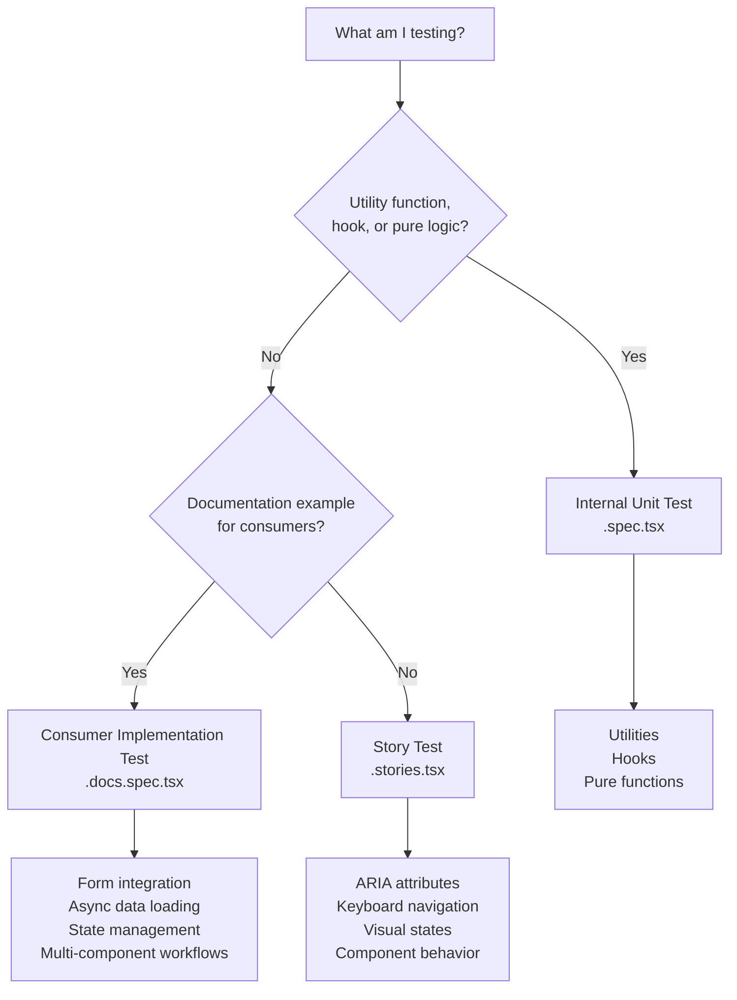

# Testing Strategy Guide

[← Back to Index](./index.md) |
[← Component Guidelines](../component-guidelines.md)

> **Note**: This guide is the authoritative source for test categorization.
> Other files provide context-specific summaries.

## Overview

Nimbus uses 3 test categories, each serving a distinct purpose and audience.

## The 3 Test Categories

| Category                          | File Pattern      | Purpose                                  | Audience     |
| --------------------------------- | ----------------- | ---------------------------------------- | ------------ |
| **Story Tests**                   | `*.stories.tsx`   | Internal component behavior testing      | Internal     |
| **Internal Unit Tests**           | `*.spec.tsx`      | Internal utility and hook testing        | Internal     |
| **Consumer Implementation Tests** | `*.docs.spec.tsx` | Documentation examples for consumer apps | **External** |

---

## Story Tests (`*.stories.tsx`)

### Purpose

Storybook stories test **internal component behavior**. They verify that our
components work correctly from a maintainer perspective.

### What Belongs Here

- Component rendering and visual states
- Interactive behavior (click, type, keyboard navigation)
- ARIA attributes and accessibility compliance
- State management (disabled, invalid, required, loading)
- Visual variants and sizes
- Focus management

### Example

```typescript
export const Disabled: Story = {
  args: { isDisabled: true },
  play: async ({ canvasElement }) => {
    const canvas = within(canvasElement);
    const button = canvas.getByRole("button");

    await expect(button).toHaveAttribute("aria-disabled", "true");
    await userEvent.tab();
    await expect(button).not.toHaveFocus();
  },
};
```

---

## Internal Unit Tests (`*.spec.tsx`)

### Purpose

Unit tests provide **fast, isolated testing** of utility functions and React
hooks. They run in JSDOM and test non-component logic.

### What Belongs Here

- Utility functions and helpers
- Custom React hooks (using `renderHook`)
- Pure functions and transformations
- Validation functions
- Data formatting utilities

### Example

```typescript
describe("formatCurrency", () => {
  it("formats USD with proper decimals", () => {
    expect(formatCurrency(1234.5, "USD")).toBe("$1,234.50");
  });
});
```

---

## Consumer Implementation Tests (`*.docs.spec.tsx`)

### Purpose

Consumer Implementation Tests are **working code examples** that consumers can
copy to test Nimbus components in their applications. These tests are
automatically injected into engineering documentation at build time.

**Key point**: These are documentation examples, not internal QA tests.

### What Belongs Here

Examples showing consumers how to:

- Integrate with form libraries (Formik, React Hook Form)
- Load async data into components
- Manage state with external libraries (Redux, Zustand)
- Handle errors in application context
- Build multi-component workflows

### Example

```typescript
/**
 * @docs-section form-integration
 * @docs-title Form Integration with Formik
 * @docs-description Example showing form submission with Formik
 * @docs-order 1
 */
describe("TextInput - Formik Integration", () => {
  it("submits form with valid data", async () => {
    const onSubmit = vi.fn();
    const user = userEvent.setup();

    render(
      <NimbusProvider>
        <Formik initialValues={{ email: "" }} onSubmit={onSubmit}>
          {({ handleSubmit, values, handleChange }) => (
            <form onSubmit={handleSubmit}>
              <TextInput
                name="email"
                value={values.email}
                onChange={handleChange}
              />
              <Button type="submit">Submit</Button>
            </form>
          )}
        </Formik>
      </NimbusProvider>
    );

    await user.type(screen.getByRole("textbox"), "test@example.com");
    await user.click(screen.getByRole("button", { name: "Submit" }));

    expect(onSubmit).toHaveBeenCalledWith(
      { email: "test@example.com" },
      expect.anything()
    );
  });
});
```

### What Does NOT Belong Here

Internal component behavior tests belong in Stories, not here:

- Testing `isDisabled`/`isInvalid`/`isRequired` states
- Testing ARIA attributes
- Testing keyboard navigation
- Testing basic render structure
- Testing visual variants

---

## Decision Flowchart



---

## Quick Reference

| What You're Testing              | Category                     | File Pattern      |
| -------------------------------- | ---------------------------- | ----------------- |
| Component states and behavior    | Story Test                   | `*.stories.tsx`   |
| ARIA attributes                  | Story Test                   | `*.stories.tsx`   |
| Keyboard navigation              | Story Test                   | `*.stories.tsx`   |
| Visual variants                  | Story Test                   | `*.stories.tsx`   |
| Form library integration example | Consumer Implementation Test | `*.docs.spec.tsx` |
| Async data loading example       | Consumer Implementation Test | `*.docs.spec.tsx` |
| State management example         | Consumer Implementation Test | `*.docs.spec.tsx` |
| Utility function                 | Internal Unit Test           | `*.spec.tsx`      |
| Custom hook                      | Internal Unit Test           | `*.spec.tsx`      |

---

## Related Guidelines

- [Unit Testing](./unit-testing.md) - JSDOM-based testing for utilities and
  hooks
- [Stories](./stories.md) - Storybook stories with play functions
- [Engineering Docs Validation](../engineering-docs-validation.md) - Test file
  integration with documentation

---

[← Back to Index](./index.md) |
[← Component Guidelines](../component-guidelines.md)
