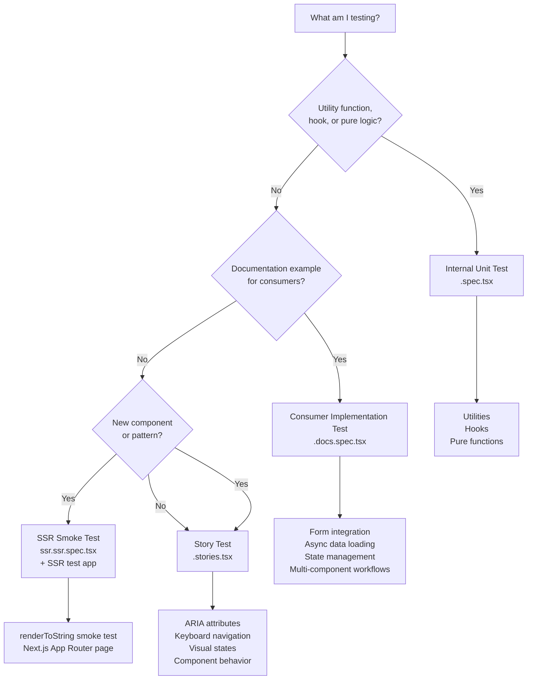

# Testing Strategy Guide

[← Back to Index](./index.md) |
[← Component Guidelines](../component-guidelines.md)

> **Note**: This guide is the authoritative source for test categorization.
> Other files provide context-specific summaries.

## Overview

Nimbus uses 3 test categories, each serving a distinct purpose and audience.

## The 4 Test Categories

| Category                          | File Pattern       | Purpose                                  | Audience     |
| --------------------------------- | ------------------ | ---------------------------------------- | ------------ |
| **Story Tests**                   | `*.stories.tsx`    | Internal component behavior testing      | Internal     |
| **Internal Unit Tests**           | `*.spec.tsx`       | Internal utility and hook testing        | Internal     |
| **Consumer Implementation Tests** | `*.docs.spec.tsx`  | Documentation examples for consumer apps | **External** |
| **SSR Smoke Tests**               | `ssr.ssr.spec.tsx` | Server-side rendering validation         | Internal     |

---

## Story Tests (`*.stories.tsx`)

### Purpose

Storybook stories test **internal component behavior**. They verify that our
components work correctly from a maintainer perspective.

### What Belongs Here

- Component rendering and visual states
- Interactive behavior (click, type, keyboard navigation)
- ARIA attributes and accessibility compliance
- State management (disabled, invalid, required, loading)
- Visual variants and sizes
- Focus management

### Example

```typescript
export const Disabled: Story = {
  args: { isDisabled: true },
  play: async ({ canvasElement }) => {
    const canvas = within(canvasElement);
    const button = canvas.getByRole("button");

    await expect(button).toHaveAttribute("aria-disabled", "true");
    await userEvent.tab();
    await expect(button).not.toHaveFocus();
  },
};
```

---

## Internal Unit Tests (`*.spec.tsx`)

### Purpose

Unit tests provide **fast, isolated testing** of utility functions and React
hooks. They run in JSDOM and test non-component logic.

### What Belongs Here

- Utility functions and helpers
- Custom React hooks (using `renderHook`)
- Pure functions and transformations
- Validation functions
- Data formatting utilities

### Example

```typescript
describe("formatCurrency", () => {
  it("formats USD with proper decimals", () => {
    expect(formatCurrency(1234.5, "USD")).toBe("$1,234.50");
  });
});
```

---

## Consumer Implementation Tests (`*.docs.spec.tsx`)

### Purpose

Consumer Implementation Tests are **working code examples** that consumers can
copy to test Nimbus components in their applications. These tests are
automatically injected into engineering documentation at build time.

**Key point**: These are documentation examples, not internal QA tests.

### What Belongs Here

Examples showing consumers how to:

- Integrate with form libraries (Formik, React Hook Form)
- Load async data into components
- Manage state with external libraries (Redux, Zustand)
- Handle errors in application context
- Build multi-component workflows

### Example

```typescript
/**
 * @docs-section form-integration
 * @docs-title Form Integration with Formik
 * @docs-description Example showing form submission with Formik
 * @docs-order 1
 */
describe("TextInput - Formik Integration", () => {
  it("submits form with valid data", async () => {
    const onSubmit = vi.fn();
    const user = userEvent.setup();

    render(
      <NimbusProvider>
        <Formik initialValues={{ email: "" }} onSubmit={onSubmit}>
          {({ handleSubmit, values, handleChange }) => (
            <form onSubmit={handleSubmit}>
              <TextInput
                name="email"
                value={values.email}
                onChange={handleChange}
              />
              <Button type="submit">Submit</Button>
            </form>
          )}
        </Formik>
      </NimbusProvider>
    );

    await user.type(screen.getByRole("textbox"), "test@example.com");
    await user.click(screen.getByRole("button", { name: "Submit" }));

    expect(onSubmit).toHaveBeenCalledWith(
      { email: "test@example.com" },
      expect.anything()
    );
  });
});
```

### What Does NOT Belong Here

Internal component behavior tests belong in Stories, not here:

- Testing `isDisabled`/`isInvalid`/`isRequired` states
- Testing ARIA attributes
- Testing keyboard navigation
- Testing basic render structure
- Testing visual variants

---

## SSR Smoke Tests (`src/test/ssr.ssr.spec.tsx`)

### Purpose

SSR smoke tests verify that every Nimbus component can render on the server
without crashing. They run `renderToString` in a pure Node.js environment (no
JSDOM, no `window`/`document`) to catch browser-only global access during
render.

### What Belongs Here

- A single `renderToString` call per component with minimal required props
- Assertions that the render produces truthy output (does not throw)
- Where possible, `toContain()` checks for expected text content

### When to Add

**Every new component or pattern must have an SSR smoke test.** When creating a
new component, add a test case to `packages/nimbus/src/test/ssr.ssr.spec.tsx`
and render the component in the Next.js SSR test app at `apps/ssr-test/`.

### How to Add

1. Import the component in `packages/nimbus/src/test/ssr.ssr.spec.tsx`
2. Add an `it()` block that renders the component inside the `renderSSR()`
   helper
3. Use the minimum required props to make the component render
4. Add the component to the appropriate section in `apps/ssr-test/app/page.tsx`
5. Run `pnpm vitest run --project=ssr` to verify the test passes
6. Rebuild the SSR test app (`cd apps/ssr-test && pnpm exec next build`) to
   verify it works in a real Next.js environment

### Example

```typescript
// In src/test/ssr.ssr.spec.tsx
it("MyComponent", () => {
  expect(
    renderSSR(<MyComponent aria-label="test">content</MyComponent>)
  ).toContain("content");
});
```

### Common Pitfalls

- Components using `useSyncExternalStore` must provide a `getServerSnapshot`
  (third argument) or they throw during SSR
- Components that access `window`/`document`/`navigator` during render (not in
  effects) will fail — guard these with `typeof window !== "undefined"` checks
  or move them into `useEffect`
- `useEffect` does not run during SSR — components that set state via effects
  (like `FormField.Label`) will render without that state on the server

---

## Decision Flowchart


```mermaid
flowchart TD
    Start[What am I testing?] --> Q1{Utility function,<br/>hook, or pure logic?}

    Q1 -->|Yes| Unit[Internal Unit Test<br/>.spec.tsx]
    Q1 -->|No| Q2{Documentation example<br/>for consumers?}

    Q2 -->|Yes| Consumer[Consumer Implementation Test<br/>.docs.spec.tsx]
    Q2 -->|No| Q3{New component<br/>or pattern?}

    Q3 -->|Yes| SSR[SSR Smoke Test<br/>ssr.ssr.spec.tsx<br/>+ SSR test app]
    Q3 -->|No| Story[Story Test<br/>.stories.tsx]
    Q3 -->|Yes| Story

    Consumer --> C1[Form integration<br/>Async data loading<br/>State management<br/>Multi-component workflows]

    Story --> S1[ARIA attributes<br/>Keyboard navigation<br/>Visual states<br/>Component behavior]

    Unit --> U1[Utilities<br/>Hooks<br/>Pure functions]

    SSR --> SSR1[renderToString smoke test<br/>Next.js App Router page]
```

---

## Quick Reference

| What You're Testing              | Category                     | File Pattern       |
| -------------------------------- | ---------------------------- | ------------------ |
| Component states and behavior    | Story Test                   | `*.stories.tsx`    |
| ARIA attributes                  | Story Test                   | `*.stories.tsx`    |
| Keyboard navigation              | Story Test                   | `*.stories.tsx`    |
| Visual variants                  | Story Test                   | `*.stories.tsx`    |
| Form library integration example | Consumer Implementation Test | `*.docs.spec.tsx`  |
| Async data loading example       | Consumer Implementation Test | `*.docs.spec.tsx`  |
| State management example         | Consumer Implementation Test | `*.docs.spec.tsx`  |
| Utility function                 | Internal Unit Test           | `*.spec.tsx`       |
| Custom hook                      | Internal Unit Test           | `*.spec.tsx`       |
| New component renders on server  | SSR Smoke Test               | `ssr.ssr.spec.tsx` |
| New component works in Next.js   | SSR Test App                 | `apps/ssr-test/`   |

---

## Related Guidelines

- [Unit Testing](./unit-testing.md) - JSDOM-based testing for utilities and
  hooks
- [Stories](./stories.md) - Storybook stories with play functions
- [Engineering Docs Validation](../engineering-docs-validation.md) - Test file
  integration with documentation
- [SSR Documentation](/home/getting-started/server-side-rendering) - Consumer
  guide for using Nimbus in SSR/RSC environments

---

[← Back to Index](./index.md) |
[← Component Guidelines](../component-guidelines.md)
