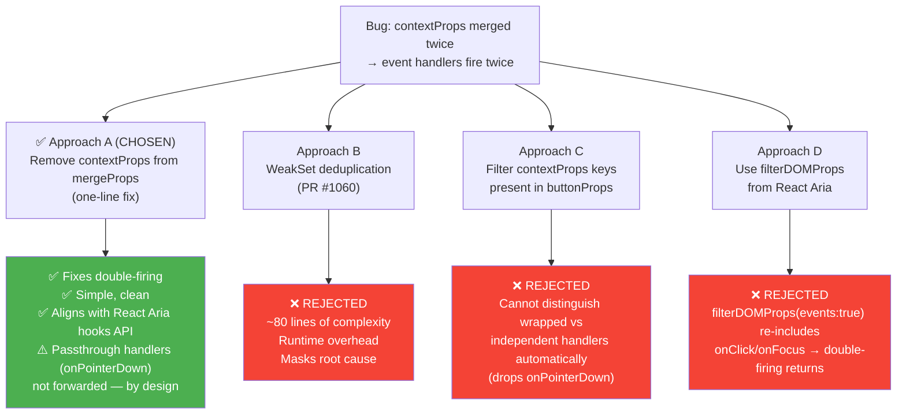

# CRAFT-2106: Button Event Handlers Fire Twice

## Status: Resolved

**Date:** 2026-02-12 **PR:**
[#1061](https://github.com/commercetools/nimbus/pull/1061) (supersedes
[#1060](https://github.com/commercetools/nimbus/pull/1060)) **Branch:**
`fix/CRAFT-2106-button-double-firing--revision-1`

---

## The Bug

The Button component merges `contextProps` twice — once into `useButton` and
again in the final `mergeProps` call. This causes all DOM event handlers
(`onClick`, `onMouseDown`, `onDoubleClick`, etc.) to fire twice per interaction.

`onPress` is unaffected because React Aria deduplicates it internally.

**File:** `packages/nimbus/src/components/button/button.tsx`

```tsx
// Current implementation (buggy)
const [contextProps, contextRef] = useContextProps(
  rest,
  baseRef,
  ButtonContext
);

const { buttonProps } = useButton(
  { ...contextProps, elementType }, // ← first merge
  contextRef
);

const componentProps = mergeProps(
  contextProps, // ← second merge (duplicate handlers)
  buttonProps,
  { as, asChild, slot: contextProps.slot || undefined }
);
```

---

## How React Aria Handles This

Understanding React Aria's two APIs is critical to choosing the right fix.

### The hooks API (`useButton`) — drops DOM handlers intentionally

`useButton` abstracts away raw DOM events behind semantic press events
(`onPress`, `onPressStart`, etc.) to hide cross-platform inconsistencies: touch
event cascades, mobile browser delays, pointer drag edge cases, and screen
reader differences.

**What `buttonProps` includes:**

- Press events: `onClick`, `onPress`, `onPressStart`, `onPressEnd` (via
  `usePress`)
- Focus events: `onFocus`, `onBlur` (via `useFocusable`)
- Keyboard events: `onKeyDown`, `onKeyUp` (via `usePress` for Enter/Space)
- Button attributes: `type`, `disabled`, `role`, `aria-disabled`, `tabIndex`
- Filtered DOM props via `filterDOMProps(props, {labelable: true})`: `data-*`,
  `aria-*`, `id`

**What `buttonProps` drops:**

- `onPointerDown`, `onPointerUp`, `onMouseDown`, `onMouseUp`
- `onDoubleClick`, `onContextMenu`
- `onTouchStart`, `onTouchEnd`
- All other DOM event handlers

This is because `filterDOMProps` only includes event handlers when called with
`events: true`. `useButton` calls it with only `{labelable: true}`.

### The component API (`react-aria-components`) — NOW passes them through

React Aria's own `Button` component (from `react-aria-components`) **changed
their approach** in
[PR #8327](https://github.com/adobe/react-spectrum/pull/8327). It now passes
through all DOM events (`onPointerDown`, `onMouseDown`, etc.) to support
third-party library integration.

These props are hidden from the docs but available in TypeScript and passed to
the DOM. The component API uses `useButton` internally but adds the passthrough
DOM events on top.

### Why this matters for Nimbus

Nimbus uses `useButton` (hooks API), not the component-based Button from
`react-aria-components`. So we hit the hooks API's limitation where arbitrary
DOM handlers are dropped.

React Aria solved this same problem in their component API by passing through
DOM events separately from `useButton`'s output.

**However**, since Nimbus uses the hooks API, aligning with its semantics is the
correct choice. Consumers should use `onPress`/`onPressStart`/`onPressEnd`
instead of raw DOM handlers like `onClick`/`onPointerDown`. A codebase scan
confirmed no consumer or internal code passes `onPointerDown` to
Button/IconButton, so nothing is lost by accepting the hooks API's behavior.

### `filterDOMProps` as a tool

`filterDOMProps` from `react-aria` supports an `events: true` option:

```tsx
import { filterDOMProps } from "react-aria";

// Only labelable props (data-*, aria-*, id) — no events
filterDOMProps(props, { labelable: true });

// Includes all DOM event handlers
filterDOMProps(props, { labelable: true, events: true });
```

This could be used to extract passthrough DOM events from `contextProps` without
manually listing them.

---

## Approaches Explored



### Approach A: Remove `contextProps` from merge (one-line fix)

```tsx
const componentProps = mergeProps(buttonProps, {
  as,
  asChild,
  slot: contextProps.slot || undefined,
});
```

**Result:** Fixes double-firing but drops any DOM handler that `useButton`
doesn't pass through. The `EventHandlersFireOnce` test fails on `onPointerDown`
— the user's handler is silently lost.

### Approach B: WeakSet deduplication (PR #1060)

Wraps handlers in memoized dedup functions keyed on the native event. Passes
deduped handlers to both `useButton` and `componentProps`.

**Result:** Works, but adds ~80 lines of runtime complexity to a primitive
component. Treats the symptom, not the cause.

### Approach C: Filter contextProps by buttonProps keys

```tsx
const passthroughProps: Record<string, unknown> = {};
for (const key of Object.keys(contextProps)) {
  if (!(key in buttonProps)) {
    passthroughProps[key] = contextProps[key as keyof typeof contextProps];
  }
}
const componentProps = mergeProps(buttonProps, passthroughProps, {
  as,
  asChild,
  slot: contextProps.slot || undefined,
});
```

**Result:** Fixes double-firing while preserving passthrough handlers. Automatic
(no manual handler lists). Uses implicit key-based filtering.

### Approach D: Use `filterDOMProps` from React Aria

```tsx
import { filterDOMProps } from "react-aria";

const componentProps = mergeProps(
  buttonProps,
  filterDOMProps(contextProps, { events: true }),
  { as, asChild, slot: contextProps.slot || undefined }
);
```

**Result:** Uses React Aria's own utility to extract passthrough DOM events.
This is the same pattern React Aria's component API uses to pass through DOM
events on top of `useButton`'s output. Needs verification that
`filterDOMProps(..., {events: true})` doesn't re-include handlers like `onClick`
that `useButton` already wraps (which would bring back the double-firing bug).

### Assessment

Approach B (PR #1060) is ruled out — too complex for a primitive.

Approach A is the simplest but drops legitimate passthrough handlers. React
Aria's own component API decided these should work, so dropping them is a step
backwards.

Approach C works and is automatic but uses an ad-hoc filtering pattern.

Approach D uses React Aria's own utility and matches their component API
pattern. If `filterDOMProps` with `events: true` includes `onClick`/`onFocus`
(which it does — those are global DOM events), it would re-introduce double-
firing for those handlers. In that case we'd need to combine D with the
`buttonProps` key check from C, or just use C alone.

---

## Why DataTable Broke With Approach A

### The chain of events

1. **DataTable row** attaches a capture-phase `pointerdown` listener that calls
   `stopPropagation()` on non-selection elements (to prevent row selection when
   clicking buttons inside the row):

   ```tsx
   // data-table.row.tsx, line 234-241
   node.addEventListener(
     "pointerdown",
     stopPropagationToNonInteractiveElements,
     { capture: true }
   );
   ```

2. **DataTable's internal buttons** use `onClick` instead of `onPress`:

   ```tsx
   // Pin button (data-table.row.tsx:441)
   <IconButton
     onClick={(e) => {
       e.stopPropagation();
       togglePin(row.id);
     }}
   >
   ```

3. With Approach A, `onClick` only flows through React Aria's usePress →
   `triggerClick` path.

4. But `pointerdown` was already stopped by DataTable's capture handler →
   usePress never starts its sequence → `triggerClick` never fires → `onClick`
   never fires.

### The real problem

DataTable uses `onClick` where it should use `onPress`. This is inconsistent
with React Aria's API design and the rest of the Nimbus codebase.

### Affected locations in DataTable

| File                                   | Line | Component           | Current                           | Should be |
| -------------------------------------- | ---- | ------------------- | --------------------------------- | --------- |
| `data-table.row.tsx`                   | 382  | Expand button       | `onClick` + `e.stopPropagation()` | `onPress` |
| `data-table.row.tsx`                   | 441  | Pin button          | `onClick` + `e.stopPropagation()` | `onPress` |
| `data-table.manager.tsx`               | 172  | Settings IconButton | `onClick`                         | `onPress` |
| `data-table.visible-columns-panel.tsx` | 230  | Reset Button        | `onClick`                         | `onPress` |

---

## Wider `onClick` Usage Across the Codebase

A full codebase scan reveals **~45 usages** of `onClick` on Button/IconButton:

| Category                       | Count | Notes                                        |
| ------------------------------ | ----- | -------------------------------------------- |
| MDX documentation examples     | ~30   | Consumer-facing docs showing `onClick` usage |
| Consumer implementation tests  | 3     | `.docs.spec.tsx` files                       |
| Documentation site (apps/docs) | 3     | Error boundary, mode toggle, delete button   |
| DataTable internal components  | 4     | The broken cases identified above            |
| Architecture decision docs     | 4     | ADR examples                                 |

This means fixing the Button and switching to `onPress` everywhere is a larger
migration effort. The documentation examples in particular teach consumers to
use `onClick`, which is the wrong pattern for React Aria components.

---

## Why Approach C (filter by buttonProps keys) Doesn't Work Either

Approach C filters out any `contextProps` key that also exists in `buttonProps`.
This seemed correct but fails for `onPointerDown`:

- `usePress` creates its **own** `onPointerDown` for press tracking (independent
  of user's handler)
- So `buttonProps` has an `onPointerDown` key
- Approach C sees this and excludes the user's `onPointerDown` from passthrough
- The user's handler is silently dropped (called 0 times instead of 1)

The core problem: `buttonProps` keys fall into two categories:

1. **Wrapped handlers** — `useButton` consumes the user's handler and returns a
   processed version that already calls it internally (e.g. `onClick`,
   `onFocus`, `onBlur`). Re-merging these causes double-firing.
2. **Independent handlers** — `usePress` creates its own handler without
   wrapping the user's (e.g. `onPointerDown`, `onMouseDown`). The user's handler
   should be chained alongside via `mergeProps`.

There is no way to distinguish these two categories automatically by inspecting
`buttonProps` keys alone. A hardcoded exclusion list would work but defeats the
purpose of a reusable utility.

## DataTable's Capture Handler: A Separate Bug

During testing we discovered that DataTable's
`stopPropagationToNonInteractiveElements` stops `pointerdown` propagation for
ALL non-selection elements — **including buttons**. This prevents `usePress`
from starting on any Button/IconButton inside a table row.

The old code only worked by accident: the double-merge bug preserved the raw
`onClick` handler alongside usePress's handler. When `usePress` couldn't fire
(pointerdown was stopped), the raw `onClick` still caught the native click
event.

The fix: change the capture handler to only stop propagation for non-interactive
elements (empty row areas), allowing buttons to receive `pointerdown` normally:

```tsx
// OLD: stops for everything except selection controls
if (!isInteractiveElement || (isInteractiveElement && !isSelectionElement)) {
  e.stopPropagation();
}

// FIXED: stops only for non-interactive areas
if (!isInteractiveElement) {
  e.stopPropagation();
}
```

With this fix, DataTable buttons can use `onPress` as intended.

## Resolution: Approach A

**Decision:** Accept the React Aria hooks API's semantics. Passthrough DOM
handlers (`onPointerDown`, `onMouseDown`, etc.) are intentionally not forwarded
by `useButton`. Consumers should use `onPress`/`onPressStart`/`onPressEnd`.

A codebase scan confirmed **zero usages** of `onPointerDown` on
Button/IconButton in consumer or internal code, so nothing is lost.

### Changes made

**Button** (`button.tsx`):

```tsx
// Before (buggy): contextProps merged via mergeProps (chains handlers → double-firing)
const componentProps = mergeProps(contextProps, buttonProps, { ... });
<ButtonRoot {...componentProps}>

// After: contextProps spread first, componentProps spread second (JSX overwrite)
const componentProps = mergeProps(buttonProps, {
  as, asChild,
  slot: contextProps.slot || undefined,
});
<ButtonRoot
  {...contextProps}
  {...componentProps}
  aria-disabled={contextProps.isDisabled || undefined}
  data-disabled={contextProps.isDisabled || undefined}
>
```

**Why JSX spread instead of `mergeProps`:**

- `mergeProps` **chains** function props — both fire → double-firing
- JSX spread **overwrites** — last one wins → only `useButton`'s processed
  handler fires
- `useButton`'s handlers already call the user's handlers internally (via
  `usePress`, `useFocusable`), so the user's handler fires exactly once
- Recipe/style props (`size`, `variant`, `colorPalette`) survive from
  `contextProps` because `useButton` doesn't output them — they pass through to
  `ButtonRoot` unchanged

**DataTable capture handler** (`data-table.row.tsx`):

- Renamed to `stopPropagationForNonInteractiveElements`
- Now only stops propagation for non-interactive areas (empty row space)
- Buttons inside rows receive `pointerdown` normally, so `usePress` works

**DataTable `onClick` → `onPress` migration:**

| File                                   | Component           | Change                                        |
| -------------------------------------- | ------------------- | --------------------------------------------- |
| `data-table.row.tsx`                   | Pin IconButton      | `onClick` → `onPress`                         |
| `data-table.row.tsx`                   | Expand button       | Raw Chakra slot → `IconButton` with `onPress` |
| `data-table.manager.tsx`               | Settings IconButton | `onClick` → `onPress`                         |
| `data-table.visible-columns-panel.tsx` | Reset Button        | `onClick` → `onPress`                         |

**DataTable expand button replacement:**

The `DataTableExpandButton` was a raw Chakra
`withContext("button", "expandButton")` slot — a plain `<button>` element with
no React Aria behavior. It was replaced with `IconButton` (`variant="ghost"`,
`borderRadius="0"`, `w="100%"`, `h="100%"`) to gain proper
`useButton`/`usePress` handling and keyboard accessibility. The `expandButton`
slot was removed from both `data-table.slots.tsx` and `data-table.recipe.ts` (it
had no styles defined).

**Regression test:** `EventHandlersFireOnce` story added to `button.stories.tsx`
— verifies `onClick`, `onPress`, `onFocus`, `onBlur`, and `onKeyDown` each fire
exactly once per interaction.

### CollapsibleMotion compatibility

Verified that `CollapsibleMotion.Trigger` works correctly with the Button fix.
All 9 story tests and 14 docs spec tests pass.

**Why the trigger uses `disabled` (not `isDisabled`):**

The trigger's `asChild` path wraps children in `<chakra.button asChild>`.
Chakra's `asChild` mechanism strips non-DOM props — so `isDisabled` (a React
Aria prop present in `useDisclosure`'s `buttonProps`) never reaches the child
component. The trigger works around this by explicitly passing
`{ disabled: isDisabled }` in `mergeProps`. The native HTML `disabled` attribute
survives Chakra's filtering and natively disables the button at the browser
level.

This is a Chakra `asChild` limitation, not a Button issue. A `disabled` →
`isDisabled` mapping on Button was considered and rejected — it would special-
case one native HTML attribute without a principled reason to do so for all of
them. The trigger's workaround is sufficient.

**Key finding:** Using the Nimbus Button _internally_ in the trigger (replacing
the current `RaButton` from `react-aria-components`) would be problematic — it
would cause double React Aria processing (`useDisclosure` produces
`onPress`/ARIA props, then `useButton` inside Nimbus Button would re-process
them). The current architecture is correct:

- **Non-`asChild` path:** Raw `RaButton` + `CollapsibleMotionTriggerSlot` —
  minimal, unstyled trigger with proper ARIA attributes
- **`asChild` path:** Consumer provides their own element (typically Nimbus
  `Button`) via composition

### All tests pass

- Button: 13/13 stories pass (including `EventHandlersFireOnce`)
- DataTable: 25/25 stories pass (including Nested Table and Row Pinning)
- CollapsibleMotion: 9/9 stories + 14/14 docs specs pass

### Follow-up work

- **`onClick` in docs**: The ~45 `onClick` usages across MDX docs and test files
  teach consumers the wrong pattern. A separate effort should migrate
  documentation examples to `onPress`.
