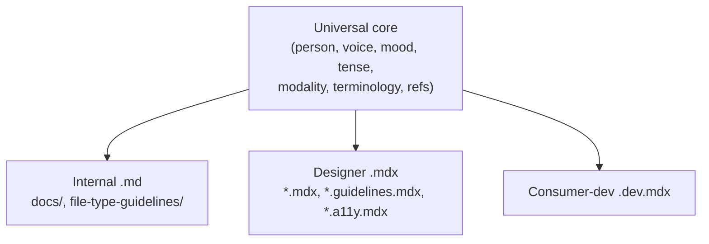

# Writing Style

[← Back to Documentation Index](./readme.md)

> The house style for **all** written prose in this repo — the voice
> ([precision over emphasis](#precision-over-emphasis)), the universal
> grammatical dimensions ([Universal core](#universal-core)), and the short
> [per-audience overlays](#audience-overlays) where they differ. Read the first
> two once; then read the one overlay that matches what you are writing.

These conventions are applied by authors and reviewers, not by an automated
linter — see [Applying this guide](#applying-this-guide).

## Why standardize

Two properties we want from every doc:

- **Understandable** — a reader extracts the intended meaning on the first pass,
  without re-reading or guessing.
- **Robust** — the meaning survives editing, partial reading, and translation;
  obligations are explicit, not implied by tone.

Both come from controlling a small set of _dimensions_ — measurable axes of
written language. Fix a value per dimension and apply it everywhere, so
consistency comes from the rules rather than from per-PR judgment.

## Precision over emphasis

The house voice is plain and declarative. State facts and obligations directly,
and let precision do the work that emphasis, slogans, and reassurance try to do.

These are strong defaults: write this way unless a reviewer agrees a specific
case reads better otherwise. They apply to **every** doc, including designer
prose — a designer doc may be warm and plain-spoken, but it should not sell.

- **Labels, not slogans.** A heading or lead-in names its content; it does not
  advertise it.

  ```text
  ✅  ## Error handling
  ❌  ## Bulletproof error handling
  ```

- **Precision replaces emphasis.** Bold text and superlatives carry no
  information. Replace the emphasis with the specific fact.

  ```text
  ✅  This runs on every request, so keep it under 5ms.
  ❌  This is **extremely** performance-critical.
  ```

- **State the rule, not the benefit.** Give the obligation and drop the payoff.
  The reader follows the rule to comply, not to feel good about it.

  ```text
  ✅  Wrap every identifier in backticks.
  ❌  Backticks keep your docs clean and professional — readers will thank you.
  ```

- **Lead with the rule.** No throat-clearing. The first sentence is the
  instruction; context follows if it is needed.

  ```text
  ✅  Run `pnpm build:tokens` before building packages — tokens are a build dependency.
  ❌  Before getting into the details, it helps to know that tokens matter. Run `pnpm build:tokens`.
  ```

- **"You" is for instructions, not reassurance.** Address the reader to tell
  them what to do, not to comfort them.

  ```text
  ✅  You pass the ref to the root element.
  ❌  Don't worry — you will find this part easy.
  ```

- **Cut filler and hedges.** Delete `simply`, `just`, `easy`, `obviously`,
  `of course`, `seamless`, `painless`. They add length, not meaning — and "easy"
  stings when it isn't.

  ```text
  ✅  Configure the proxy in `vite.config.ts`.
  ❌  Simply just configure the proxy — it's easy.
  ```

## Universal core

These apply to **every** doc — internal `.md`, designer `.mdx`, and
consumer-developer `.dev.mdx`. They are the grammatical dimensions; the voice
above governs how they read.

### Person and address

Address the reader as **you**, and only to instruct (see
[Precision over emphasis](#precision-over-emphasis)). Describe the system in the
**third person**. Avoid the first person (`I`, `we`, `our`) in consumer-facing
docs — it is ambiguous about who acts and does not translate cleanly.

```text
✅  You import the component from the package root.
✅  The API loads the registry at boot.
❌  We load the registry at boot.        (who is "we"?)
❌  I'd recommend importing it directly.  (who is "I"?)
```

> Internal `docs/*.md` **may** use "we" for genuine team decisions ("we chose
> Pothos because…"). Allow it there; avoid it everywhere else.

### Voice

Prefer the **active voice**. The actor comes before the action, so the reader
never has to reconstruct who is responsible.

```text
✅  Run the sync script before building.
✅  Pothos generates the schema.
❌  The sync script should be run before building.  (run by whom?)
❌  The schema is generated.                         (by what?)
```

Passive voice is acceptable when the actor is genuinely unknown or irrelevant
("The file is gitignored").

### Mood

Match grammatical mood to intent — and never mix them in one sentence:

| Intent                          | Mood       | Form                          |
| ------------------------------- | ---------- | ----------------------------- |
| Tell the reader to do something | Imperative | "Run `pnpm build`."           |
| State a fact about the system   | Indicative | "The build emits to `dist/`." |

A step is a command; an explanation is a statement. When the two blur, the
reader cannot tell whether a sentence is an instruction or background.

### Tense

Use the **present tense** for behavior — code behavior is timeless, not a future
promise.

```text
✅  The hook returns a typed document.
❌  The hook will return a typed document.
```

Reserve the present perfect for genuine prerequisites ("Once you **have
installed** the browsers, …").

### Modality — normative keywords

State obligation with reserved keywords, not tone. It makes "is this required?"
answerable by reading one word.

| Keyword    | Meaning                                            |
| ---------- | -------------------------------------------------- |
| **must**   | Required. No exceptions. Breaking it is a defect.  |
| **should** | Strong default. Deviate only with a stated reason. |
| **may**    | Genuinely optional. Either choice is fine.         |

Do not weaken these with synonyms. Prefer the keyword over `have to`,
`needs to`, `ought to`, `is required to`.

```text
✅  Components must have a play function.
✅  You should colocate the recipe with the slot; inline it only for trivial cases.
✅  You may pass a custom `ref`.
❌  Components have to have a play function.
❌  You really need to colocate the recipe.
```

> In **designer** prose, a softer register is fine, but the keyword still
> carries the obligation — write "Badges should stay under three words" rather
> than dressing the rule up so it reads as a suggestion.

### Terminology — one term per concept

Maintain a controlled vocabulary: **one word per concept, one concept per
word.** Switching synonyms makes the reader wonder whether you mean something
new.

| Concept                                      | Use                              | Not                    |
| -------------------------------------------- | -------------------------------- | ---------------------- |
| Someone who integrates Nimbus into their app | **consumer**                     | user, client, customer |
| The end user of a consumer's app             | **user** / **end user**          | consumer               |
| The Nimbus repo's own engineers              | **contributor** / **maintainer** | developer (ambiguous)  |

Identifier and product names have one canonical casing: `TypeScript`,
`JavaScript`, `GitHub`, `npm`, `pnpm`, `Storybook`, `React Aria`, `Chakra UI`,
`MDX`. Wrap every code identifier, path, and command in backticks
(`useGraphqlQuery`, `packages/nimbus`, `pnpm build`) so prose words never
masquerade as code.

### Reference and antecedents

Every `it`, `this`, `that`, `they` must have **one** unambiguous antecedent
within roughly one clause. When the antecedent is ambiguous, repeat the noun.

```text
✅  The recipe imports the slot. The slot wraps the Chakra primitive.
❌  The recipe imports the slot, and it wraps the Chakra primitive.  (which one wraps?)
```

### Information ordering

- **Given before new.** Open a sentence with what the reader already knows; end
  with the new information.
- **Preconditions before steps.** State what must be true _before_ the first
  numbered step, not inside step 4.
- **Lead with the conclusion.** Open a section with its outcome; put caveats and
  detail after (see [Lead with the rule](#precision-over-emphasis)).

### Sentence construction

One idea per sentence. Prefer short, declarative sentences over clause-stacked
ones. If a sentence has more than one "and"/"but"/"which", consider splitting
it.

### Headings and structure

- **Sentence case** for headings ("Getting started", not "Getting Started").
- Headings are [labels, not slogans](#precision-over-emphasis) — they name a
  section, they do not advertise it.
- Markdown tables for matrices; fenced code blocks always carry a language tag.
- Diagrams are **Mermaid**, never ASCII art — see
  [maintaining-docs.md](./maintaining-docs.md).

## Audience overlays

The core above is fixed. These overlays adjust only the **rhetorical**
dimensions — register, assumed knowledge, and how much "why" versus "how" — for
each surface.



### Internal docs (`docs/*.md`, `file-type-guidelines/`)

Audience: contributors and maintainers of this repo.

- **Assume deep context.** You may use repo jargon, file paths, and package
  names without expanding them.
- **Document the "why".** Record the decision and its rationale, not just the
  rule — a contributor needs to know when the rule stops applying.
- **First-person plural is allowed** for team decisions (see
  [Person and address](#person-and-address)).
- **Reference, don't duplicate.** Canonical facts live in exactly one doc;
  everything else links to it.

### Designer docs (`*.mdx`, `*.guidelines.mdx`, `*.a11y.mdx`)

Audience: designers consuming the design system on the docs site.

- **Concept over code.** Explain _when_ and _why_ to use a component before
  _how_. Keep prose light on implementation detail.
- **Plain language.** Expand or avoid engineering jargon; assume no TypeScript
  knowledge.
- **Warm, not promotional.** A friendlier, plainer register is welcome, but
  [precision over emphasis](#precision-over-emphasis) still holds — warmth, not
  selling. Normative keywords still carry the rule (see
  [Modality](#modality--normative-keywords)).
- **Show, don't tell.** Lead with a live example; let the visual do the work.

### Consumer-developer docs (`*.dev.mdx`)

Audience: developers integrating Nimbus components into their apps.

- **API-first and task-oriented.** Open with import and basic usage; organize by
  what the consumer wants to accomplish.
- **Copy-paste-ready examples.** Every snippet should run as written. Prefer a
  working example over a prose description of one.
- **Address the consumer as "you"**; describe the component in the third person.
- **State the contract precisely.** Use `must`/`should`/`may` for prop
  requirements, defaults, and constraints — this is the consumer's API contract.

## Applying this guide

This guide is applied by **authors and reviewers**, not by an automated linter.
We evaluated prose-linting tools (Vale, textlint) and chose not to adopt one:
the component MDX dialect uses build-time tokens (e.g. `{{docs-tests:}}`) that
strict MDX parsers reject, and the remaining findings were dominated by
low-signal passive-voice and weak-word noise. The cost outweighed the benefit.

When writing or reviewing docs, check the dimensions in priority order:

1. **Modality** — is every obligation stated with `must` / `should` / `may`?
2. **Terminology** — one term per concept, and canonical casing for identifiers
   (`TypeScript`, `JavaScript`, `GitHub`, `npm`, `pnpm`, `Storybook`,
   `React Aria`, `Chakra UI`).
3. **Person, voice, mood, tense** — the [Universal core](#universal-core).
4. **Precision over emphasis** — labels not slogans, no pep talk, no
   reassurance, no filler.

The `/review` command treats this guide as part of its knowledge base, so a
review of changed docs or component prose checks these conventions. The
deterministic `pnpm check:claude-docs` guardrail is complementary — it enforces
the index/link/anchor structure, not the prose itself.
