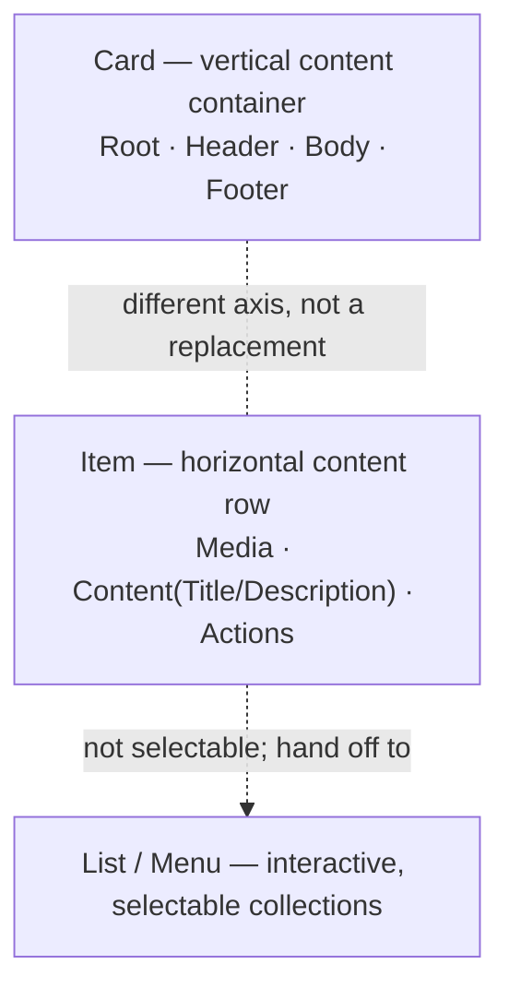
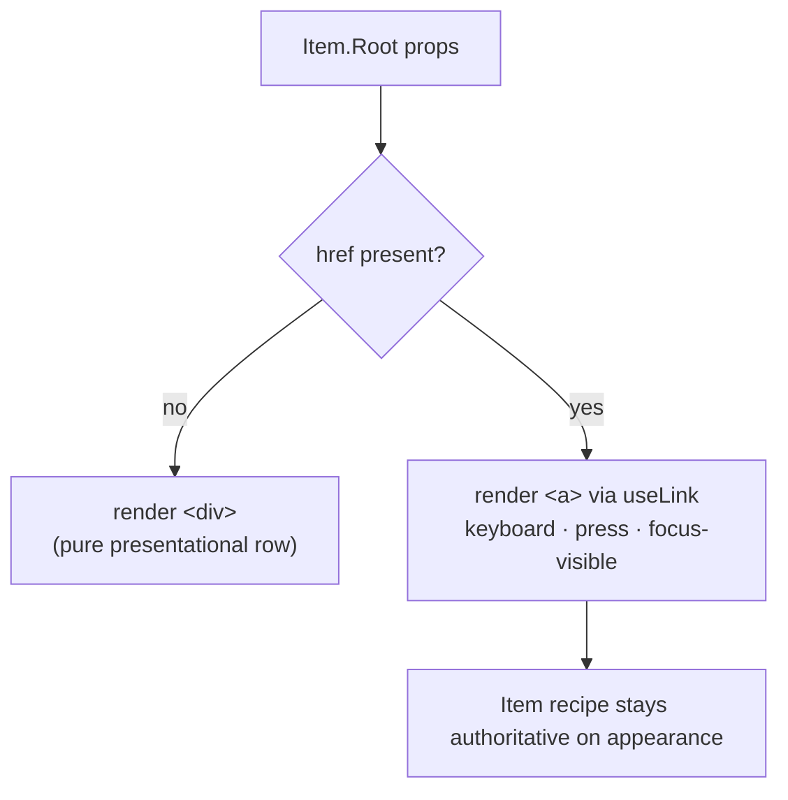

# Design: Item

## Context

`Item` is a **Tier 3 presentational compound** — layout, styling, and
accessibility, with no data or runtime concerns. It fills the one container
shape Nimbus lacks: a **horizontal content row** (leading media, a
title/description column, trailing actions), as opposed to `Card` (a vertical
content container) and `List`/`Menu` (interactive, selectable collections).

The anatomy and the interactivity model are lifted from shadcn's **React Aria**
`Item` variant and retrofitted to Nimbus conventions. The single most important
decision it carries over is _restraint_: the row is presentational and only
upgrades to a link — never a button, never a selection target.

## Where Item sits among Nimbus containers



`Item` complements rather than competes: reach for `Card` when content stacks
vertically as a self-contained block, for `Item` when it reads as a row in a
set, and for `List`/`Menu` when rows must be selectable or navigable as a
managed collection.

## The crux: link-upgrade, and why not a button

shadcn's React Aria `Item` integrates the framework in exactly one place:

```tsx
const Element = "href" in props ? LinkPrimitive : "div";
```

Nimbus adopts the same polymorphism, but sources the behavior from the `useLink`
**hook** (`react-aria`) — the identical primitive `Nimbus`'s own `Link`
component uses internally — rather than importing `react-aria-components`'
`Link`, and rather than wrapping the row in Nimbus `<Link>`.



Two things this must NOT do, and why:

- **No button / `onPress`-as-button mode.** A `<button>` wrapping the
  title+description+media subtree announces the whole thing as one control, and
  it makes the nested `Item.Actions` buttons invalid (`<button>` inside
  `<button>`). Real actions are `Button`/`IconButton` placed in `Item.Actions`,
  which keep an **independent focus order** from the row link. A link containing
  action buttons is the tolerable, common composition; a button containing them
  is not.
- **No wrap in Nimbus `<Link>`.** The `Link` recipe carries link-specific
  appearance (font color, underline) that would fight Item's recipe. Reusing the
  `useLink` hook gives us the accessible link behavior while Item's own recipe
  governs how the row looks.

## Responsibilities & seams

### `Item.Root` — the row envelope (compound provider)

- **Owns:** the `nimbusItem` slot-recipe context every part reads; the flex row
  layout (media · content · actions), plus optional header/footer bands; the
  `variant`/`size` axes; the div↔`<a>` polymorphism and, in link mode, the
  `useLink` behavior + focus-visible ring.
- **Refuses to own:** the content of each part (crosses the seam as `children`);
  selection state; the semantics of a _collection_ (that is the peer
  `ItemGroup`, below).

### The parts

- **`Item.Media`** — a fixed, non-shrinking leading slot with its own `variant`
  (`default | icon | image`) to size/shape icon vs avatar vs image content.
  Decorative by default.
- **`Item.Content` / `Item.Title` / `Item.Description`** — the vertical text
  column; `Content` is the flex-growing middle, `Title` primary, `Description`
  secondary.
- **`Item.Actions`** — trailing slot for interactive controls; independent focus
  order; the _only_ sanctioned home for row actions.
- **`Item.Header` / `Item.Footer`** — optional full-width bands above/below the
  row (shadcn parity).

### `ItemGroup` — the standalone peer (separate component/folder)

`ItemGroup` wraps `Item.Root` rows; it is a **parent** of the row, so it cannot
be a `withContext` slot of `nimbusItem` (a context slot must live under the
`Item.Root` provider). It is therefore its own component with its own
`nimbusItemGroup` recipe:

- **`ItemGroup.Root`** — a plain vertical stack container. It deliberately does
  **not** set `role="list"`: a list role requires `listitem` children and
  forbids separator children (`aria-required-children`), which free composition
  can't guarantee.
- **`ItemGroup.Separator`** — a horizontal divider (`role="separator"`, not a
  focus stop) between rows.

## Styling

One `defineSlotRecipe` keyed `nimbusItem`, className `nimbus-item`, one slot per
part, **design tokens only**. Registered in `src/theme/slot-recipes/index.ts`.

- Root: `variant` = `plain | outline | subtle` (default `plain`); `size` =
  `xs | sm | md` (default `md`, controlling padding/gap density).
- Media: `variant` = `default | icon | image`.

`outline`/`subtle` deliberately match the Nimbus-wide variant vocabulary
(`button`, `avatar`, `code`, `toast`); `Card`'s `outlined`/`muted` is the
outlier and is not touched here.

## Accessibility (WCAG 2.1 AA)

- Link-mode `Item.Root` is a genuine `<a>`: keyboard focusable, activates on
  Enter, shows a recipe-driven focus-visible ring; navigation integrates with
  the app router via `useLink`.
- Row link and `Item.Actions` controls occupy distinct, independently reachable
  focus stops — no nested-interactive trap. A capture-phase guard on the link
  root cancels navigation when a click originates inside `Item.Actions`, so
  nested controls (whose own React Aria press handling stops event propagation)
  remain operable without navigating the row.
- `Item.Media` is decorative unless the consumer names it.
- `ItemGroup.Root` is a plain container (no `role="list"`, see above);
  `ItemGroup.Separator` is `role="separator"` and not a focus stop.
- Variant/size never encode meaning by color alone.

## Usage notes

- **Clickable row** → put `href` on `Item.Root`; do not also make the whole row
  a button. Secondary per-row actions go in `Item.Actions`.
- **List of rows** → wrap in `ItemGroup.Root` and interleave
  `ItemGroup.Separator`.
- **Selectable / navigable collection** → that is not `Item`; use `List`/`Menu`.
- **Media** → supply your own `Icon`/`Avatar`/`Image` as `Item.Media` children;
  set its `variant` to match.
