# @commercetools/nimbus-i18n

This package manages the translation message compilation pipeline for the Nimbus
design system. It transforms translation data from Transifex format into
pre-compiled, component-level message dictionaries that are bundled directly
with Nimbus components.

> 📖 **For i18n development information (adding messages, extraction workflow,
> etc.), see the
> [Nimbus README](../nimbus/README.md#internationalization-i18n-development)**

## Package Purpose

This is an **internal build tool package** that:

- **Stores translation source data** (`data/`) for the extraction and
  translation workflow
- **Compiles messages at build time** using `@internationalized/string-compiler`
- **Generates component-level message files** in
  `packages/nimbus/src/components/*/intl/` and `*.messages.ts`
- **Eliminates runtime parsing overhead** by pre-compiling all messages to
  JavaScript functions

> **Note:** Message extraction uses a custom script to parse `.i18n.ts` files.
> Components use compiled `.messages.ts` dictionaries with
> `LocalizedStringDictionary` from `@internationalized/string` at runtime.

## Architecture

### Locale Configuration

**Single Source of Truth:** All supported locales are defined in
`packages/i18n/scripts/locales.ts` and shared between the build scripts and the
Vite config (`optimize-locales-plugin`).

### Build Pipeline

The package runs a 3-step compilation process:

1. **Transform & Split** (`build:split`) - Transforms Transifex format to simple
   key-value pairs (removes metadata, extracts string values) and groups
   messages by component (parses `Nimbus.{Component}.{key}` IDs). Both
   operations happen in memory, eliminating intermediate files. Simple strings
   remain plain text; variable strings use ICU MessageFormat syntax like
   `{variable}` or pluralization.
2. **Compile** (`build:compile-strings`) - Compiles messages to TypeScript files
   with JavaScript functions using `@internationalized/string-compiler`. Simple
   strings compile to plain strings; variable strings (with ICU syntax) compile
   to functions.
3. **Generate Dictionaries** (`build:dictionaries`) - Creates message dictionary
   files that import all locale files and export `LocalizedStrings` objects
   (`*MessagesStrings`) for use with the `useLocalizedStringFormatter` hook

#### Message Normalization

The dictionary generation uses a shared `normalizeMessages` utility function
that adapts compiled messages to match the `LocalizedString` signature expected
by `LocalizedStringDictionary`.

**Why this is needed:**

- `@internationalized/string-compiler` generates functions with signature:
  ```typescript
  (args: Record<string, string | number>) => string;
  ```
- `LocalizedStringDictionary` expects functions with signature:
  ```typescript
  (args: Variables, formatter?: LocalizedStringFormatter) => string;
  ```
  where `Variables` can be `undefined`

**What it does:**

- Wraps compiled functions to accept `undefined` args and optional formatter
  parameter
- Filters out boolean values from args (compiled functions only accept string |
  number)
- Passes strings through unchanged (they're already compatible)
- Runtime-safe: Original functions don't use the formatter, and we provide empty
  object fallback for undefined args

The `normalizeMessages` function is located in
`packages/nimbus/src/utils/normalize-messages.ts` and is imported by all
generated `*.messages.ts` files.

### Output

The build process generates files in `packages/nimbus/src/components/`:

```
packages/nimbus/src/components/alert/
├── alert.messages.ts ← Generated dictionary
└── intl/ ← Generated compiled messages
    ├── en.ts
    ├── de.ts
    ├── es.ts
    ├── fr-FR.ts
    └── pt-BR.ts
```

> **Note:** These generated files are **not tracked in git** (see `.gitignore`).
> They must be regenerated after cloning or switching branches by running
> `pnpm build` or `pnpm extract-intl` from the repository root.

These files are consumed directly by Nimbus components using the
`useLocalizedStringFormatter` hook, which internally uses
`LocalizedStringDictionary` from `@internationalized/string`.

> 📚 **Reference:**
> [`@internationalized/string`](https://github.com/adobe/react-spectrum/tree/main/packages/%40internationalized/string)
> is part of the [React Spectrum](https://github.com/adobe/react-spectrum)
> project by Adobe.

### Component Usage

Components import and use the generated message dictionaries via the
`useLocalizedStringFormatter` hook:

```typescript
import { useLocalizedStringFormatter } from "@/hooks";
import { alertMessagesStrings } from "./alert.messages";

export const AlertDismissButton = () => {
  const msg = useLocalizedStringFormatter(alertMessagesStrings);

  return (
    <button aria-label={msg.format("dismiss")}>
      ...
    </button>
  );
};
```

**Important Notes:**

- **Hook Pattern**: Components use `useLocalizedStringFormatter` hook which
  automatically handles locale from React Aria context (no need to call
  `useLocale()` separately)
- **API Signature**:
  - `msg.format(key)` - Returns `string` directly for simple messages (no
    variables needed)
  - `msg.format(key, { variableName: value })` - Returns `string` with variables
    interpolated for variable messages
  - **Single method**: All components use `msg.format()` for both simple and
    variable messages
  - **Key first, then optional args** for variable messages
- **Message Keys**: Use the key extracted from the message ID (e.g.,
  `"Nimbus.Alert.dismiss"` → `"dismiss"`), not the object key from the
  `.i18n.ts` file
- **Variable Messages**: Messages with variables use ICU MessageFormat syntax
  (like `{fullName}`) and require `msg.format()` with arguments:

  ```typescript
  const msg = useLocalizedStringFormatter(avatarMessagesStrings);
  const label = msg.format("avatarLabel", {
    fullName: "John Doe",
  });
  ```

  **Note:** Simple strings don't need ICU syntax—they're just plain text. ICU
  MessageFormat syntax is only needed for variable interpolation or
  pluralization.

- **Locale Handling**: The hook automatically normalizes locale codes (e.g.,
  `"en-US"` → `"en"`, `"de-DE"` → `"de"`) and falls back to English for
  unsupported locales

## Supported Locales

- **English (en)** - Default locale
- **German (de)**
- **Spanish (es)**
- **French (fr-FR)**
- **Portuguese (pt-BR)**

## Development Workflow

### Adding New Messages

1. Create `.i18n.ts` file in component directory (see
   [Nimbus README](../nimbus/README.md#internationalization-i18n-development))
2. Run `pnpm extract-intl` from project root (extracts + compiles in one step)
   - Or run `pnpm --filter @commercetools/nimbus-i18n build` from i18n package
3. Messages are automatically compiled to `*.messages.ts` dictionaries
4. Import and use in component with `useLocalizedStringFormatter` hook

### Updating Existing Messages

- Edit `.i18n.ts` file with new text or message IDs
- Run `pnpm extract-intl` to re-extract and compile
- Changes reflect immediately in components (no restart needed)

### Build Integration

The i18n build runs automatically during:

- `pnpm build` (full monorepo build)
- `pnpm extract-intl` (extraction + compilation)

**When to rebuild manually:**

- After adding new `.i18n.ts` files
- After modifying message IDs or default messages
- After downloading new translations from Transifex
- If `*.messages.ts` files are missing or outdated

## Build Commands

```bash
# Full build (runs all 3 steps)
pnpm build

# Individual steps (for debugging or manual execution)
pnpm build:split            # Transform Transifex format & split by component
pnpm build:compile-strings  # Compile messages to TypeScript
pnpm build:dictionaries     # Generate dictionaries
```

**Note:** For normal development, use `pnpm extract-intl` from the project root,
which handles both extraction and compilation. Individual build steps are
primarily for debugging the pipeline.

## Message Format

### Simple vs Variable Messages

**Simple strings** (no variables):

- Plain text, no special syntax needed
- Example: `"Dismiss"` → compiles to: `dismiss: "Dismiss"`
- Use `msg.format(key)` in components (no args needed)

**Variable strings** (with ICU MessageFormat syntax):

- Use ICU syntax for interpolation: `{variableName}`
- Example: `"Avatar image for {fullName}"` → compiles to:
  `avatarLabel: (args) => "Avatar image for ${args.fullName}"`
- Use `msg.format(key, { variableName: value })` in components

**Note:** ICU MessageFormat syntax is only needed for variable interpolation or
pluralization. Simple strings are just plain text and don't require any special
syntax.

## Message Keys Structure

All translation keys follow the pattern: `Nimbus.{ComponentName}.{messageKey}`

**Key Extraction:** When messages are split by component, the `{messageKey}`
portion becomes the key used in components. The full ID is used for extraction
and translation, but components use only the extracted key.

Examples:

- `Nimbus.Alert.dismiss` → Component uses: `"dismiss"` (simple string, no ICU
  syntax)
- `Nimbus.Avatar.avatarLabel` → Component uses: `"avatarLabel"` (variable string
  with ICU syntax: `{fullName}`)
- `Nimbus.LoadingSpinner.default` → Component uses: `"default"` (simple string,
  not `"defaultLoadingMessage"` from the object key)
- `Nimbus.Pagination.ofTotalPages` → Component uses: `"ofTotalPages"` (variable
  string with ICU syntax: `{totalPages}`)

**Note:** The message key in components comes from the `id` field in `.i18n.ts`
files, not the object key. For example:

```typescript
// .i18n.ts file
export const messages = {
  defaultLoadingMessage: {
    // ← Object key (not used in component)
    id: "Nimbus.LoadingSpinner.default", // ← ID (extracted to "default")
    defaultMessage: "Loading data",
  },
};

// Component usage
const msg = useLocalizedStringFormatter(loadingSpinnerMessagesStrings);
msg.format("default"); // ← Use "default"
```

## Internal Package

**Note:** This package is **private** (marked as `"private": true` in
`package.json`) and is for internal Nimbus development only. It will not be
published to npm. The compiled message files are generated in the
`@commercetools/nimbus` package and consumed directly by components. External
consumers do not need to install or use this package directly.

## Translation Workflow

1. **Extraction**: Messages are extracted from `.i18n.ts` files using custom
   extraction script and added to `data/core.json`
2. **Commit & Merge**: Changes to `data/core.json` are committed and merged to
   the `main` branch
3. **GitHub-Transifex Integration**: The `transifex.yml` configuration file
   enables automated synchronization with Transifex, detecting new or updated
   translation keys
4. **Localization Manager Coordination**: A ticket must be created for the
   localization manager to initiate professional translation of new or updated
   keys
5. **Translation Management**: Localization manager coordinates translation work
   through the Transifex platform
6. **Automated PR Creation**: Once translations are complete, Transifex
   automatically creates a pull request with updated translation files
7. **Compilation**: Translated files are compiled using the build pipeline
8. **Runtime Usage**: Components import and use compiled `*.messages.ts` files

```mermaid
flowchart TD
    Start["📝 Source Component<br/>.i18n.ts files"]
    Extract["🔍 Extraction<br/>data/core.json"]
    MergeMain["🔀 Merge to Main<br/>(triggers GitHub integration)"]
    Transifex["🌐 Transifex Platform<br/>(Translation Management)"]
    LocTicket["📋 Localization Manager<br/>(Manual ticket creation<br/>for new/updated keys)"]
    GitHubIntegration["⚙️ GitHub-Transifex Integration<br/>(Automated via transifex.yml)"]
    AutoPR["🤖 Automated PR<br/>(Created by Transifex<br/>when translations ready)"]
    TranslatedData["📦 Translated Data<br/>data/en.json<br/>data/de.json<br/>data/es.json<br/>data/fr-FR.json<br/>data/pt-BR.json"]

    Start -->|"Custom extraction script<br/>(pnpm extract-intl)"| Extract
    Extract -->|"Commit & merge"| MergeMain
    MergeMain -->|"Automatic sync"| GitHubIntegration
    GitHubIntegration -->|"Detects changes"| Transifex

    Transifex -.->|"Required for<br/>new/updated keys"| LocTicket
    LocTicket -.->|"Coordinates<br/>translation"| Transifex

    Transifex -->|"Translations complete"| AutoPR
    AutoPR -->|"Merge PR"| TranslatedData

    TranslatedData --> BuildPipeline

    subgraph BuildPipeline["═══════ BUILD PIPELINE ═══════"]
        Split["build:split<br/>(Transform & Split in memory)"]
        TempFiles[".temp/by-component/<br/>{Component}/{locale}.json<br/>(messages grouped by component)"]
        CompileStrings["build:compile-strings<br/>(@internationalized/string-compiler)"]
        IntlFiles["packages/nimbus/src/components/<br/>{component}/intl/{locale}.ts<br/>(compiled message functions)"]
        Dictionaries["build:dictionaries<br/>(generate LocalizedStringDictionary)"]
        MessagesFiles["{component}.messages.ts<br/>(message dictionaries)"]

        Split --> TempFiles
        TempFiles --> CompileStrings
        CompileStrings --> IntlFiles
        IntlFiles --> Dictionaries
        Dictionaries --> MessagesFiles
    end

    MessagesFiles -->|"Import & use with<br/>useLocalizedStringFormatter"| Runtime["🎯 Nimbus Components<br/>(Runtime Usage)"]

    style Start fill:#e3f2fd,color:#000000
    style Extract fill:#fff3e0,color:#000000
    style MergeMain fill:#c8e6c9,color:#000000
    style GitHubIntegration fill:#b2dfdb,color:#000000
    style Transifex fill:#f3e5f5,color:#000000
    style LocTicket fill:#ffe0b2,color:#000000
    style AutoPR fill:#c5cae9,color:#000000
    style TranslatedData fill:#e8f5e9,color:#000000
    style BuildPipeline fill:#fafafa,color:#000000
    style Runtime fill:#e1f5fe,color:#000000
```



### Transifex Integration Details

**Automated Process:**

- **GitHub Integration**: The repository uses `transifex.yml` to configure
  automated synchronization with the Transifex platform. When changes to
  `packages/i18n/data/core.json` are merged to the `main` branch, the
  GitHub-Transifex integration automatically detects new or updated translation
  keys and syncs them to the Transifex project.
- **Pull Request Creation**: Once professional translators complete translations
  in Transifex, the platform automatically creates a pull request with the
  updated translation files (`data/*.json`), streamlining the integration of
  translated content back into the codebase.

**Manual Coordination:**

- **Localization Manager Notification**: For any new or updated translation
  keys, a ticket must be created to notify the localization manager. This
  initiates the professional translation coordination process and ensures proper
  review, context provision, and quality assurance for all translatable content.

**Complete Workflow:**

1. Developer adds new messages to `.i18n.ts` files
2. Run `pnpm extract-intl` to extract messages and add them to `data/core.json`
3. Commit and merge changes to `main` branch
4. GitHub-Transifex integration (via `transifex.yml`) automatically syncs
   changes to Transifex
5. **Create ticket** for localization manager to coordinate translation work
6. Localization manager coordinates professional translation through Transifex
7. Transifex automatically creates a pull request when translations are complete
8. Merge PR to integrate translated files into the codebase
9. Run build pipeline to compile messages for component usage
