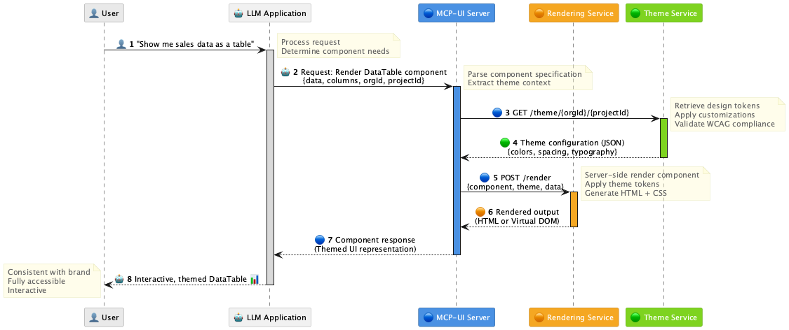
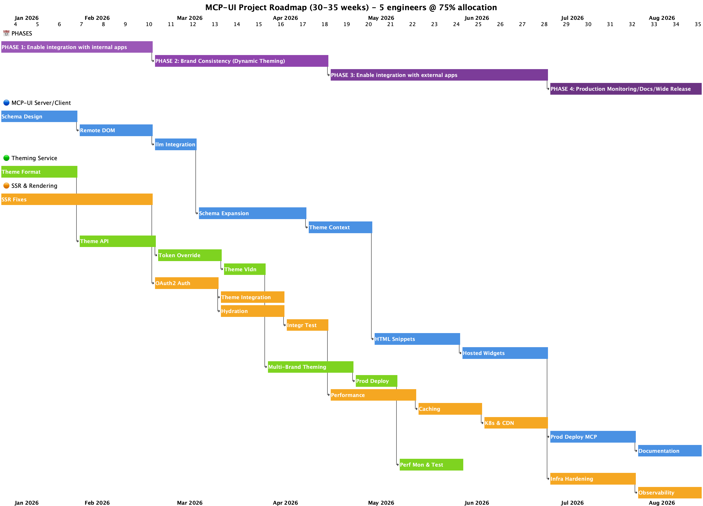

# MCP-UI: Universal Component Rendering for LLM Applications

## Executive Overview

### The Problem

Modern LLM applications face a critical challenge: **how to present rich,
interactive user interfaces in their responses while maintaining visual
consistency with the host application's design system.**

When AI agents need to return complex data visualizations, forms, tables, or
interactive components, they currently have limited options:

1. **Plain text responses** - Lacks visual hierarchy, structure, and
   interactivity
2. **Custom HTML/CSS** - Inconsistent styling, poor accessibility, high
   maintenance burden
3. **Static images** - Non-interactive, not responsive, inaccessible
4. **Framework-specific code** - Security risks, requires consumers to execute
   untrusted code

This creates friction in user experience, breaks visual consistency across
applications, and limits the sophistication of AI-driven interfaces.

### The Solution

**MCP-UI (Model Context Protocol - User Interface)** provides a universal,
declarative approach to rendering rich UIs in LLM responses. It enables AI
agents to specify interfaces using standardized component descriptions that are:

- **Visually consistent** with the host application's design system
- **Fully themed** to match brand guidelines automatically
- **Accessible** with WCAG 2.1 AA compliance built-in
- **Interactive** with proper event handling and state management
- **Secure** without requiring code execution in the consumer environment
- **Performant** with optimized rendering strategies

### Universal Applicability

This tooling is designed for **any LLM application that returns visual responses
to users:**

- **Chatbots and conversational AI** - Rich, interactive responses beyond plain
  text
- **AI-powered dashboards** - Dynamic data visualization and analytics
- **Agent-driven workflows** - Form generation, multi-step processes, guided
  experiences
- **Knowledge bases** - Structured information presentation with clear hierarchy
- **Design assistants** - UI mockups, component previews, design system
  exploration
- **E-commerce assistants** - Product cards, comparison tables, checkout flows
- **Analytics tools** - Interactive charts, data tables, filtering interfaces

**The workflow described here would be necessary to implement for ANY component
library** (Material UI, Ant Design, Chakra UI, shadcn/ui, etc.). Each library
would need similar infrastructure to enable declarative component rendering from
LLM-generated specifications.

### Why Nimbus?

Nimbus is **uniquely well-suited** for dynamically generated LLM UIs:

| Nimbus Feature                  | Benefit for LLM-Generated UIs                                                                         |
| ------------------------------- | ----------------------------------------------------------------------------------------------------- |
| **Design Token Architecture**   | Systematic theming through semantic tokens enables automatic brand consistency without manual styling |
| **React Aria Foundation**       | Built-in accessibility ensures WCAG compliance without manual ARIA implementation                     |
| **Slot Recipe System**          | Predictable styling API maps cleanly to declarative component specifications                          |
| **Compound Component Patterns** | Clear component relationships translate naturally to structured data formats                          |
| **Type Safety**                 | Comprehensive TypeScript definitions enable validated component specifications and error prevention   |
| **SSR-Ready**                   | First-class server rendering support for performance, SEO, and edge deployment                        |
| **CommerceTools Integration**   | Native alignment with our product ecosystem and existing infrastructure                               |

**In contrast**, implementing this workflow with other component libraries would
require:

- Building custom theming infrastructure (Material UI has complex theme objects)
- Adding accessibility layer on top (many libraries lack comprehensive ARIA
  support)
- Creating component specification schemas from scratch
- Implementing SSR support for each framework separately

Nimbus **already has these foundational capabilities**, making it the ideal
platform for LLM-driven UI generation.

---

## Implementation Buckets

The MCP-UI system is divided into **three parallel, interconnected
workstreams**. Each bucket represents a critical piece of infrastructure that
can be developed simultaneously, with clear integration points.

### 🔵 Bucket 1: MCP-UI Server/Client Implementation

The core protocol implementation that enables LLM agents to specify and render
Nimbus components through multiple delivery methods.

**Components:**

- **MCP Server Tools** - Define component schemas and rendering APIs for AI
  agents
- **Remote DOM Implementation** - Component delivery using remote-dom protocol
  (~30 KB payloads)
- **Client Integration** - Testing client integration with LLMs for proof of
  concept and validation
- **HTML Snippet Rendering** - Lightweight component delivery for external
  applications
- **Hosted Widget System** - Iframe/web component delivery for complex UIs
- **Component Library Coverage** - Ongoing expansion of Nimbus component mapping
  and specification

**Key Deliverables:**

- Core component tool definitions (initial set covering primary use cases)
- Remote DOM element registry and mapping system
- Component Rendering Service API (authenticated)
- HTML snippet generation pipeline
- Widget hosting infrastructure

---

### 🟢 Bucket 2: Theming Support & Service

Infrastructure for dynamic theme application to rendered components, enabling
multi-brand and multi-tenant theming.

**Components:**

- **Theme Serialization** - Convert Nimbus themes to portable, transmittable
  formats
- **Theme Service API** - REST/GraphQL API for theme retrieval and management
- **Design Token Management** - Systematic token override and customization
  system
- **Theme Validation** - Ensure theme integrity, WCAG compliance, and
  compatibility
- **Multi-Brand Support** - Handle multiple theme configurations per
  organization/project
- **Integration with merchant-center-settings** - Leverage existing
  infrastructure

**Key Deliverables:**

- Theme serialization format specification
- Theme generation from base colors (Radix 12-step methodology)
- Theme Service GraphQL API
- Organization and project-level theme management
- Build-time static generation (`pnpm nimbus generate-theme`)
- Runtime theme generation (Phase 5)

---

### 🟠 Bucket 3: SSR & Component Rendering Service

Server-side rendering infrastructure for high-complexity interactive components
in LLM response UIs, featuring two-phase rendering (instant SSR display +
client-side hydration for full interactivity) with integrated theme application.

**Components:**

- **SSR Foundation in Nimbus** - Hydration-safe component implementations
- **Component Rendering Service** - Authenticated HTTP API
  (commercetools-identity OAuth2) for SSR with hydration metadata and Theme
  Service integration
- **Theme Service Integration** - Dynamic theme resolution and application per
  project/organization during SSR
- **Hydration Runtime** - Client-side runtime (~150KB) for attaching React event
  handlers and state
- **Performance Optimization** - Caching strategies (theme caching, HTML
  caching), code splitting, bundle optimization
- **HTML Snippet Generation** - Lightweight SSR for simple non-interactive
  components
- **Widget Hosting Service** - Full SSR + hydration for complex interactive
  components (forms, tables, dashboards)
- **Production Infrastructure** - Kubernetes deployment, CDN distribution,
  monitoring

**Key Deliverables:**

- SSR-safe Nimbus components (no hydration mismatches)
- Component Rendering Service API with commercetools-identity OAuth2
  authentication
- Theme Service API client with caching layer for dynamic theme resolution
- Nimbus hydration runtime package for client-side interactivity
- Two-phase rendering: instant display (SSR with theme applied) + full
  interactivity (hydration)
- Kubernetes deployment manifests with HPA
- Prometheus metrics and Falcon LogScale integration with Theme Service
  monitoring
- CDN-hosted hydration runtime

---

### Parallel Development Strategy

**All three buckets can and SHOULD start simultaneously** to meet rapidly
evolving business needs:

- **🔵 MCP-UI** can begin with Remote DOM implementation (no theming or SSR
  needed initially)
- **🟢 Theming** can develop theme serialization and service infrastructure
  independently
- **🟠 SSR** can fix hydration issues and build rendering service in parallel

**Integration points are well-defined:**

- 🟢 Theme serialization → 🔵 MCP-UI themed rendering
- 🟠 SSR support → 🔵 HTML snippets and widgets
- 🟢 Theme service → 🟠 Rendering service (theme injection)

---

## System Architecture

The following diagram illustrates the high-level data flow from user request to
rendered UI:

### Architecture Flow Explained

1. **User Request** → Natural language query to LLM application
2. **LLM Processing** → Determines appropriate Nimbus component(s) and data
   structure
3. **Component Specification** → MCP-UI server receives structured component
   request with project/organization context
4. **Authentication** → commercetools-identity OAuth2 validates request
   credentials
5. **Theme Resolution** → Theme Service API retrieves
   project/organization-specific design tokens (with caching)
6. **Server Rendering** → Component rendered with theme applied during SSR (for
   external apps) or Virtual DOM (for internal)
7. **Response Assembly** → Fully-formed UI returned to user (instant display via
   SSR + hydration metadata for interactivity)

### Component Delivery Methods

| Method            | Use Case                                | Bundle Size                        | Rendering Approach                                    |
| ----------------- | --------------------------------------- | ---------------------------------- | ----------------------------------------------------- |
| **Remote DOM**    | Internal apps (Nimbus installed)        | ~30 KB virtual DOM                 | Client-side mapping to installed components           |
| **HTML Snippet**  | External apps (simple, non-interactive) | ~10-30 KB SSR HTML + CSS           | Pure SSR, no hydration needed                         |
| **Hosted Widget** | External apps (complex, interactive)    | ~150 KB hydration runtime (cached) | SSR for instant display + hydration for interactivity |

---

## Projected Effort & Timeline

The following timeline roadmap illustrates the **parallel workstreams** and their key
dependencies:

### Timeline Breakdown by Phase

#### Phase 1: Remote DOM Foundation (Weeks 1-10)

**Goal:** Usable MCP-UI system with basic components (no theming required)

**Duration:** 8-10 weeks (2-2.5 months)

**Parallel Work:**

- 🔵 **MCP-UI (6-8 weeks)**
  - MCP server schema design (3-4 weeks)
  - Remote DOM proof of concept (3-4 weeks)
  - Testing client integration with LLMs (2-3 weeks)

- 🟢 **Theming (3-4 weeks)**
  - Theme serialization format (3-4 weeks)

- 🟠 **SSR (6-8 weeks)**
  - Fix hydration issues in Nimbus components (6-8 weeks)
  - Ensure SSR-safe implementations (no hydration mismatches)

**Deliverable:** Remote DOM functional for internal apps + SSR-ready Nimbus
components

---

#### Phase 2: Themed Rendering (Weeks 11-18)

**Goal:** Dynamic theming support integrated with MCP-UI

**Duration:** 6-8 weeks (1.5-2 months)

**Parallel Work:**

- 🔵 **MCP-UI (5-7 weeks)**
  - Component schema coverage expansion (5-7 weeks)
  - Theme context propagation (2-3 weeks)

- 🟢 **Theming (7-9 weeks)**
  - Theme Service API development (3-5 weeks)
  - Design token override system (3-4 weeks)
  - Theme validation (2-3 weeks)

- 🟠 **SSR (7-9 weeks)**
  - SSR service with commercetools-identity OAuth2 authentication (2-3 weeks)
  - Theme Service API client integration and caching (2-3 weeks)
  - Hydration runtime development (2-3 weeks)
  - Integration testing (SSR + hydration + theme resolution) (2-3 weeks)

**Deliverable:** Component Rendering Service with Theme Service integration and
hydration support for complex interactive components

**Dependency:** 🟢 Theme serialization must complete before 🔵 themed rendering

---

#### Phase 3: External Use Cases (Weeks 19-28)

**Goal:** HTML snippets and hosted widgets for external applications

**Duration:** 8-10 weeks (2-2.5 months)

**Parallel Work:**

- 🔵 **MCP-UI (7-9 weeks)**
  - HTML snippet rendering (3-5 weeks) - **Depends on 🟠 SSR**
  - Hosted widget implementation (3-5 weeks) - **Depends on 🟠 SSR**
  - Component coverage expansion (ongoing maintenance, non-blocking)

- 🟢 **Theming (5-7 weeks)**
  - Multi-brand theme management (3-5 weeks)
  - Production deployment (2-3 weeks)

- 🟠 **SSR (7-9 weeks)**
  - Performance optimization (3-4 weeks)
  - Caching strategy (2-3 weeks)
  - Kubernetes + CDN deployment (hydration runtime) (2-3 weeks)

**Deliverable:** Production-ready SSR with hydration for external applications
(HTML snippets + hosted widgets)

**Phase Complete When:** Hosted widget implementation finishes

**Critical Dependency:** 🟠 Rendering Service API must complete before 🔵
HTML/Widget features

**Note:** Component coverage expansion continues as ongoing maintenance and does
not gate phase progression.

---

#### Phase 4: Production Hardening (Weeks 29-35)

**Goal:** Production-ready system with monitoring, documentation, and robust
component coverage

**Duration:** 6-8 weeks (1.5-2 months)

**Parallel Work:**

- 🔵 **MCP-UI (4-6 weeks)**
  - Production deployment
  - Documentation and examples

- 🟢 **Theming (2-3 weeks)**
  - Performance monitoring

- 🟠 **SSR (4-6 weeks)**
  - Production hardening
  - Monitoring integration

**Deliverable:** Fully deployed, monitored, documented system

---

### Key Timeline Insights

**Phase 1 establishes foundation** - Remote DOM functional for internal apps
while SSR foundation is prepared (2-2.5 months)

**Parallel development enables progress** - Three workstreams progress simultaneously with managed dependencies

**Clear integration points** - Dependencies are well-defined and scheduled to minimize blocking

**Incremental delivery** - Each phase adds new capabilities, building toward full production readiness

**Two-phase rendering strategy** - Instant SSR display + client-side hydration for full interactivity

**Realistic buffer** - Timeline includes 25% buffer for unknown blockers and integration challenges

**Total Timeline: 30-35 weeks (7.5-8.5 months) to full production**

**Team Capacity**: 5 engineers with 75% project allocation (~94 focused hours/week)

**Adjustments**: Timeline accounts for maintenance responsibilities, coordination overhead, limited Claude Code access (3 of 5 engineers), and 25% buffer for unknown blockers

---

## Success Metrics

The following metrics will be tracked to measure MCP-UI effectiveness and guide
continuous improvement:

### Adoption & Usage Metrics

**What we want to measure:**

- Number of LLM applications integrating MCP-UI
- Component usage frequency by type
- Active MCP-UI sessions per day/week/month
- Theme Service API request volume
- Adoption rate across internal vs. external applications

---

### Performance Metrics

**What we want to measure:**

- Component rendering latency (p50, p95, p99)
- Theme Service response time (p50, p95, p99)
- Theme resolution duration (API call + cache lookup)
- Theme cache hit rate
- SSR HTML generation time (including theme application)
- Client-side hydration time and success rate
- Bundle size per component and delivery method
- Time to First Byte (TTFB) for server-rendered components
- Time to interactive (SSR display → hydration complete)
- Theme Service availability and error rate

---

### Quality Metrics

**What we want to measure:**

- Accessibility audit scores (automated via axe-core)
- Visual regression test pass rate
- Component specification validation errors
- Theme consistency violations (WCAG contrast failures)
- User-reported rendering issues and bugs
- API error rates (4xx, 5xx responses)

---

### Developer Experience Metrics

**What we want to measure:**

- Time to integrate MCP-UI (new applications)
- Component schema coverage percentage
- Theme customization adoption rate
- Documentation clarity feedback (surveys)
- API usage errors and common mistakes
- Time to first successful component render

---

### Business Impact Metrics

**What we want to measure:**

- Reduction in custom UI code written by product teams
- Time saved on design system implementation
- Consistency score across applications (visual similarity)
- Customer satisfaction with AI-generated UIs
- Support ticket reduction for UI-related issues

---

**Note:** Specific targets and goals will be established during initial
deployment based on baseline measurements and business priorities.

---

## Risk Mitigation

### High-Impact Risks

| Risk                                          | Impact   | Likelihood | Mitigation Strategy                                                                                                                                                                                  |
| --------------------------------------------- | -------- | ---------- | ---------------------------------------------------------------------------------------------------------------------------------------------------------------------------------------------------- |
| **Hydration mismatches in SSR**               | Critical | Medium     | • CSS Grid layouts (declarative) • Comprehensive SSR testing suite • Browser API guards (`useIsClient`) • Clear SSR implementation patterns                                              |
| **Theme Service availability**                | High     | Low        | • Default theme fallback • Theme caching layer (in-memory/Redis, 5-min TTL) • Multi-region deployment • Health checks and automated failover • Graceful degradation to default theme |
| **Component Rendering Service scaling**       | High     | Medium     | • Horizontal Pod Autoscaling (HPA) • Connection pooling • Rate limiting per consumer • Edge caching for rendered output • Theme cache reduces Theme Service load                     |
| **Security vulnerabilities (XSS, injection)** | Critical | Low        | • commercetools-identity OAuth2 authentication • Input validation and sanitization • CSP headers on rendered output • Regular security audits • Secure Theme Service API calls       |

---

### Medium-Impact Risks

| Risk                                 | Impact | Likelihood | Mitigation Strategy                                                                                                                                   |
| ------------------------------------ | ------ | ---------- | ----------------------------------------------------------------------------------------------------------------------------------------------------- |
| **Performance degradation at scale** | Medium | Medium     | • Bundle size monitoring in CI • Benchmarking suite for regressions • Tree-shaking verification • Separate server entry point             |
| **Component schema evolution**       | Medium | High       | • Semantic versioning strategy • Backward compatibility guarantees • Deprecation notices (6+ months) • Migration guides and codemods      |
| **Cross-browser compatibility**      | Medium | Low        | • Automated browser testing (Playwright) • Progressive enhancement approach • Polyfills for older browsers • Clear browser support policy |
| **Breaking changes in Nimbus**       | Medium | Medium     | • Integration testing against main branch • Version pinning in production • Automated migration guides • Pre-release testing program      |

---

### Low-Impact Risks

| Risk                        | Impact | Likelihood | Mitigation Strategy                                                                                                                                                   |
| --------------------------- | ------ | ---------- | --------------------------------------------------------------------------------------------------------------------------------------------------------------------- |
| **Slow developer adoption** | Low    | Medium     | • Developer advocacy and training • Clear documentation with examples • Interactive playground/demos • Office hours and support channels                  |
| **Maintenance burden**      | Low    | Low        | • Automated testing (unit, integration, E2E) • Clear ownership and on-call rotation • Runbooks and incident response plans • Automated dependency updates |
| **Competing solutions**     | Low    | Low        | • Focus on Nimbus integration advantages • CommerceTools ecosystem lock-in • First-mover advantage in our org • Continuous feature innovation             |

---

### Proactive Risk Management

**Continuous Monitoring:**

- Real-time performance dashboards (Prometheus + Grafana)
- Error tracking and alerting (Falcon LogScale/Humio)
- Uptime monitoring (PagerDuty integration)
- User feedback channels (surveys, support tickets)

**Regular Reviews:**

- Bi-weekly risk assessment meetings
- Quarterly security audits
- Performance regression analysis (weekly)
- Dependency vulnerability scanning (automated)

---

## Conclusion: Why This Work Matters

The MCP-UI system represents a **fundamental shift** in how AI applications
deliver user interfaces. This is not just infrastructure—it's the **foundation
for the next generation of LLM-powered experiences**.

### For Product Teams

**Faster time-to-market for AI-powered features**

- No custom UI code needed for LLM responses
- Instant visual consistency with brand guidelines
- Pre-built component library for common use cases

**Consistent user experience across all touchpoints**

- Design system automatically applied
- Accessibility baked in, not bolted on
- Theme changes propagate instantly to all LLM UIs

**Reduced maintenance through centralized component library**

- Single source of truth for component behavior
- Automatic updates to all consuming applications
- No duplicate UI code to maintain

---

### For Engineering Teams

**Secure rendering without executing untrusted code**

- AI agents only specify component structure, not implementation
- No `eval()` or `new Function()` risks
- Sandboxed rendering environments (iframes, web components)
- commercetools-identity OAuth2 authentication for API security

**Type-safe component specifications with validation**

- Compile-time type checking for component schemas
- Runtime validation prevents malformed UIs
- Clear error messages for debugging

**Integrated theme management with caching**

- Dynamic theme resolution per project/organization
- Theme Service integration with 5-minute cache TTL
- Automatic brand consistency without manual configuration

**Flexible delivery methods for any use case**

- Remote DOM for internal applications (~30 KB virtual DOM)
- HTML snippets for simple non-interactive components (~10-30 KB SSR HTML + CSS)
- Hosted widgets for complex interactive components (~150 KB hydration runtime,
  CDN-cached)

---

### For End Users

**Visually cohesive interfaces matching brand expectations**

- No jarring style differences between AI and non-AI UIs
- Consistent interaction patterns (buttons, forms, tables)
- Professional appearance that builds trust

**Accessible components meeting WCAG 2.1 AA standards**

- Screen reader support out of the box
- Keyboard navigation that works correctly
- Proper ARIA attributes and semantic HTML

**Interactive experiences beyond static text responses**

- Sortable data tables for exploring information
- Interactive forms for multi-step workflows
- Rich data visualizations for understanding complex data

---

### Strategic Value

This work is **not optional**—it's **necessary** for CommerceTools to remain
competitive in the AI era.

#### Without MCP-UI, we face:

- **Fragmented user experiences** - Each product team builds custom UI solutions
- **Security vulnerabilities** - Executing LLM-generated code creates attack
  vectors
- **Accessibility compliance gaps** - Manual ARIA implementation is error-prone
- **Unsustainable maintenance burden** - Duplicate UI code across multiple
  applications
- **Slower innovation** - Teams spend time on infrastructure instead of features

#### With MCP-UI, we enable:

- **Unified design system for AI** - Every LLM response looks like it belongs
- **Secure by default** - No code execution, only declarative specifications
- **Accessibility at scale** - WCAG compliance without manual effort
- **Faster feature velocity** - Teams focus on AI logic, not UI implementation
- **Competitive differentiation** - Best-in-class AI experiences in our market

---

### The Opportunity

LLM applications are no longer just text generators—**they are becoming
sophisticated UI builders**. The companies that provide the best AI-generated
interfaces will win customer trust and market share.

The MCP-UI system, built on Nimbus, provides the **infrastructure foundation**
for the next generation of AI-powered applications at CommerceTools. It
transforms LLM responses from text-based answers into **rich, interactive,
brand-consistent experiences** that delight users and scale across our entire
product ecosystem.

**The question is not whether to build this—it's how quickly we can deliver it
to our customers.**

---

_Document Version: 2.1_ _Last Updated: 2025-12-05_ _Status: Architecture
Approved - Implementation in Progress_ _Owner: Nimbus Team_ _Changelog: Updated
to reflect Theme Service integration in Component Rendering Service,
commercetools-identity OAuth2 authentication, and enhanced observability
metrics_
